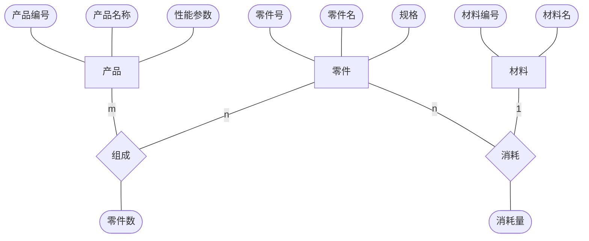

# 数据库原理 - 题集

评价标准只有分数，所以还得做题。  
做题也是一个巩固知识点和加深理解的方式。  

题集所用参考书为 《数据库系统概论（第 5 版）》（王珊、萨师煊）。

[toc]

## 数据库系统概述

- 下列哪个不是数据库系统必须提供的数据控制功能  

1 安全性  
2 可移植性  
3 完整性  
4 并发控制  

> 选 2 。
> 教材上表述的是 DBMS 必须提供安全性、完整性、并发控制、数据库恢复 4 个方面的数据控制功能。

- 在 DBS 中，DBMS 和 OS 之间的关系是

1 并发运行  
2 相互调用  
3 OS 调用 DBMS  
4 DBMS 调用 OS  

> 注意，在层次关系上，DBMS 在 OS 之上，因此是 DBMS 调用 OS 。另外注意，对于操作系统内部使用的数据库系统，应该认为是操作系统的一部分，这部分是不能提供给上层作为完整数据库使用的。  

- 数据库管理系统能实现对数据库中数据的查询、插入、修改和删除，这类功能成为  

1 数据定义功能  
2 数据管理功能  
3 数据操纵功能  
4 数据控制功能  

> DBMS 提供数据定义，数据组织、存储和管理，数据操纵，数据库的事务管理和运行管理，数据库的建立和维护，其他功能（如转换）。数据查询、插入、修改和删除属于数据操纵的功能。因此选 3 。  

- 数据库是在计算机系统中按照一定数据模型组织、存储和应用的  

1 文件的集合  
2 数据的集合  
3 命令的集合  
4 程序的集合  

> 数据库定义：数据库是长期储存在计算机内、有组织的、可共享的大量数据的集合。因此选 2 。

- 在数据库系统阶段数据由（）统一管理  

1 管理员  
2 系统分析员  
3 DBMS  
4 DB  

> 数据管理技术的发展经历了人工管理、文件系统、数据库系统三个阶段。在数据库系统阶段，数据显然由 DBMS 来管理，严格的说是 DBS 来管理。

- 数据库系统与文件系统的主要区别是  

1 数据库系统复杂，而文件系统简单  
2 文件系统不能解决数据冗余和数据独立性问题，而数据库系统可以解决  
3 文件系统只能管理程序文件，而数据库系统能过够管理各种类型的文件  
4 文件系统管理的数据量较少，而数据库系统可以管理庞大的数据量

> 文件系统相比人工管理的主要优点是数据可以长期保存，应用程序不用管理数据。数据库系统相比文件系统是解决了数据冗余和独立性问题。因此选 2 。

- 数据管理技术经历了（）、（）和（）三个阶段。

> 数据管理技术经历了人工管理、文件系统、数据库系统管理三个阶段。人工管理阶段，数据一般不保存，由程序负责数据的管理；文件系统阶段实现了数据的长期保存，并且文件系统负责数据的管理；数据系统管理阶段解决了数据的冗余、独立性等问题。

## 数据模型

- 层次模型、网状模型和关系模型的划分依据是  

1 记录长度  
2 文件的大小  
3 联系的复杂程度  
4 数据之间的联系  

> 毫无疑问，这些模型之间的区别在与数据之间的联系不同。层次模型是树状结构，网状模型是网状结构，关系模型是关系结构（表结构）。选 4 。  

- 数据模型的三要素是  

1 外模式、模式、内模式  
2 关系模型、层次模型、网状模型  
3 实体、联系、属性  
4 数据结构、数据操作、完整性约束  

> 数据库系统的三级模式是外模式、模式、内模式。数据模型的主要分类是关系模型、层次模型、网状模型。数据模型的组成要素是数据结构、数据操作、完整性约束。因此选 4 。  

- 当前数据库应用系统的主流数据模型是

1 层次数据模型  
2 网状数据模型  
3 关系数据模型  
4 面向对象数据模型  

> 主流的是关系模型，选 3 。层次模型的代表是 IBM 的 IMS 。网状模型的代表是 DBTG 系统，或者叫做 CODASYL 系统。

- 关系模型的数据结构是  

1 树  
2 图  
3 表  
4 二维表  

> 层次模型是树结构，网状模型是图结构，关系模型是二维表。表还有一维表。  

- 二元实体之间的联系可以抽象为三类，它们是（）、（）、（）。

> 实体之间的联系有一对一、一对多、多对多等多种类型。  

- 构造 E-R 模型的三个基本要素是（）、（）、（）。

> E-R 模型即 E-R 方法，是用来表示概念模型的一种方法。概念模型是现实世界到机器世界的一个中间层次。E-R 模型中，两个实体之间的联系有一对一、一对多、多对多三种来呢西，还有两个以上的实体型之间的联系以及单个实体型内的联系。E-R 模型的三个基本要素就是实体、属性、联系。在 E-R 图中，实体用矩形表示，属性用椭圆形表示，联系用菱形表示。

- 试述概念模型的作用。  

> 概念模型是现实世界到机器世界的一个中间层次。概念模型用于信息世界的建模，是现实世界到信息世界的第一层抽象，是数据库设计人员进行数据库设计的有力工具，也是数据库设计人员和用户之间进行交流的语言。  

## 数据库系统的结构

- 数据的存储结构与数据逻辑结构之间的独立性成为数据的  

1 物理独立性  
2 结构独立性  
3 逻辑独立性  
4 分布独立性  

> 数据库系统的结构有三级模式、两级映像，实现数据的独立性。外模式为用户模式，模式为数据的逻辑模式，内模式为存储模式。数据的存储结构和数据逻辑结构之间的独立性由内模式和模式之间的映射提供，实现数据的物理独立性，即内模式改变时，模式可以保持不变。相应的，模式和外模式之间的映射保证了程序与数据的逻辑独立性，即模式发生改变时，外模式不用改变，从而应用程序也不用改变。因此本题选 1 。

- 数据库三级视图，反映了三种不同角度看待数据库的观点，用户眼中的数据库称为  

1 存储视图  
2 概念视图  
3 内部视图  
4 外部视图  

> 外模式、模式、内模式，也是用户模式、数据逻辑模式、物理模式，因此选 4 。

- 数据的独立性可分为（）和（）

> 数据的独立性可分为数据的逻辑独立性和数据的物理独立性，逻辑独立性提供了上层应用对数据模式的独立性，物理独立性提供了数据模式对物理存储的独立性。

- 关系数据模型有哪些优缺点？

> 关系模型与格式化模型（层次模型和网状模型）不同，是建立在严格的数学概念之上的。  
> 关系模型概念单一，实体、实体之间的联系、属性都是体现在一个表上，对数据的查询结果也是一张表，因此直观易用。  
> 存取路径对用户透明，从而具有更高的数据独立性。  
> 由于存取路径对用户透明，因此 DBMS 需要更多关注查询优化。  

## 数据库系统的组成

- 数据库系统中，DBA 表示  

1 应用程序设计者  
2 数据库使用者  
3 数据库管理员  
4 数据库结构  

> 毫无疑问选 3 。DBA 的职责包括：  
> 决定数据库中的信息内容和结构；决定数据库的存储结构和存取策略；定义数据的安全性要求和完整性约束条件；监控数据库的使用和运行；数据库的改进和重组、重构。  

- 数据库系统是由（）、（）、（）、数据库管理员等组成的一个整体。  

> 数据库系统一般由数据库、数据库管理系统、应用程序和数据库管理员组成。

## 关系数据结构及形式化定义

- 同一个关系模型的任意两个元组值

1 不能全同
2 可全同
3 必须全同
4 以上都不是

> 选1 。由于元组表示一个关系，是关系集合中的一个元素，因此同一关系模型中的任意两个元组值不能全同。

- 在关系 R(R#,RN,S#) 和 S(S#,SN,SD) 中，R 的主码是 R#，则 S# 在 R 中称为  

1 外码  
2 候选码  
3 主码  
4 超码

> 外码，即引用的外部表的主码；候选码，即能唯一确定元组的最小属性集；主码，即人为选定的一个候选码；超码，即候选码的超集。因此选 1 。

- 关系模式的任何属性  

1 不可再分  
2 可再分  
3 命名在该关系模式中可以不唯一  
4 以上都不是  

> 关系模式要求每一个分量都必须时不可分的数据项，因此选 1 。

- 现实世界的“特征”术语，对应于数据世界的  

1 属性  
2 联系  
3 记录  
4 数据项  

> 属性就是对象的特征，联系是对象和对象之间的关联。选 1 。

- 关系模型中，一个码是  

1 可由多个任意属性组成  
2 至多由一个属性组成  
3 可由一个或多个其值能唯一标识该关系模式中任何元组的属性组成  
4 以上都不是  

> 毫无疑问选 3，但是本题从语义上而言 1 也是对的。

- 客观存在并可相互区别的事物称为  

1 属性  
2 码  
3 实体  
4 域

> 这里理解一下域：一组具有相同数据类型的值的集合。答案为实体，即选 3  。

- 关系模型是  

1 用关系表示实体  
2 用关系表示联系  
3 用关系表示实体及其联系  
4 用关系表示属性  

> 回顾关系的定义，关系是域的笛卡儿积的子集，因此关系既表达了实体，又表达了实体之间的联系。事实上，要描述一个关系需要一个 5 元组：  
> R(U,D,DOM,F)
> 关系名（属性名集合，属性域，属性向域的映射，数据的依赖关系集合）  
> 因此选 3 。

- 关系数据库中的码是指  

1 能唯一决定关系的字段  
2 不可改动的专用保留字  
3 关键的很重要的字段  
4 能唯一标识元组的属性或属性集合

> 毫无疑问选 4 。

## 关系的完整性

- 下列有关主键和外键之间关系的描述中正确的是  

1 一个表中最多只能有一个主键，多个外键  
2 一个表中最多只能有一个外键，一个主键  
3 一个表中可以有多个主键，多个外键  
4 一个表中最多只能有一个外键，多个主键

> 主键是从候选码中认为选定的一个，因此只能有一个。外键引用的外部表的主键，因此可以有多个。  

## 关系代数

- 下列哪些运算是关系代数的基本运算  

1 交、并、差  
2 投影、选取、除、联结  
3 联结、自然联结、笛卡尔乘积  
4 投影、选取、笛卡尔乘积、差  

> 首先，除、自然联结肯定不是基本运算，因此排除 2、3，交运算可以用并、差表示。教材中给定的 5 种基本运算为并、差、笛卡尔积、选择、投影。不是基本运算的为交、连接、除运算。注：连接可以通过在笛卡尔积的结果集中进行选择运算实现。  

- 下列哪个是单目运算  

1 差  
2 并  
3 投影  
4 除法  

> 差、并、除法和算术运算类似，因此是双目运算。投影操作用于筛选列，其操作数即为用于筛选的表，因此是单目运算符。  
> 注意：SQL 中对于多表的投影，从关系运算的角度，应该理解为先连接（或者说先进行笛卡尔积），然后对结果表进行选择运算。  

- 自然连接是构成新关系的有效方法。一般情况下，当对关系 R 和 S 使用自然连接时，要求 R 和 S 含有一个或多个共有的  

1 元组  
2 行  
3 记录  
4 属性  

> 自然连接是一种等值连接，并且在结果集中对相同的属性列只保留一列。因此选 4 。

- 关系代数中，从关系中取出所需属性组成新关系的操作称为（）

> 传统的关系运算有交、并、差、广义笛卡儿积，专门的关系运算有选择、投影、连接、除。并、差、笛卡尔积、选择、投影为 5 个基本运算。交、连接、除为非基本运算。广义笛卡儿积是将多个关系模式中的元组作为元素进行笛卡儿积，结果元素中属性为给定关系模式的属性串接。选择是从给定元组中选出满足给定条件的元组集，投影则是从给定关系模式中选择若干列生成新的元组。

- 设有三个关系：  
  S(S#,SNAME,AGE,SEX)  
  C(C#,CNAME,TEACHER)  
  SC(S#,C#,GRADE)  
  试用关系代数表达式表示下列查询语句：  

（1）检索讲授“数据结构”的老师的教师名 TEACHER。  
> $\Pi_{TEACHER}(\sigma_{CNAME='数据结构'}(C))$

（2）检索至少选修“陈军”老师所授全部课程的学生姓名（SNAME）  
> 先找出教师对应的全部的课程编号（选择），然后找出选修全部课程编号的学生编号（除），然后根据学生编号找出对应的学生姓名（自然连接），然后找出学生姓名（投影）。  
> $\Pi_{SNAME}(\Pi_{S\#,C\#}(SC)\div \Pi_{C\#}(\sigma_{TEACHER='陈军'}(C))\Join \Pi_{S\#,SNAME}(S))$

（3）检索至少选修两门课程的学生学号（S#）  
> 通过对选课表的一次笛卡儿积实现，如果一名学生只选了一门课，则结果元组中同一名学生对应的选课一定也是同一门课。找出存在不同课的元组，即为至少选修了两门课程的学生。  
> $\Pi_{S\#}(\sigma_{SC1.S\#=SC2.S\#\land SC1.C\#\ne SC2.C\#}(SC1\times SC2))$

（4）检索“数据库原理”分数为 80 分及以上的学生学号（S#）。  
> 可以先连接再选择，也可以先选择，再连接。  
> 这里先从课程表中找出数据库原理的元组，然后从选课表中找出分数为 80 分以上的元组，然后两表进行自然连接，得到需要的学号。  
> $\Pi_{S\#}(\Pi_{C\#}(\sigma_{CNAME='数据库原理'}(C))\Join \Pi_{S\#,C\#}(\sigma_{GRADE>80}(SC)))$

（5）检索选修全部课程的学生姓名（SNAME）。  
> 先得到全部课程（投影），然后得到选修全部课程的学号（除），然后得到学生姓名（自然连接）
> $\Pi_{SNAME}((\Pi_{S\#,C\#}(SC)\div\Pi_{C\#}(C))\Join \Pi_{S\#,SNAME}(S))$

（6）检索“李强”同学不学课程的课程号（C#）。  
> 先得到所有课程的课程号，然后得到李强学的课程号（通过自然连接），求差即可。  
> $\Pi_{C\#}(C)-\Pi_{C\#}(\sigma_{SNAME='李强'}(\Pi_{S\#,SNAME}(S)\Join\Pi_{S\#,C\#}(SC)))$  

（7）检索全部学生都选修的课程的课程号（C#）和课程名（CNAME）。  
> 先得到全部学生（投影），然后得到全部选修的课程（除），然后得到课程名（连接）。  
> $\Pi_{C\#,CNAME}((\Pi_{S\#,C\#}(SC)\div\Pi_{S\#}(S))\Join \Pi_{C\#,CNAME}(C))$

（8）检索选修课程包含学号为 2 的学生所修课程的学生学号（S#）。  
> 注意是全称语义。也即选修了所有学号为 2 的学生也选修课程的学生。  
> 先找出学号为 2 的学生选修的全部课程（选择，投影），然后找出至少选修全部这些课程的学号（除）。  
> $\Pi_{S\#,C\#}(SC)\div \Pi_{C\#}(\sigma_{S\#=2}(SC))$

## 数据查询

- SQL 语句的一次查询结果是

1 数据项  
2 记录  
3 元组  
4 表  

> SQL 查询是可以看作是一次对关系数据库的关系操作，其结果是元组的集合，即为表。

- 采用 SQL 查询语言对关系进行查询操作，若要求查询结果中不出现重复元组，可在 SELECT 子句后增加保留字  

1 DISTINCT  
2 UNIQUE  
3 NOT NULL  
4 SINGLE  

> DISTINCT 表示去除结果集中的重复元组，UNIQUE 是不允许重复的完整性限制，NOT NULL 是不允许为 NULL 的完整性限制，SINGLE 是部分数据库的数据类型定义字。因此选 1 。

- 在 SQL 语句中，谓词 EXISTS 的含义是

1 全称量词  
2 存在量词  
3 自然连接  
4 等值连接  

> 毫无疑问选 2 。SQL 中没有全程量词，只能将全称量词通过谓词演化为存在量词和否定量词，如：  
> $\lnot (\forall A)=\exist (\lnot A)$  
> 即  
> $\forall A=\lnot \exist (\lnot A)$

- 在 SQL 语句中，对输出结果进行排序的语句是  

1 GROUP BY  
2 ORDER BY  
3 WHERE  
4 HAVING  

> 毫无疑问选 2 。

- 设有如下 4 个关系模式：  
S(SN,SNAME,CITY)  
P(PN,PNAME,COLOR,WEIGHT)  
J(JN,JNAME,CITY)  
SPJ(SN,PN,JN,QTY)  
其中，S 表示供应商，P 表示零件，J 表示工程，SPJ 表示供应关系，QTY 表示提供的零件数量。  

（1）取出供应商为“清华同方”的供应商编码（SN）。  

```SQL
SELECT `SN`
FROM S
WHERE `SNAME`='清华同方';
```

（2）取出重量最轻的零件编码（PN）。  

这里要使用聚集函数来找出最大的或最小的值。

```SQL
SELECT `PN`
FROM `P`
WHERE `WEIGHT` = (
  SELECT MIN(`WEIGHT`)
  FROM `P`;
);
```

（3）取出由供应商 S1 提供零件的工程名称（JNAME）。  

```SQL
SELECT `JNAME`
FROM `J`,`SPJ`,`S`
WHERE `J`.`JN`=`SPJ`.`JN`
AND `SPJ`.`SN`=`S`.`SN`
AND `S`.`SNAME`='S1';
```

（4）取出为工程 J1 和 J2 提供零件的供应商编码（SN）。  

```SQL
SELECT `SN`
FROM `S`,`P`,`SPJ`
WHERE `S`.`SN`=`SPJ`.`SN`
AND `P`.`PN`=`SPJ`.`PN`
AND (
  `S`.`SNAME`='J1'
  OR `S`.`SNAME`='J2'
);
```

## 删除数据

- 从表中删除记录的 SQL 语句是  

1 INSERT  
2 DELETE  
3 UPDATE  
4 DROP  

> 毫无疑问是 2 。DROP 用于对模式的删除，而不是对数据的修改。  

## 数据库安全性控制

- 下列 SQL 语句中，能够实现“给用户 teacher 授予查询 SC 的权限”这一功能的是  

1 GRANT SELECT ON sc TO teacher  
2 REVOKE SELECT ON sc TO teacher  
3 GRANT SELECT ON TABLE TO teacher  
4 REVOKE SELECT ON TABLE TO teacher  

> 显然为 1 。

- 在 SQL 语句中，给用户授权的命令是  

1 GRANT  
2 SET  
3 REVOKE  
4 FROM  

> 毫无疑问是 1 。

## 规范化

- 关系模式 R 中的属性全部是主属性，则 R 的最高范式必定是  

1 2NF  
2 3NF  
3 BCNF  
4 4NF  

> 回顾几种范式。2NF 是去掉了部分函数依赖，3NF 是去掉了传递依赖，BCNF 是去掉了主属性中的部分函数依赖和传递依赖，4NF 是去掉了非平凡的多值依赖中非函数依赖的情况。  
> 考虑为全码，因此必然能够满足 3NF 的要求。对于 BCNF ，要求主属性不存在对码的部分函数依赖和传递依赖，则不一定能满足要求。
> 选 2 。

- 若关系 R 的候选码都是由单属性构成的，则 R 的最高范式必定是

1 1NF  
2 2NF  
3 3NF  
4 无法确定

> 由于候选码都是单属性，因此不存在非主属性对码的部分函数依赖，2NF 可以满足。而传递依赖不确定是否存在，因此为 2NF 。选 2 。

- 设有关系 S(SNO, SNAME, DNAME, DADDR) ，将其规范化到第三范式正确的答案是  

1 S1(SNO, SNAME) S2(DNAME, DADDR)  
2 S1(SNO, SNAME, DNAME) DEPT(DNAME, DADDR)  
3 S1(SNO, SNAME, DADDR) S2(SNO, SNAME)  
4 以上都不对  

> 这个题要紧扣答案进行解答。 
> 这是一个学生数据库，分别是学号、学生名字、学院名字、学院地址。  
> SNO $\rightarrow$ SNAME  
> SNO $\rightarrow$ DNAME  
> DNAME $\rightarrow$ DADDR  
> 或者 DADDR $\rightarrow$ DNAME
> 可以选取学号作为码。  
> 先去除部分函数依赖，由于主码只有一个属性，因此没有部分函数依赖。  
> 再去除传递依赖，发现学院既可以通过主码确定，又可以通过学院名字确定，因此需要进行模式分解，将学院名字和学院地址的关系分离出去，得到答案 2 。  
> 注意：观察答案，然后猜测模式分解的方式，找出正确的答案。  

- 关系模型中 3NF 是指

1 满足 2NF 且不存在组合属性  
2 满足 2NF 且不存在部分依赖现象  
3 满足 2NF 且不存在非主属性  
4 满足 2NF 且不存在传递依赖现象

> 2NF 消除非主属性对码的部分函数依赖，3NF 消除非主属性对码的传递依赖，BCNF 消除主属性对码的部分函数依赖和传递依赖，4NF 消除非平凡的多值依赖中非函数依赖的部分。因此选 4 。

- 设计性能较优的关系模式成为规范化，规范化的主要的理论依据是  

1 关系规范化理论  
2 关系运算理论  
3 关系代数理论  
4 数理逻辑  

> 引用：“由于关系模型由严格的数学理论基础，并且可以向别的数据模型转换，因此，人们就以关系模型为背景来讨论这个问题，形成了数据库逻辑设计的一个有力工具：关系数据库的规范化理论”。因此选 1 。

- 关系模式中，满足 2NF 的模式  

1 可能是 1NF  
2 必定是 1NF  
3 必定是 3NF  
4 必定是 BCNF  

> 不同的规范化层次之间是包含的关系，BCNF 是函数依赖层次上的最高规范化程度。选 2 。

- 消除了部分函数依赖的 1NF 的关系模式必定是  

1 1NF  
2 2NF  
3 3NF  
4 4NF  

> 1NF 通过消除非主属性对码的部分函数依赖得到 2NF ，2NF 通过消除非主属性对码的传递依赖得到 3NF ，因此这里只能选 2 。

- 为什么要进行模式分解？分解的依据是什么？

> 对于一个具体问题，存在多种构造关系模式的方法，其中一些关系模式可能会存在数据冗余，插入、更新、删除异常，因此要通过模式分解的方法，避免这些问题。分解的依据是不同层次的范式要求，包括去除部分函数依赖和传递依赖等，去除非平凡多值依赖中不是函数依赖的部分等。

## 数据库设计

设工厂由三个实体集。一是“产品”实体集，属性有产品编号、产品名称、性能参数；二是“零件”实体集，属性有零件号、零件名、规格；三是“材料”实体集，属性有材料编号、材料名。  
设产品与零件之间有“组成”联系，每件产品可由多种零件组成，但每种零件也可以组成多个产品，组成要有零件数；零件与材料之间有“消耗”来联系，每种零件消耗一种材料，一种材料可供多种零件消耗，消耗要有消耗量；  
（1）试画出 E-R 图，并在图上注名属性、联系类型、实体标识符。  
（2）将 E-R 图转换成关系模型，并说明主键和外键。  

解：  

（1）  



（2）  
先写出实体型关系：  

产品（产品编号、产品名称、性能参数）  
零件（零件号、零件名、规格）  
材料（材料编号、材料名）

然后处理给出一对多的关系：  

对于消耗联系，可以合并到零件上，也即：

零件（零件号、零件名、规格、材料编号、消耗量）  

最后处理多对多的关系：  

组成（产品编号、零件号、零件数）  