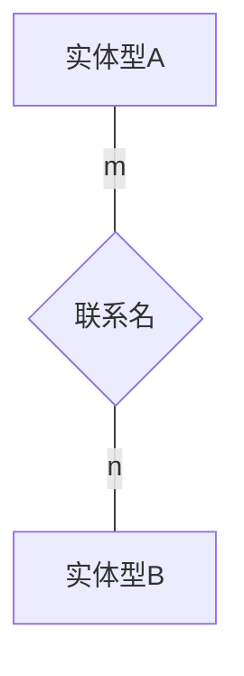
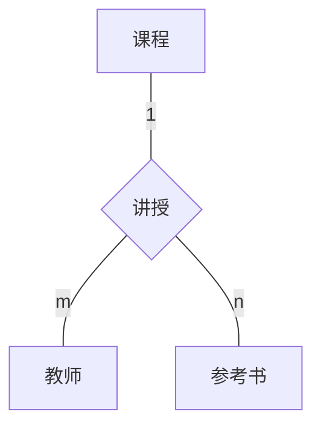
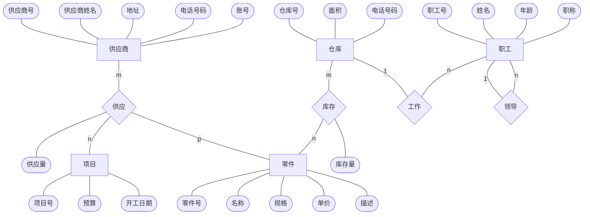
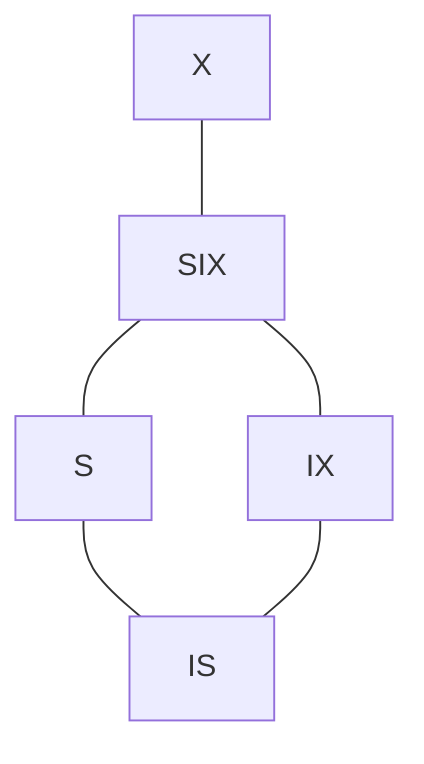

# 数据库系统概论 - 基础

主要内容为《数据库系统概论（第 5 版）》（王珊、萨师煊）的知识点。

涉及的学生选课数据库示例参考实验（文）。

[toc]

## 1 概述

### 1.1 数据库的 4 个基本概念

**数据**、**数据库**、**数据库管理系统**、**数据库系统**是与数据库技术密切相关的 4 个基本概念。

#### 1.1.1 数据（data）

描述事物的符号记录称为**数据**。数据和关于数据的解释是不可分的。数据的解释是指对数据含义的说明。数据的含义称为**数据的语义**，数据与其语义是不可分的。

#### 1.1.2 数据库（DataBase,DB）

严格地讲，数据库是**长期储存**在计算机内、**有组织**的、**可共享**的大量数据的集合。数据库中的数据按一定的数据模型组织、描述和储存，具有**较小的冗余度**（redundancy）、**较高的数据独立性**（data indenpendency）和**易扩展性**（scalability），并可为各种用户**共享**。

#### 1.1.3 数据库管理系统（DataBase Management System, DBMS）

属于系统软件，用于管理数据。主要功能包括：数据定义功能，数据组织、存储和管理，数据操纵，数据库的事物管理和运行管理，数据库的建立和维护功能，其他功能（如通信、转换、异构）。

#### 1.1.4 数据库系统（DataBase System, DBS）

数据库系统是由数据库、数据库管理系统（及其应用开发工具）、应用程序和数据库管理员（DataBase Administrator, DBA）组成的存储、管理、处理和维护数据的系统。

### 1.2 数据管理技术的产生和发展

数据管理是指对数据进行分类、组织、编码、存储、检索和维护，它是数据处理的中心问题。数据的处理是指对各种数据进行收集、存储、加工和传播的一系列活动的总和。  
数据管理技术经历了**人工管理**、**文件系统**、**数据库系统**三个阶段。  
**数据库系统的出现使信息系统从以加工数据的程序为中心转向围绕共享的数据库为中心的新阶段**。

#### 1.2.1 人工管理阶段

硬件：没有直接存取的存储设备。  
软件：没有操作系统，没有管理数据的专门软件。  
数据处理方式：批处理。  

特点：  

- 数据不保存
- 应用程序管理数据
- 数据不共享
- 数据不具有独立性

#### 1.2.2 文件系统阶段

硬件：有了磁盘、磁鼓等直接存取设备。  
软件：操作系统中有了专门的数据管理软件（文件系统）。  
数据处理方式：批处理，联机实时处理。  

特点：  

- 数据可以长期保存
- 由文件系统管理数据
- 数据共享性差，冗余度大
- 数据独立性差

#### 1.2.3 数据库系统阶段

硬件：有了大容量磁盘，硬件价格下降。  
软件：价格上升，编制和维护系统软件及应用程序所需的成本相对增加。  
数据处理方式：联机实时处理要求更多，开始提出和考虑分布处理。  

特点：

- 见下文。

### 1.3 数据库系统的特点

#### 1.3.1 数据结构化

数据库系统实现**整体数据的结构化**，这是数据库的主要特征之一，也是**数据库系统与文件系统的本质区别**。  
整体是指数据不再仅仅针对某一个应用，而是面向整个组织或企业；不仅数据内部是结构化的，而且整体是结构化的，数据之间是具有联系的。  
数据库系统中，存取数据的方式很灵活，可以存取数据库中的某一个或一组数据项、一个记录或一组记录。在文件系统中，数据存取的单位是记录，粒度不能细化到数据项。  

#### 1.3.2 共享性高、冗余度低、易扩充

**数据共享大大减少数据冗余**，同时避免不相容和不一致。  
如果数据存在重复存储，则修改数据时就容易产生数据的不一致。  

数据面向整个系统，是有结构的数据，因此数据库系统弹性大，易于扩充。  

#### 1.3.3 数据独立性高

**数据独立性**是借助数据库管理数据的一个显著优点。

- **物理独立性**：用户的应用程序和数据库中的数据的物理存储是相互独立的。物理独立性由数据库的内模式到模式映像实现。  
- **逻辑独立性**：用户的应用程序与数据库的逻辑结构是相互独立的。逻辑独立性由数据库的模式到外模式映像实现。  

数据的独立性简化了应用程序的编制，大大减少了应用程序的维护和修改。  

#### 1.3.4 数据由数据库管理系统统一管理和控制

数据库管理系统提供安全性保护、完整性检查（数据的正确性、有效性、相容性）、并发控制、数据库恢复功能。

### 1.4 数据模型

**数据模型是对现实世界数据特征的抽象**。  
现有的数据库系统均是基于某种数据模型的。数据模型是数据库系统的核心和基础。  

#### 1.4.1 两类数据模型

开发实施数据库应用系统中需要使用不同的数据模型：**概念模型**，**逻辑模型**，**物理模型**。根据模型应用的不同目的，可以将三种模型分为两大类：第一类是概念模型，第二类是逻辑模型和物理模型。

- 概念模型：按用户的观点来对数据和信息建模，主要用于数据库设计。
- 逻辑模型和物理模型：按计算机系统的观点对数据建模，主要用于数据库管理系统的实现。

#### 1.4.2 概念模型

##### 1.4.2.1 信息世界中的基本概念

- **实体**（entity）  
  客观存在并可相互区别的事物称为实体。实体一定是可以相互区别的，这是关系模型中同一个关系中的两个元组的候选码一定不同的现实基础。如一个学生。  
- **属性**（attribute）  
  实体所具有的某一特性称为属性。一个实体可以有多个属性。如学号、性别。
- **码**（key）  
  唯一标识实体的属性集称为码。由于实体一定是可以相互区别的，因此实体一定有码。如学生实体的码为学号。这里可以有意识的区分一下码、候选码、主码、超码的概念。  
- **实体型**（entity type）  
  用实体名及其及其属性名集合来抽象和刻画同类实体，称为实体型。注意这里的“型”表示语义上的抽象。如学生（学号、姓名、性别）。  
- **实体集**（entity set）  
  同一类型的实体的集合称为实体集。如全体学生。
- **联系**（relationship）  
  在现实世界中，事物内部以及事物之间是由联系的，这些联系在信息世界中反映为实体内部的联系和实体之间的联系。实体内部的联系通常指组成实体的各属性之间的联系，实体之间的联系通常是指不同实体集之间的联系。  
  **实体之间的联系有一对一、一对多、多对多等类型**。  
  一对一：实体集 A 中的任意一个实体，在实体集 B 中有且仅有一个与之对应，反之亦然，则 A 和 B 为一对一联系。  
  一对多：实体集 A 中的任意一个实体，在实体集 B 中有多个与之对应；实体集 B 中的任意一个实体，在实体集 A 中仅有一个与之对应，则 A 和 B 为一对多联系。  
  多对多：实体集 A 中的任意一个实体，在实体集 B 中有多个与之对应；实体集 B 中的任意一个实体，在实体集 A 中有多个与之对应，则 A 和 B 为多对多联系。  

##### 1.4.2.2 概念模型的一种表示方法：视图-联系方法

- **实体-联系方法**（Entity-Relationship approach）  
  用 E-R 图（E-R diagram）来描述现实世界的概念模型，E-R 方法也称为 E-R 模型。

#### 1.4.3 数据模型的组成要素

一般地讲，**数据模型**是严格定义的一组概念的集合。这些概念精确地描述了系统的静态特性、动态特性和完整性约束条件（integrity constraints）。

**数据模型**通常由**数据结构**、**数据操作**、**数据的完整性约束**三部分组成。  

- 数据结构：描述数据库的组成对象以及对象之间的联系。是数据库系统静态特性的描述。
- 数据操作：数据操作是指对数据库中各种对象的实例允许执行的操作的集合，包括操作及有关的操作规则。是数据库系统动态特性的描述。
- 数据的完整性约束条件：是一组完整性规则。

#### 1.4.4 常用的数据模型

数据库领域中主要的逻辑数据模型有：

- 层次模型（hierarchical model）
- 网状模型（network model）
- 关系模型（relational model）
- 面向对象数据模型（object oriented data model）
- 对象关系数据模型（object relational data model）
- 半结构化数据模型（semistructure data model）

其中，层次模型和网状模型统称为格式化模型。

在格式化模型中，数据结构的单位是**基本层次联系**。基本层次联系是指两个记录以及它们之间的一对多（包括一对一）的联系。

#### 1.4.5 层次模型

层次数据库系统的典型代表是 IBM 公司的 IMS。

数据结构：

- 基本层次关系：只有一个根节点，其余节点有且只有一个双亲节点。

优点：

- 结构简单清晰
- 查询效率高
- 良好的完整性支持

缺点：

- 不适合表达非层次联系。
- 不易表达多个双亲节点
- 查询子女节点必须通过双亲节点
- 层次命令趋于程序化

#### 1.4.6 网状模型

允许一个以上的节点无双亲。
一个节点可以有多于一个的双亲。

优点：

- 描述多种联系
- 性能良好

缺点：

- 结构复杂
- DDL（数据操作语言）、DML（数据定义语言）复杂，并且要嵌入某一种高级语言中，不易掌握
- 必须了解存取路径，必须了解系统结构细节。

#### 1.4.7 关系模型

IBM 公司的 San Jose 研究室的研究院 E.F.Codd 首次提出了数据库系统的关系模型。
关系模型是最重要的一种数据模型。
关系模型是建立在严格的数据概念的基础上的。

相关术语：

- **关系**（relation）  
  对应一张表。
- **元组**（tuple）  
  对应表中的一行。
- **属性**（attribute）  
  对应表中的一列。
- **码**（key）  
  码键。某个属性组，可以唯一确定一个元组，则称为关系的码。
- **域**（domain）  
  一组具有相同数据类型的集合。属性的取值范围来自某个域。
- **分量**  
  元组中的一个属性值。

关系模型要求关系必须是规范化的，即必须满足一定的规范条件，其中最基本的一条就是关系的每一个分量必须是一个不可分的数据项。

**优点**：  

- 不同于格式化模型（如层次模型和网状模型），是建立在严格的数学概念基础上的。
- 概念单一（关系）。
- 存取路径对用户透明。

**缺点**：  

- 存取路径的透明带来了应用中的性能缺陷（数据库管理系统必须对用户的查询进行优化）。

### 1.5 数据库系统的结构

#### 1.5.1 数据库系统模式的概念

数据模型中有“型”（type）和“值”（value）的概念。

- 型（type）：指对某一类数据的结构和属性的说明。
- 值（value）：型的一个具体赋值。

**模式**是数据库中全体数据的逻辑结构和特征的描述，仅仅涉及型的描述，不涉及具体的值。  
模式的一个具体的值称为一个实例（instance）。  
模式是相对稳定的，而实例是相对变动的。  

#### 1.5.2 三级模式结构

数据库系统的三级模式结构是指数据库系统是由外模式、模式、内模式三级构成。

- **模式**（schema）  
  模式也称**逻辑模式**，是数据库中全体数据的逻辑结构和特征的描述，是所有用户的公共数据视图。模式实际上是数据库数据在逻辑级上的视图。DBMS 提供模式 DDL 来严格定义模式。
- **外模式**（external schema）  
  **外模式**也称**子模式**（subschema）或**用户模式**，是数据库用户能够看见和使用的局部数据的逻辑结构和特征的描述，是数据库用户的数据视图，是与某一应用有关的数据的逻辑表示。**外模式通常是模式的子集**。DBMS 提供外模式 DDL 来严格定义外模式。
- 内模式（internal schema）  
  **内模式**也称**存储模式**（storage schema），一个数据库只有一个内模式。它是数据物理结构和存储方式的描述，是数据在数据库内部的组织方式。

一个数据库只有一个存储模式和逻辑模式，但是与不同的应用相关可以有很多个用户模式。

外模式和模式、模式与内模式之间的两层映像保证了数据库系统中的数据的逻辑独立性和物理独立性。

#### 1.5.3 数据库的二级映像功能与数据独立性

为了在系统内部实现三个抽象层次的联系和转换，数据库管理系统在这三级模式之间提供了两层映像：外模式 / 模式映像和模式 / 内模式映像。

- 外模式 / 模式映像  
  模式描述的是数据的全局逻辑结构，外模式描述的是数据的局部逻辑结构。  
  对于每一个外模式，数据库系统都有一个外模式 / 模式映像，它定义了外模式与模式之间的对应关系。  
  应用程序是一句数据的外模式编写的，从而当模式改变时，数据库管理员对各个外模式 / 模式的映像作相应改变，使外模式保持不变，应用程序不必修改，保证了数据与程序的逻辑独立性。  
  提供了数据的逻辑独立性。  
  **模式和外模式是一对多的关系**。  
- 模式 / 内模式映像  
  数据库中只有一个模式，也只有一个内模式，所以**模式和内模式是一对一的关系**。  
  当数据库的存储结构改变时，数据库管理员对模式 / 内模式映像作相应改变，使模式保持不变，从而应用程序也不必改变。  
  提供了数据的物理独立性。  

### 1.6 数据库系统的组成

数据库系统一般由**数据库**、**数据库管理系统**、**应用程序**、**数据库管理员**构成。  
即：DB、DBMS、APP、DBA  

#### 1.6.1 硬件平台，数据库

- 足够大的内存
- 足够大的磁盘，足够大的磁带作数据备份
- 较高的通道能力

#### 1.6.2 软件

- DBMS。是为数据库的建立、使用和维护配置的系统软件。
- 操作系统。支持数据库管理系统运行。
- 具有数据库接口的高级语言及其编译工具，用于开发应用程序。
- 以 DBMS 为核心的应用开发工具。为数据库系统的开发和应用提供了良好的环境。
- 数据库应用系统。为特定应用环境开发。

#### 1.6.3 人员

- **数据库管理员**（DBA，DataBase Administrator）  
  数据库管理员主要有以下指责：  
  - 决定数据库中的信息内容和结构
  - 决定数据库的存储结构和存取策略
  - 定义数据的安全性要求和完整性约束条件
  - 监控数据库的使用和运行
  - 数据库的改进和重组、重构
- **系统分析员和数据库设计人员**  
  系统分析员  
  负责应用系统的需求分析和规范说明，和用户及数据库管理员相结合，确定系统的硬件软件配置，并参与数据库系统的概要设计。  
  数据库设计人员  
  负责数据库中数据的确定及数据库各级模式的设计。
- **应用程序员**  
  负责设计和编写应用系统的程序模块。
- **用户**  
  指最终用户。最终用户通过应用系统的用户借口使用数据库。

## 2 关系数据库

**关系数据库看应用数学方法来处理数据库中的数据**。

最早将这类方法用于数据处理的是 1962 年 CODASYL 发表的“信息代数”，之后有 1968 年 David Child 在 IBM 7090 机上实现的集合论数据结构，但系统、严格地提出关系模型的是美国 IBM 公司的 E.F.Codd 。

### 2.1 关系数据结构及形式化定义

#### 2.1.1 关系

关系模型的数据结构非常简单，只包含单一的数据结构：关系。在用户看来，关系模型中数据的逻辑结构是一张扁平的二维表。  
在关系模型中，现实世界的实体以及实体间的各种联系均用单一的结构类型，即关系来表示。  

##### 2.1.1.1 域（domain）  

域是一组具有相同数据类型的值的集合。

##### 2.1.1.2 笛卡尔积（cartesian product）  

**定义**：给定一组域 $D_1,D_2,...,D_n$ ，则笛卡尔积 $D_1\times D_2\times ... D_n=\{(d_1,d_2,...,d_n)|d_i\in D_i,i=1,2,...,n\}$ 。即 $n$ 个域的笛卡尔积为从 $n$ 个域中依次任意取一个元素组成的 $n$ 元组的集合，**笛卡尔积的元素个数为参与运算的各个域的元素数目的乘积**。域的不同取值的个数称为域的基数（cardinal number），域的基数不大于域的元素数目。（在书中，域的元素数目暂没有找到专用名字）

笛卡尔积的元组中元素的顺序与运算顺序有关。  

狭义的笛卡儿积：  
N 张一维表的笛卡儿积运算得到一张 N 列二维表，元组数量为各个一维表的元组的数量乘积。  
狭义的笛卡儿积的元素是域中的值（元组的分量）。  

广义的笛卡儿积：  
N 张多列二维表的笛卡儿积得到一张多列二维表，列数为各一维表列数之和，元组数量为各个二维表元组数量的乘积。  
广义的笛卡儿积的元素是元组。  

##### 2.1.1.3 关系（relation）  

**定义**：$D_1\times D_2\times ... \times D_n$ 的子集叫做在域 $D_1,D_2,...,D_n$ 上的关系，表示为 $R(D_1,D_2,...,D_n)$ ，有 $R(D_1,D_2,...,D_n)\subset D_1\times D_2\times ... \times D_n$。其中 $R$ 为关系的名字，$n$ 是关系的目或度(degree)。  

**关系是一个笛卡尔积的子集**。

- **候选码**（candidate key）：  
  若关系中的某一**属性组**的值能唯一地标识一个元组，而其子集不能，则称该属性组为候选码。  
  若一个关系有多个候选吗，则选定其中一个为**主码**（primary key）。  
  候选码的属性称为主属性（prime attribute），不在任何候选码之中的属性称为非主属性（non-prime attribute）或非码属性（non-key attribute）。  
  如果关系中的所有属性都是这个关系的候选码，则称为全码（亦即只有引用所有属性才能唯一标识一个元组）。  

关系可以有三种类型：  

- **基本关系**：实际存在的表  
- **查询表**：查询结果对应的表  
- **视图表**：基本表或其他视图表导出的表，是虚表，不对应实际存储的数据  

数学上的关系作为关系数据模型的数据结构时，需要给予如下的限定和扩充：  

- 限定关系数据模型中的关系必须是有限集合。
- 通过为关系的每个列附加一个属性名的方法取消关系属性的有序性。

基本关系具有以下 6 条性质：  

1. 列是同质的。即每一列中的分量是同一类型的数据，来自同一个域。（因为来自同一个域，所以是同质的）  
2. 不同的列可出自同一个域，称其中的每一列为一个属性，不同的属性要给予不同的属性名。  
3. 列的顺序无所谓，即列的次序可以任意交换。（因为不同的列有不同的属性名）  
4. 任意两个元组的候选码不能取相同的值。（现实世界的任意对象都是可以唯一识别的）  
5. 行的顺序无所谓，即行的次序可以任意交换。（行是集合中的元素，集合中的元素是无序的）  
6. 分量必须取原子值，即每一个分量都必须为不可分的数据项，或者说不能表中有表。（因为关系数据库基于逻辑代数，使用一阶谓词逻辑，无法处理一个元组中的一个分量有多于一个的值的情况）  

关系模型要求关系必须是规范化的，即要求关系必须满足一定的规范条件。  
**规范化的关系简称为范式**（Normal Form, NF）。  
范式有 1NF、2NF、3NF、BCNF、4NF、5NF 等。

**注**：实际的关系数据库实现中，并不一定具有完整的 6 条性质。

#### 2.1.2 关系模式（relation schema）

关系数据库中，关系模式是型，关系是值。关系是关系模式在某一时刻的状态或内容。关系模式是静态的、稳定的，而关系是动态的、随时间不断变化的。

关系的描述称为关系模式。  

关系模式可以形式化地表示为 $R(U,D,DOM,F)$ 。  
其中， $R$ 为关系名， $U$ 为组成关系的属性名的集合， $D$ 为 $U$ 中属性所来自的域，$DOM$ 为属性向域的映像集合，$F$ 为属性间数据的依赖关系集合。

#### 2.1.3 关系数据库

在一个给定的应用领域中，所有关系的集合构成一个关系数据库。  
关系数据库的型称为**关系数据库模式**，是对关系数据库的描述。  
关系数据库的值是这些关系模式在某一时刻对应的关系的集合，通常就称为**关系数据库**。

#### 2.1.4 关系模型的存储结构

有的关系数据库管理系统中一个表对应一个操作系统文件，将物理数据组织交给操作系统完成。  
有的关系数据库管理系统从操作系统那里申请若干个大的文件，自己划分文件空间，组织表、索引等存储结构，并进行存储管理。

### 2.2 关系操作

#### 2.2.1 基本的关系操作

关系模型中常用的关系操作包括**查询**（query）、**插入**（insert）、**删除**（delete）、**修改**（update）。  
查询操作又可分为**选择**（select）、**投影**（project）、**除**（divide）、**并**（union）、**差**（except）、**交**（intersection）、**笛卡尔积**等。

关系操作的特点是集合操作方式，即操作的对象和结果都是集合。也称为一次一集合（set-at-a-time）的方式。相应的非关系数据模型的数据操作方式则为一次一记录（record-at-a-time）的方式。  

#### 2.2.2 关系数据语言的分类

早期的关系操作能力通常用代数方式或逻辑方式来表示，分别称为**关系代数**（relational algebra）和**关系演算**（relational calculus）。  

关系代数用对关系的运算来表达查询要求，关系演算则用谓词来表达查询要求。  
关系演算又可按谓词变元的基本对象是元组变量还是域变量分为**元组关系演算**和**域关系演算**。  

已经证明**关系代数、元组关系演算和域关系演算三种语言在表达能力上是等价的，都具有完备的表达能力**。

**结构化查询语言（Structured Query Language, SQL）是集查询、数据定义语言、数据操纵语言和数据控制语言（Data Control Language, DCL）于一体的关系数据语言**。SQL 充分体现了关系数据语言的特点和优点，是关系数据库的标准语言。

### 2.3 关系的完整性

关系模型的完整性规则是对关系的某种约束条件。  

关系模型中有三类完整性约束：**实体完整性**（entity integrity）、**参照完整性**（referential integrity）、**用户定义的完整性**（user-defined integrity）。

实体完整性、参照完整性是关系模型必须满足的完整性约束条件，被称作是**关系的两个不变性**。

#### 2.3.1 实体完整性

**实体完整性用来保证关系数据库中每个元组是可区分的、是唯一的**。

**实体完整性规则**：  
若属性（一个或一组）A 是基本关系 R 的主属性，则 A 不能取空值（null value）。所谓空值就是“不知道”或“不存在”或“无意义”的值。

实体完整性可以理解为主码约束。

#### 2.3.2 参照完整性


**定义**：设 F 是基本关系 R 的一个或一组属性，但不是 R 的码，K 是基本关系 S 的主码。如果 F 与 K 对应，则称 F 是 R 的**外码**（foreign key），称 R 为**参照关系**（referencing relation），基本关系 S 为**被参照关系**（referenced relation）或目标关系（target relation）。关系 R 和 S 可以是同一个关系。

- 为什么要求外码不是码？  
  参考：如果是码，则要求唯一标识关系，但是外码的值要么为空，要么来源于另一个关系的码，因此不一定能满足要求。
- 为什么要求被参照关系中对应的码是主码？  
  参考：外码在元组中的最终形式是一个值，这个值引用自外部的关系，且是唯一引用（而不是取判别应用的哪一项）。如果被引用的属性不是主码，则这个引用从值来看就具有不唯一性（看起来不知道具体引用的是哪一个）。这本身就是参照完整性的规则。  
- 理解：**外码，即外部表的码**。  
  
**参照完整性规则**：  
若 F 是关系 R 的外码，则 R 中的每一个元组在 F 上的取值必须或者等于空值，或者等于某个被参照关系中的对应的主码值。

#### 2.3.3 用户定义的完整性

用户定义的完整性就是针对某一具体关系数据库的约束条件，它反映某一具体应用所涉及的数据必须满足的语义要求。

### 2.4 关系代数

**关系代数是一种抽象的查询语言，用对关系的运算来表达查询**。

**关系代数的运算对象是关系，运算结果亦为关系**。

关系代数用到的运算符包括两类：集合运算符和专门的关系运算符。  
传统的集合运算将关系堪称元组的集合，其运算是从行的角度来进行；专门的关系运算不仅涉及行，而且涉及列。

**一些记号**：  

（1）设**关系模式**为 $R(A_1,A_2,...,A_n)$ ，它的一个**关系**设为 $R$ 。$t\in R$ 表示 $t$ 是 $R$ 的一个**元组**。$t[A_i]$ 表示元组 $t$ 中相应于属性 $A_i$ 的一个**分量**。  
理解：关系是模式，一个具体的关系是元组，元组的一个元素就是元组的分量。  
（2）若 $A=\{A_{i1},A_{i2},...,A_{ik}\}$ ，其中 $A_{i1},A_{i2},...,A_{ik}$ 是 $A_1,A_2,...,A_n$ 中的一部分，则 $A$ 称为**属性列**或**属性组**。$t[A]=(t[A_{i1}],t[A_{i2}],...,t[A_{ik}])$ 表示元组 $t$ 在属性列 $A$ 上**诸分量的集合**， $\overline{A}$ 则表示 $\{A_1,A_2,...,A_n\}$ 中去掉 $\{A_{i1},A_{i2},...,A_{ik}\}$ 后**剩余的属性组**。  
（3）$R$ 为 $n$ 目关系，$S$ 为 $m$ 目关系。$t_r\in R, t_s\in S$ ，$\overgroup{t_rt_s}$ 称为元组的**连接**（concatenation）或**元组的串接**。它是一个 $n+m$ 的元组，前 $n$ 个分量为 $R$ 中的一个 $n$ 元组，后 $m$ 个分量为 $S$ 中的一个 $m$ 元组。  
（4）给定一个关系 $R(X,Z)$，$X$ 和 $Z$ 为属性组。当 $t[X]=x$ 时，$x$ 在 $R$ 中的**象集**（image set）定义为 $Z_x=\{t[Z]|t\in R,t[X]=x\}$ 。

**例子**：  
R | -
:-: | :-:
$x_1$ | $Z_1$
$x_1$ | $Z_2$
$x_1$ | $Z_3$
$x_2$ | $Z_2$
$x_2$ | $Z_3$

$x_1$ 在 $R$ 中的象集 $Z_{x1}=\{Z_1,Z_2,Z_3\}$ 。

#### 2.4.1 传统的集合运算

传统的集合运算是二目运算，包括并、差、交、笛卡尔积 4 种运算。

设关系 $R$ 和关系 $S$ 都是 $n$ 目关系，且相应的属性取自同一个域，$t$ 是元组变量，$t\in R$ 表示 $t$ 是 $R$ 的一个元组。  
在这个前提下定义运算如下：  

- **并**（union）  
  $R\cup S=\{t|t\in R \lor t\in S\}$  
  $n$ 关系和 $n$ 目关系的并仍为 $n$ 目关系。

- **差**（except）  
  $R-S=\{t|t\in R\land t\notin S\}$  
  要注意的是，集合运算中的差运算只去除相交的部分，最小集为空集。

- **交**（intersection）  
  $R\cap S=\{t|t\in R\land t\in S\}$  
  交运算可以通过基本运算表示：  
  $R\cap S=R-(R-S)$  
  这里也能看出，集合运算的差运算和算术差运算是有区别的（不能像算术运算一样去括号）。

- **笛卡尔积**（cartesian product）  
  狭义上的笛卡尔积为域和域的运算得到元组集合。  
  这里扩展笛卡尔积为元组和元组的运算得到元组。  
  两个分别为 $n$ 目和 $m$ 目的关系 $R$ 和 $S$ 的笛卡尔积是一个 $n+m$ 列的元组的集合。若 $R$ 有 $k_1$ 个元组，$S$ 有 $k_2$ 个元组，则关系 $R$ 和关系 $S$ 的笛卡尔积有 $k_1\times k_2$ 个元组。  
  $R\times S=\{\overgroup{t_Rt_S}|t_R\in R\land t_S\in S\}$

#### 2.4.2 专门的关系运算

专门的关系运算包括选择、投影、连接、除运算等。  

并、差、笛卡尔积、选择和投影这 5 中运算为基本的运算，交、连接和除均可以用这 5 中运算来表达。

关系代数中，这些运算经过有限次复合后形成的表达式称为**关系代数表达式**。

##### 2.4.2.1 选择（selction）

**选择**又称为限制（restriction）。它是在关系 $R$ 中选择满足给定条件的诸元组，记作 $\sigma_F(R)=\{t|t\in R\land F(t)='true'\}$ 。  
其中 $F$ 是一个逻辑表达式，是选择条件，取逻辑值“真”或“假”。逻辑表达式 $F$ 的基本形式为 $X_1\theta Y_1$ 。

**选择运算选出满足条件的行**。  

- **例**：查询信息系（IS 系）全体学生。  
  $\sigma_{sdept='IS'}(student)$
- **例**：查询年龄小于 20 岁的学生。  
  $\sigma_{sage<20}(student)$

##### 2.4.2.2 投影（projection）

关系 $R$ 上的投影是从 $R$ 中选择若干属性列组成新的关系，记作 $\Pi_{A}(R)=\{t[A]|t\in R\}$ ，其中 $A$ 为 $R$ 中的属性列。

**投影运算选出给定的列**。  

- **例**：查询学生的姓名和所在系。  
  $\Pi_{sname,sdept}(student)$  
  结果如：  
  sname | sdept
  :-: | :-:
  李勇 | CS
  刘晨 | CS
  王敏 | MA
  张立 | IS

##### 2.4.2.3 连接（join）

连接也称为 $\theta$ 连接。它是从两个关系的笛卡尔积中选取属性间满足一定条件的元组。记作 $R\underset{A\theta B}{\Join} S=\{\overgroup{t_rt_s}|t_r\in R\land t_s\in S\land t_r[A]\theta t_s[B]\}$ 。

连接运算用 5 中基本运算表示：  
$R\underset{F}{\Join} S=\sigma_{F}(R\times S)$  

**连接运算将两个表按行和给定条件连接**。  

连接运算中有两种重要的连接，一种是**等值连接**（equijoin），一种是**自然连接**（natural join）。  

$\theta$ 为 $=$ 的连接称为等值连接，将等值连接结果中的重复的属性列去掉，则得到自然连接。  
对于自然连接，可能会有一些元组不出现在结果中，称这些被舍弃的元组为**悬浮元组**（dangling tuple）。

如果把悬浮元组保存在结果关系中，不存在的属性填充为 NULL，则称为**外连接**（outer join）。如果只保留左边关系中的悬浮元组，则为**左外连接**（left outer join）；如果只保留右边关系的悬浮元组，则为**右外连接**（right outer join）。

##### 2.4.2.4 除运算（division）

设关系 $R$ **除**以关系 $S$ 的结果为关系 $T$ ，则 $T$ 包含所有在 $R$ 但不在 $S$ 中的属性及其值，且 $T$ 的元组与 $S$ 的元组的所有组合都在 $R$ 上。  

用**象集**的方式定义为：  
给定关系 $R(X,Y)$，$S(Y,Z)$ ，$R\div S=\{t_r[X]|t_r\in R\land \Pi_Y(S)\sube Y_x\}$  
其中，$Y_x$ 为 $x$ 在 $R$ 中的象集，$x=t_r[X]$ 。

除运算用 5 种基本运算表示：  
设 $R(X,Y)$，$S(Y,Z)$ ，需要表示 $R\div S$ 。  
要找出的列来自 R ，因此可以转换为从 R 中去掉那些不满足条件的元组，然后进行投影即可。  
将 R 中的 X 和 S 中的 Y 进行笛卡儿积，就得到所有符合除运算且结果集包含所有 R 中的元组的元组集（理想的被除数），用这个元组集减去 R 中已有的元组集，就得到 R 中目前不符合条件的元组（因为如果符合条件，那么该元组就是一个对应 X 属性下值的某个完全集，参考下面的例子），从这些元组中投影出 X ，即得到所有不符合条件的 X。这就是我们需要从 R 中去除的元组。  
$\Pi_X(R)-\Pi_{X}(\Pi_X(R)\times \Pi_Y(S)-R)$  

**例子**：

$R$ | - | -
:-: | :-: | :-:
A | B | C
$a_1$ | $b_1$ | $c_2$
$a_2$ | $b_3$ | $c_7$
$a_3$ | $b_4$ | $c_6$
$a_1$ | $b_2$ | $c_3$
$a_4$ | $b_6$ | $c_6$
$a_2$ | $b_2$ | $c_3$
$a_1$ | $b_2$ | $c_1$

$S$ | - | -
:-: | :-: | :-:
B | C | D
$b_1$ | $c_2$ | $d_1$
$b_2$ | $c_1$ | $d_1$
$b_2$ | $c_3$ | $d_2$

$R\div S$ |
:-: |
A |
$a_1$ |

除运算的一些理解：  
对于 $R\div S$，从 R 中选择不在 S 中的属性，且 S 中的全部对应元组（被消去）都在得到的结果集中的元组对应的被消去的属性中。  
存在列相同的两个关系才能做除运算，否则一定是空集。  
**除运算可以看作是笛卡儿积的逆运算，用商和除数作笛卡儿积，得到的结果集应该是被除数的子集**。  
除运算实现了一种找出具有 S 中所有关系的 R 中的元组集的语义。即一种全称语义。  

另注：  
包含被除集合中的全部对应属性元组，这里包含意味着是超集，也即**至少包含**。

- 查询选修了全部课程的学生号码和姓名。  

> 根据选课表和课程表，通过除法运算，即得到选修了全部课程的学生号码。然后根据得到学生号码得到姓名即可。  
> $\Pi_{SNO,SNAME}((\Pi_{SNO,CNO}(SC)\div \Pi_{CNO}(COURSE))\Join \Pi_{SNO,SNAME}(STUDENT))$

### 2.5 关系演算

关系演算是关系数据语言中的一类，是与关系代数不同的一种关系数据语言。关系演算是以数理逻辑中的谓词演算为基础的。  
按照谓词变元的不同，关系演算可以分为元组关系演算和域关系演算。  

#### 2.5.1 元组关系演算语言 ALPHA

ALPHA 语言是 E.F.Codd 提出的一种典型的元组关系演算语言。  
ALPHA 主要有 GET、PUT、HOLD、UPDATE、DELETE、DROP 6 条语句，语句的基本格式为：  

```ALPHA
操作语句 工作空间名 (表达式): 操作条件  
```

##### 2.5.1.1 检索操作

（1）简单检索（无条件检索）  

GET W (sc.cno)  

GET W (student)  

（2）限定的检索（带条件的检索）  

GET W (student.sno, student.sage): student.sdept='IS' $\land$ student.sage<20  

（3）带排序的检索  

GET W (student.sno, student.sage): student.sdept='CS' DOWN student.sage  

（4）用元组变量的检索

操作条件中使用使用量词时必须用元组变量。  

- 查询信息系学生的名字  

RANGE student X  
GET W (X.sname): x.sdept='IS'  

（5）用存在量词的检索

- 查询选修 2 号课程的学生名字  

RANGE SC X  
GET W (student.sname): $\exist$ X(X.sno=student.sno $\land $ X.cno='2')  

（6）带有多个关系的表达式的查询

- 查询选修了全部课程的学生姓名  

RANGE course CX  
  sc SCX  
GET W (student.sname): $\forall$ CX $\exist$ SCX (SCX.sno=student.sno $\land$ SCX.cno=CX.cno)  

（7）用蕴含的检索  

- 查询至少选修了 201215122 学生所选课程的学生学号

RANGE course CX  
  sc SCX  
  sc SCY  
GET W (student.sno): $\forall$ CX ( $\exist$ SCX (SCX.sno='201215122' $\land$ SCX.cno=CX.cno)  
  $\Rightarrow$ $\exist$ SCY (SCY.sno=student.sno) $\land$ SCY.cno=CX.cno )

##### 2.5.1.2 更新操作

略。  

#### 2.5.2 元组关系演算

略。  

#### 2.5.3 域关系演算语言 QBE

域关系演算以元组变量的分量（即域变量）作为谓词变元的基本对象。  
QBE 由 M.M.Zloof 在 1975 年提出。QBE 即 Query By Example ，它最突出的特点是操作方式。用户通过终端屏幕编辑城西，以填写表格的方式构造查询要求，而查询结果也是以表格的形式显示，因此非常直观、易学易用。  

## 3 关系数据库标准语言 SQL

结构化查询语言（structured query language, SQL）。

### 3.1 SQL 概述

#### 3.1.1 SQL 的产生和发展

SQL 是在 1974 年由 Boyce 和 Chamberlin 提出的，最初叫 Sequel ，并在 IBM 公司掩饰的关系数据库管理系统圆形 System R 上实现。1986 年 10 月，美国国家标准局的数据库委员会 X3H2 批准了 SQL 作为关系数据库语言的美国标准，同年公布了 SQL 标准文本（简称 SQL-86）。1987 年，国际标准化组织也通过了这一标准。

目前，没有一个数据库系统能够支持 SQL 标准的所有概念和特性。大部分数据库系统能支持 SQL/92 标准中的大部分功能以及 SQL99、SQL2003 中的部分新概念。同时许多软件厂商对 SQL 基本命令集还进行了不同程度的扩充和修改，又可以支持标准以外的一些功能特性。

#### 3.1.2 SQL 的特点

##### 3.1.2.1 综合统一

数据库系统的主要功能是通过数据库支持的数据语言来实现的。非关系模型的（层次模型、网状模型）的数据语言一般都分为：  
（1）模式数据定义语言。  
（2）外模式数据定义语言。  
（3）数据存储有关的描述语言。  
（4）数据操纵语言。  
当用户数据库投入运行后，如果需要修改模式，必须停止现有数据库的运行，准出数据，修改模式并编译后再重装数据库，十分麻烦。  

SQL 集数据定义语言、数据操纵语言、数据控制语言的功能于一体，语言风格统一，可以独立完成数据库生命周期中的全部活动，包括：  

- 定义和修改、删除关系模式，定义和删除视图，插入数据，建立数据库。
- 对数据库中的数据进行查询和更新。
- 数据库重构和维护。
- 数据库安全性、完整性控制，以及事务控制。
- 嵌入式 SQL 和动态 SQL 定义。

##### 3.1.2.2 高度非过程化

用 SQL 进行数据操作时，**只要提出“做什么”，而无须指明“怎么做”**，因此无须了解存取路径。存取路径的选择以及 SQL 的操作过程由系统自动完成。这不但**大大减轻了用户负担**，而且**有利于提高数据独立性**。

这种面向问题的语言又称为第四代语言。

##### 3.1.2.3 面向集合的操作方式

非关系数据模型采用的是面向记录的操作方式，而 SQL 采用集合操作方式。不仅操作对象、查找结果可以是元组的集合，而且一次插入、删除、更新操作的对象也可以是元组的集合。

##### 3.1.2.4 以同一种语法结构提供多种使用方式

SQL 既是独立的语言，又是嵌入式语言，而且在两种不同的使用方式下，SQL 的语法结构基本上是一致的。

##### 3.1.2.5 语言简介，易学易用

#### 3.1.3 SQL 的基本概念

外模式：若干视图和部分基本表。  
模式：若干基本表。  
内模式：若干存储文件。  

### 3.2-3.8 学生-课程数据库

参见数据库系统概论-上机（文）。  

### 3.9 补充：关系代数与 SQL

本节是教材外的补充内容，可以加深对 SQL 的理解。  

关系代数提供了传统的集合运算交、并、差、笛卡儿积，以及专门的关系运算选择、投影、连接、除。关系代数中的 5 个基本运算是并、差、笛卡儿积、选择、投影。SQL 中直接可以实现 5 种基本运算，因此也可以实现所有的关系代数运算（交、连接、除）。

事实上，SQL 也直接提供了交、连接的语义，只是没有提供除语义。  

#### 3.9.1 交

所有的集合运算都有两种实现方式，一种是利用 SQL 的集合运算，一种是非集合运算。  

- 找出选修了 1 号课程且选修了 2 号课程的学生。  

集合运算的方式：  

```SQL
SELECT sno
FROM sc
WHERE cno=1
INTERSECT
SELECT sno
FROM sc
WHERE cno=2;
```

非集合运算的方式：  

```SQL
SELECT sc1.sno
FROM sc sc1
WHERE sc1.sno IN (
  SELECT sc2.sno
  FROM sc sc2
  WHERE sc2.cno=1
)
AND sc1.cno=2;
```

注意，这里是筛选出满足对同一个属性有多个条件的元组，因此需要对关系进行自身笛卡儿积，然后筛选。  
也可以用使用自身连接来处理：  

```SQL
SELECT sc1.sno
FROM sc sc1, sc sc2
WHERE sc1.sno=sc2.sno
AND sc1.cno=1
AND sc2.cno=2;
```

#### 3.9.2 并

- 找出选修了 1 号课程的学生和选修了 2 号课程的学生。  

集合运算的方式：  

```SQL
SELECT sc.sno
FROM sc
WHERE sc.cno=1
UNION
SELECT sc.sno
FROM sc
WHERE sc.cno=2;
```

非集合运算的方式：  

```SQL
SELECT DISTINCT sc.sno
FROM sc
WHERE sc.cno=1
OR sc.cno=2;
```

#### 3.9.3 差

- 找出选修了 2 号课程，但是没有选修 1 号课程的学生。  

集合运算的方式：  

```SQL
SELECT sc.sno
FROM sc
WHERE sc.cno=2
EXCEPT
SELECT sc.sno
FROM sc
WHERE sc.cno=1;
```

非集合运算的方式：  

这里直接使用条件复合的方式来处理。  

```SQL
SELECT sc1.sno
FROM sc sc1
WHERE NOT EXISTS (
  SELECT *
  FROM sc sc2
  WHERE sc2.sno=sc1.sno
  AND sc2.cno=1
)
AND sc1.cno=2;
```

#### 3.9.4 笛卡儿积

对于 SQL ，笛卡儿积也可以反过来认为是无条件的连接。  

- 计算 $sc \times student$ 。  

```SQL
SELECT sc.*,student.*
FROM sc,student;
```

#### 3.9.5 选择

SQL 种选择直接通过 WHERE 子句实现。

- 查询选修了 1 号课程的学生学号。  

```SQL
SELECT sc.sno
FROM sc
WHERE sc.cno=1;
```

#### 3.9.6 投影

SQL 中 SELECT 后给出的信息即为投影操作。  

- $\Pi_{sname, ssex}(student)$ 。

```SQL
SELECT student.sname, student.ssex
FROM student;
```

#### 3.9.7 连接

SQL 中直接支持连接，条件由 WHERE 子句给出。  
SQL 也可以通过嵌套实现连接，嵌套的条件可以更为复杂。  

- 查询选修了 1 号课程的学生姓名。  

连接实现：  

```SQL
SELECT student.sname
FROM sc,student
WHERE student.sno=sc.sno
AND sc.cno=1;
```

嵌套实现：  

```SQL
SELECT student.sname
FROM student 
WHERE EXISTS (
  SELECT *
  FROM sc
  WHERE sc.sno=student.sno
  AND sc.cno=1
);
```

#### 3.9.1 除

回顾除运算用 5 种基本运算的实现：  
$\Pi_X(R)-\Pi_{X}(\Pi_X(R)\times \Pi_Y(S)-R)$  

由于差运算本身也不能直接在 SQL 中实现（不考虑集合运算），因此除运算回归到其语义上来转换。  

- 查询选修了全部课程的学生的学生号码。  

首先用关系代数表达：  
先找出全部的课程（投影），然后找出选修了全部这些课程的学生（除）。  
$\Pi_{sno,cno}(sc)\div\Pi_{cno}(course)$

然后用 SQL 表达：  
记：  
p：x 是课程表中的一门课程。  
q：学生 y 选修了课程 x 。  
则为  
$\forall x(p\to q)$  
$\Leftrightarrow \lnot \exist x(\lnot (p\to q))$  
$\Leftrightarrow \lnot \exist x(\lnot (\lnot p\lor q))$  
$\Leftrightarrow \lnot \exist x(p\land \lnot q)$  
其语义为：  
不存在这样的课程，这个课程在课程表中，并且这个学生没有选这个课程。  

```SQL
-- 对于所有学生
SELECT student.sno
FROM student
WHERE NOT EXISTS ( -- 不存在学生没有选某一门课程
  -- 课程表中的所有课程
  SELECT *
  FROM course c
  WHERE NOT EXISTS ( -- 不存在学生选了这门课程
    -- 学生选修了课程
    SELECT *
    FROM sc sc
    WHERE sc.sno=student.sno
    AND sc.cno=c.cno
  )
);
```

**如何设计这样的 SQL 语句**？  
先根据语义找出需要哪几张表，然后确定最内层是那张表（也即所有外层表需要和内层表进行笛卡儿积），然后设计内层表的语义。

- 查询至少选修了学生 201215122 选修的全部课程的学生的学生号码。  

首先用关系代数表达：  
先找出选修的全部课程（选择，投影），然后找出选修了这些全部课程的学生（除）。  
$\Pi_{sno,cno}(sc)\div\Pi_{cno}(\sigma_{sno='201215122'}(sc))$  

然后用 SQL 表达：  
直接给出转换后的语义：  
找出这样的学生 x ：不存在这样的课程 y ，学生 201215122 选修了 y ，而学生 x 没有选修 y 。

```SQL
-- 对于所有学生
SELECT student.sno
FROM student
WHERE NOT EXISTS (
  -- 找出 201215122 选修了的课程 并且 目标学生没有选修的课程
  SELECT *
  FROM sc sc1
  WHERE sc1.sno='201215122'
  AND NOT EXISTS (
    -- 找出符合目标学生选修了目标课程的项
    SELECT *
    FROM sc sc2
    WHERE sc2.sno=student.sno
    AND sc2.cno=sc1.cno
  )
);
```

## 4 数据库安全性

数据库的特点之一是由数据库管理系统提供统一的数据保护功能来保证数据的安全可靠和正确有效。数据库的数据保护主要包括数据的**安全性**和完整性。

### 4.1 数据库安全性概述

数据库的安全性是指保护数据库以防止不合法使用所造成的数据泄露、更改或破坏。

数据库的一大特点是数据可以共享，而共享和安全是矛盾的两面。

#### 4.1.2 安全标准简介

计算机以及信息安全技术方面有一系列的安全标准，最有影响的当推 TCSEC 和 CC 这两个标准。  

TCSEC 是指 1958 年美国国防部正式颁布的《DoD 可信计算机系统评估准则》（桔皮书）。  

CTCPEC、TC、TCSEC 和 ITSEC 的发起组织于 1993 年起开始联合行动，将各自独立的准则集合成一组单一的、能被广泛使用的 IT 安全准则，这一行动被称为通用准则（CC）项目。

1991 年 4 月，美国国家计算机安全中心颁布了《可信计算机系统评估准则关于可信数据库系统的解释》（TCSEC/TDI，紫皮书），将 TCSEC 扩展到数据库管理系统。

TCSEC/TDI 将系统划分为 4 组 7 个等级，依次是 D、C（C1，C2）、B（B1，B2，B3）、A（A1）。  
**C1级**：进行自主存取控制（DAC），保护或限制用户权限的传播。现有的商业系统往往稍作改进即可满足要求。  
**B1级**：标记安全保护。对系统的数据加以标记，并对标记的主体和客体实施强制存取控制（MAC）以及审计等安全机制。B1 级别的产品才被认为是真正意义上的安全产品。  

### 4.2 数据库安全性控制

#### 4.2.1 用户身份鉴别

常用的用户身份鉴别方法有以下集中：  

- 静态口令鉴别
- 动态口令鉴别
- 生物特征鉴别
- 智能卡鉴别

#### 4.2.2 存取控制

数据库安全最重要的一点就是确保只授权给有资格的用户访问数据库的权限，同时令所有未被授权的人员无法接近数据，这主要通过数据库系统的存取控制机制实现。

存取控制机制主要包括定义用户权限和合法权限检查两部分，两部分一起组成了数据库管理系统的存取控制子系统。  

C2 级的数据库管理系统支持自主存取控制（DAC），B1 级的数据库管理系统支持强制存取控制（MAC）。

**自主存取控制**：  
用户对于不同的数据库对象有不同的存取权限，不同的用户对同一对象也有不同的权限，而且用户还可将其拥有的存取权限转授给其它用户。

**强制存取控制**：  
每一个数据库对象被标以一定的密级，每一个用户也被授予某一个级别的许可证。对于任意一个对象，只有具有合法许可证的用户才可以存取。

#### 4.2.3 自主存取控制方法

大型数据库管理系统都支持自主存取控制。  
用户授权是由两个要素组成的：数据库对象和操作类型。在数据库系统中，定义存取权限称为授权。  
在关系数据库系统中，存取控制的对象不仅有数据本身，还有数据模式。  

#### 4.2.4-4.2.5 授权：授予与收回；数据库角色

参考实验。

#### 4.2.6 强制存取控制方法

在自主存取控制方法中，可能存在数据的“无意泄漏”。比如甲将自己权限范围内的某些数据存取权限授权给乙，甲的意图是仅允许乙本人操纵这些数据。但甲的这种安全性要求并不能得到保证，因为乙一旦获得了对数据的权限，就可以将数据备份，获得自身权限的副本，并在不征得甲统一的前提下传播副本。造成这一问题的根本原因在于这种机制仅仅通过对数据的存取权限来进行安全控制，而数据本身并无安全标记。

强制存取控制是对数据本身进行密级标记，无论数据如何赋值，标记与数据是一个不可分的整体，只有符合标记要求的用户才可以操纵数据，从而提供了更高级别的安全性。

### 4.3 视图机制

可以为不同的用户定义不同的视图，把数据对象限制在一定的范围内。

视图机制间接地实现支持存取谓词的用户权限定义。

### 4.4 审计

审计功能就是数据库管理系统达到 C2 以上安全级别必不可少的一项指标。  

审计功能把用户对数据库的所有操作自动记录下来放入审计日志中。审计员可以李勇审计日志监控数据库中的各种行为，重现导致数据库现有状态的一系列事件，找出非法存取数据的人、时间和内容等。

### 4.5 数据加密

存储加密，传输加密。

### 4.6 其它安全性保护

**推理控制**处理的是强制存取控制未解决的问题。  
数据库推理控制机制用来避免用户李勇其能够访问的数据推知更高密级的数据，即用户利用其被允许的多次查询结果，结合相关的领域背景知识以及数据之间的约束，推导出其不能访问的数据。

**隐蔽信道**处理内容也是强制存取控制未解决的问题。  
例如，高安全等级用户向某列插入数据，低安全用户向该列插入相同数据，如果两者事先约定，则根据插入是否失败就能实现信息流从高安全等级向低安全等级流动，从而导致高安全等级敏感信息泄漏。

随着人们对隐私的重视，**数据隐私**成为数据库应用中新的数据保护模式。所谓数据隐私是指控制不愿被他人知道或他人不便知道的个人数据的能力。

## 5 数据库完整性

数据库的完整性（integrity）是指数据的**正确性**（correctness）和**相容性**（compatability）。  
数据的正确性是指数据是符合现实世界语义、反映当前实际状况的；数据的相容性是指数据库同一对象在不同关系表中的数据是符合逻辑的。  

为维护数据库的完整性，数据库管理系统必须能够实现如下功能：  
（1）提供定义完整性约束条件的机制。  
（2）提供完整性检查的方法。  
（3）进行违约处理。  

现在商用的关系数据库管理系统产品都支持完整性控制，即完整性定义和检查控制由关系数据库管理系统实现，不必由应用程序来完成，从而**减轻应用程序员的负担**。更重要的是，关系数据库管理系统使得完整性控制成为其核心支持的功能，从而能够**为所有用户和应用提供一致的数据库完整性**。  

### 5.1 实体完整性

#### 5.1.1 定义实体完整性

关系模型的实体完整性在 CREATE TABLE 中用 PRIMARY KEY 定义。

- 例：将 student 表中的 sno 属性定义为码。  
  可以定义为列级约束条件。  

  ```SQL
  CREATE TABLE student (
    sno CHAR(9) PRIMARY KEY,
    sname CHAR(20) NOT NULL,
    ssex CHAR(2),
    sage SMALLINT,
    sdept CHAR(20)
  );
  ```

  也可以定义为表级约束条件。  

  ```SQL
  CREATE TABLE student (
    sno CHAR(9),
    sname CHAR(20) NOT NULL,
    ssex CHAR(2),
    sage SMALLINT,
    sdept CHAR(20),
    PRIMARY KEY(sno)
  );
  ```

#### 5.1.2 实体完整性检查和违约处理

用 PRIMARY KEY 定义了主码之后，每当用户程序对基本表插入一条记录或对主码列进行更新操作时，将执行以下检查：  
（1）检查主码值是否唯一，如果不唯一则拒绝插入或修改。  
（2）检查主码的各个属性是否为空，只要有一个为空就拒绝插入或修改。  

检查是否唯一的一个方法是在主码上自动建立一个索引。  

### 5.2 参照完整性

#### 5.2.1 定义参照完整性

关系模型的参照完整性在 CREATE TABLE 中用 FOREIGN KEY 短语定义哪些列为外码，用 REFERENCES 短语指明这些外码参照哪些表的主码。

- 例：定义 SC 表中的参照完整性。

  ```SQL
  CREATE TABLE sc (
    sno CHAR(9) NOT NULL,
    cno CHAR(4) NOT NULL,
    grade SMAILLINT,
    PRIMARY KEY (sno,cno),
    FOREIGN KEY (sno) REFERENCES student(sno),
    FOREIGN KEY (cno) REFERENCES course(cno)
  );
  ```

#### 5.2.2 参照完整性检查和违约处理

当修改参照表引起参照完整性破坏时，则拒绝。当修改被参照表引起参照完整性破坏时，则有拒绝、级联删除或设置为空值三种处理策略。  

系统默认的处理策略一般为拒绝，也可以显式的给出策略，如：  

```SQL
...
FOREIGN KEY (sno) REFERENCES student(sno)
  ON DELETE CASCADE
  ON UPDATE CASCADE,
FOREIGN KEY (cno) REFERENCES course (cno)
  ON DELETE NO ACTION
  ON UPDATE CASCADE,
  ...
```

当删除学生表中的元组时，表内对应元组也会被串联删除。  
当更新学生表中的元组时，表内对应属性也会被串联更新。  
当删除课程表引起不一致时，拒绝删除。  

### 5.3 用户定义的完整性

#### 5.3.1 属性上的约束条件

##### 5.3.1.1 属性上约束条件的定义

属性值限制包括：  

- 列值非空（NOT NULL）
- 列值唯一（UNIQUE）
- 检查列值是否满足一个条件表达式（CHECK 短语）

- 例：student 表的 ssex 只允许取“男”或“女”。  
  
  ```SQL
  ...
  ssex CHAR(2) CHECK (ssex IN ('男','女')),
  ...
  ```

##### 5.3.1.2 属性上约束条件的检查和违约处理

如果约束条件不被满足，则拒绝执行。

#### 5.3.2 元组上的约束条件

和属性上约束条件的定义类似，可以用 CHECK 短语定义约束条件。元组级的限制可以设置不同属性之间的取值的相互约束条件。

- 例：对学生表，当学生的性别是男时，析名字不能以 'Ms.' 打头。  
  
  ```SQL
  ...
  CHECK (ssex='女' OR sname NOT LIKE 'Ms.%')
  ...
  ```

### 5.4 完整性约束命名子句

使用 CONSTRAINT 子句来进行完整性约束命名。

#### 5.4.1 完整性约束命名子句

例：建立表 student，要求学号在 90000～99999 之间。

```SQL
CREATE TABLE student (
  sno NUMERIC(6)
    CONSTRAINT C1 CHECK (sno BETWEEN 90000 AND 99999)
);
```

#### 5.4.2 修改表中的完整性限制

可以删除命名子句，然后再添加。

- 去掉上例中对学号的限制。

```SQL
ALTER TABLE student
  DROP CONSTRAINT C1;
```

### 5.5 域中的完整性限制

可以用 CREATE DOMAIN 语句建立一个域，并同时指明该域应该满足的完整性约束条件，然后就可以用域来定义属性。

- 建立一个性别域，并声明性别域的取值范围。  

```SQL
CREATE DOMAIN genderdomain CHAR(2)
  CHECK (VALUE IN ('男','女'));

ssex genderdomain
```

### 5.6 断言

在 SQL 中可以使用数据定义语言中的 CREATE ASSERTION 语句，通过声明性断言来指定更具一般性的约束。可以定义涉及多个表或聚集操作的比较复杂的完整性约束。

#### 5.6.1 创建断言的语句格式

```SQL
CREATE ASSERTION <断言名> <CHECK 子句>
```

- 例：限制数据库课程最多 60 名学生选修。  
  
  ```SQL
  CREATE ASSERTION ASSE_SC_DB_NUM CHECK (
    60 >= (
      SELECT count(*)
      FROM course,sc
      WHERE sc.cno=course.cno 
        AND course.cname='数据库'
    )
  );
  ```

#### 5.6.2 删除断言的语句格式

```SQL
DROP ASSERTION <断言名>;
```

### 5.7 触发器

触发器（trigger）是用户定义在关系表上的一类由事件驱动的特殊过程。  
触发器类似于约束，但是比约束更加灵活，可以实施更为复杂的检查和操作，具有更精细和更强大的数据控制能力。

#### 5.7.1 定义触发器

触发器又叫作时间-条件-动作（event-condition-action）规则。

```SQL
CREATE TRIGGER <触发器名>
{BEFORE|AFTER} <触发事件> ON <表名>
REFERENCING NEW|OLD ROW AS <变量>
FOR EACH {ROW|STATEMENT}
[WHEN <触发条件>] <触发动作体> 
```

规则：  
（1）只有表的拥有者，即创建表的用户才可以在表上创建触发器，并且一个表上只能创建一定数量的触发器。  
（2）触发器名。  
触发器名可以包含模式名，也可以不包含模式名。同一模式下，触发器名必须是唯一的，并且触发器名和表必须在同一模式下。  
（3）表名。  
触发器只能定义在基本表上，不能定义在视图上。被定义了触发器的表也称为触发器的目标表。  
（4）触发事件。  
触发事件可以是 INSERT、DELETE 或 UPDATE，也可以是这几个事件的组合，如 INSERT OR DELETE ，还可以是 UPDATE OF <触发列,...> ，即进一步指明修改哪些列时激活触发器。AFTER/BEFORE 指明触发的时机。  
（5）触发器类型  
触发器按照所触发的间隔尺寸可以分为行级触发器（FOR EACH ROW）和语句级触发器（FOR EACH STATEMENT）。所谓语句级触发器，是指一条触发语句执行一次触发，行级触发器是指影响了多少行就触发多少次。  
（6）触发条件  
触发器被激活时，同时满足触发条件，触发动作才会执行。  
（7）触发动作体  
触发动作体可以是一个匿名 PL/SQL 过程块，也可以是对已创建存储过程的调用。如果是行级触发器，则过程体中可以使用 NEW 和 OLD 引用 UPDATE/INSERT 事件之前和之后的值。  
如果触发动作体执行失败，并不影响其它触发器将影响的对象。 

#### 5.7.2 激活触发器

同一个表上的多个触发器激活时遵循如下的执行顺序：  
（1）BEFORE 触发器。  
（2）触发器的 SQL 语句。  
（3）AFTER 触发器。  
对于同一个表上的多个同类触发器，遵循“谁先创建谁先执行”的原则（也可以按照触发器名字排序）。

#### 5.7.3 删除触发器

```SQL
DROP TRIGGER <触发器名> ON <表名>;
```

## 6 关系数据理论

参考第 2 章：  
关系模式可以形式化地表示为 $R(U,D,DOM,F)$ 。  
其中， $R$ 为关系名， $U$ 为组成关系的属性名的集合， $D$ 为 $U$ 中属性所来自的域，$DOM$ 为属性向域的映像集合，$F$ 为属性间数据的依赖关系集合。  
在模式设计中，省略 $D,DOM$，即看成一个三元组：$R<U,F>$ 。

### 6.1 问题的提出

**问题**：  
针对一个具体问题，应该如何构造一个适用于它的数据模式？即应该构造几个关系模式，每个关系由哪些属性组成等？  

由于关系模型有严格的数学理论基础，并且可以向别的数据模型转换，因此就以关系模型为背景来讨论这个问题，形成了数据库逻辑设计的一个有力工具：**关系数据库的规范化理论**。

在模式设计中，假设已知一个模式 $S\text{\o}$ ，它仅由单个关系模式组成，问题是要设计一个模式 $SD$ ，它与 $S\text{\o}$ 等价，但在某些指定的方面更好一些。

**数据依赖**：  
数据依赖是一个关系内部属性与属性之间的一种约束关系。这种约束关系是通过属性间值的相等与否体现出来的数据间相关关系。  
数据依赖中最重要的是**函数依赖**（functional dependency）和**多值依赖**（multi-valued dependency）。

**例**：  
以学生表为例，U={sno,sdept,mname,cno,grade} 。  
sno：学号，  
sdept：所在系，  
mname：系主任姓名，  
cno：课程号，  
grade：成绩。  

（1）一个系有若干学生，但一个学生只属于一个系。  
（2）一个系只有一名负责人。  
（3）一个学生可以选修多门课程，每门课程有若干学生选修。  
（4）每个学生学习每门课程有一个成绩。

构成的函数依赖为 $F=\{ sno\to sdept,sno\to mname \}$ 。

student 表示例：  

sno | sdept | mname | cno | grade
:-: | :-: | :-: | :-: | :-:
S1 | 计算机系 | 张明 | C1 | 95
S2 | 计算机系 | 张明 | C2 | 90
S3 | 计算机系 | 张明 | C1 | 88
... | ... | ... | ... | ...

这个关系模式存在如下问题：  

（1）数据冗余  
例如，系主任姓名重复出现。  
（2）更新异常  
数据冗余将引起更新之后数据不一致的风险。  
（3）插入异常  
没有学生数据时，无法存入把系及其系主任的信息存入数据库。  
（4）删除异常  
如果要删除整个系的学生信息，则这个系及其系主任的信息也丢掉了。  

**一个好的关系模式应当不会发生插入异常、删除异常、更新异常，数据冗余应当尽可能少**。

### 6.2 规范化

#### 6.2.1 函数依赖

**定义**：设 $R(U)$ 是属性集 $U$ 上的关系模式，$X,Y$ 是 $U$ 的子集。若对于 $R(U)$ 的任意一个可能的关系 $r$ ，$r$ 中不可能存在两个元组在 $X$ 上的属性值相等，而在 $Y$ 上的属性值不等，则称 **$X$ 函数确定 $Y$** 或 $Y$ 函数依赖于 $X$ ，记作 $X\rightarrow Y$ 。

注意：函数依赖不是指关系模式的某个或某些关系满足的约束条件，而是指关系模式的一切关系钧窑满足的约束条件。

一些术语和记号：  

- $X\rightarrow Y$ ，但 $Y\nsubseteq X$ ，则称 $X\rightarrow Y$ 是**非平凡的函数依赖**。  
- $X\rightarrow Y$ ，但 $Y\subset X$ ，则称 $X\rightarrow Y$ 是**平凡的函数依赖**。  
- 若 $X\rightarrow Y$ ，则 $X$ 成为这个函数依赖的决定属性组，也称为**决定因素**。  
- 若 $X\rightarrow Y$，$Y\rightarrow X$ ，则记作 $X\gets \rightarrow Y$ 。  
- 若 $Y$ 不函数依赖于 $X$ ，则记作 $X\nrightarrow Y$ 。

**定义**：  
在 $R(U)$ 中，如果 $X\rightarrow Y$ ，并且对于 $X$ 的任何一个真子集 $X'$ ，都有 $X'\nrightarrow Y$ ，则称 $Y$ 对 $X$ **完全函数依赖**，记作 $X\overset{F}{\rightarrow }Y$ 。  
若 $X\rightarrow Y$ ，但 $Y$ 不完全函数依赖于 $X$ ，则称 $Y$ 对 $X$ 部分**部分函数依赖**，记作 $X\overset{P}{\rightarrow} Y$ 。

例：$(sno,cno)\rightarrow grade$ 是完全函数依赖，$(sno,cno)\rightarrow sname$ 是部分函数依赖，因为 $sno\rightarrow sname$ 。

**定义**：  
在 $R(U)$ 中，如果 $X\rightarrow Y(Y\nsubseteq X)$ ，$Y\nrightarrow X$ ，$Y\rightarrow Z$ ，$Z\nsubseteq Y$ ，则称 $Z$ 对 $X$ **传递函数依赖**。记为 $X\overset{传递}{\rightarrow} Z$ 。

#### 6.2.2 码（键、键码）

**定义**：设 $K$ 为 $R<U,F>$ 中的属性或属性组合，若 $K\overset{F}{\rightarrow}U$ ，则称 $K$ 为 $R$ 的**候选码**。  
理解：即若 $K$ 完全函数确定 $U$ （$K\rightarrow U$），则称 $K$ 为 $R$ 的候选码。  
描述性的定义（来自第 2 章）：若关系中的某一属性组的值能唯一地标识一个元组，而其子集不能，则称该属性组为候选码。
注：码的定义是要求完全函数确定整个元组，而不是元组中的任意属性，因此码的选定可能引起对于某些属性的部分函数依赖（非完全函数依赖），这是 2NF 需要解决的问题。

如果 $U$ 函数依赖于 $K$ ，即 $K\rightarrow U$ ，则 $K$ 称为**超码**。候选码是特殊的超码。候选码扩展属性后就成了超码。

若有多个候选码，则选定其中一个为**主码**（primary key）。包含在任何一个候选码中的属性称为**主属性**，不包含在任何候选码中的属性称为**非主属性**或非码属性。如果整个属性组是码，则称为**全码**。

**定义**：关系模式 $R$ 中属性或属性组 $X$ 并非 $R$ 的码，但 $X$ 是另一个关系模式的码，则称 $X$ 是 $R$ 的**外部码**，也称为外码。  
注：外码也是码，但是不是本关系模式的码，而是外部关系模式的码。

#### 6.2.3 范式

范式（normal form）。

关系数据库中的关系是要满足一定要求的，满足不同程度要求的为不同范式。  
满足最低要求的叫第一范式，简称 1NF ，在第一范式中满足进一步要求的为第二范式，其余以此类推。  

有关范式理论的研究主要是 E.F.Codd 做的工作。1971-1972 年 Codd 系统地提出了 1NF 、2NF 、3NF 的概念，讨论了规范化的问题。1974 年，Codd 和 Boyce 共同提出了新范式，即 BCNF 。1976 年 Fagin 提出了 4NF 。后来又有研究人员提出了 5NF 。  

一个低一级范式的关系模式通过**模式分解**可以转换为若干个高一级范式的关系模式的集合，这种过程就叫**规范化**。

满足每一个分量必须是不可分的数据项的关系模式就属于**第一范式**（1NF）。  
注：第一范式是关系数据库中关系必须遵守的基本要求，因此不再额外讨论。  
为什么要有第一范式：因为关系数据库查询语言是基于一阶逻辑表达查询的，无法表达更高阶（表中有表的情况）的查询要求。

各种范式之间的关系为：  
$5NF \subset 4NF \subset BCNF \subset 3NF \subset 2NF \subset 1NF$ 。

理解这种包含关系：例如，$1NF$ 包含 $2NF$ ，表明 $2NF$ 是一种 $1NF$ ，即 $2NF$ 是在 $1NF$ 的基础上加入了更多的条件。这个加入条件的过程就是规范化。

#### 6.2.4 2NF

**定义**：若 $R\in 1NF$ ，且每一个非主属性完全函数依赖于任何一个候选码，则 $R\in 2NF$ 。  
注：参考码的定义，码并不要求完全函数确定任意属性。

在 1NF 的基础上，去掉部分函数依赖关系，就得到了 2NF 。对于 1NF ，存在一些属性，这些属性部分函数依赖于主码。

举例：  
给定关系模式 SLC(sno,sdept,sloc,cno,grade) 。其中 sloc 为住处，并且每个系的学生住在同一个地方。SLC 的码为 (sno,cno) 。函数依赖列举如下：  
$(\text{sno},\text{cno})\overset{F}{\rightarrow} \text{grade}$  
$\text{sno}\rightarrow \text{sdept}$  
$(\text{sno},\text{cno})\overset{P}{\rightarrow}\text{sdept}$  
$\text{sno}\rightarrow \text{sloc}$  
$(\text{sno},\text{cno})\overset{P}{\rightarrow}\text{sloc}$  
$\text{sdept}\rightarrow \text{sloc}$

其中 sdept、sloc 并不完全函数依赖于码（存在码的子集被函数依赖），因此 SLC 不符合 2NF 定义。

符合 1NF 而不符合 2NF 定义的关系模式，会产生以下问题：  

（1）插入异常。比如无法插入一个没有选课的学生信息。这是由于部分属性部分函数依赖于码，从而导致插入的粒度可能小于一个码的情况，从而无法插入。  
（2）删除异常。要删除一个学生的选课信息，同时也会删除学生的信息。与插入类似，当需要删除一个更小粒度的信息时，无法实现。  
（3）修改复杂。比如转系，则需要修改 sdept，以及 sloc，以及如果选修了多门课，则相应就有多行需要修改。

上述 SLC 例子不满足 2NF 的解决办法是用投影分解把关系模式分几位两个关系模式：SC(sno,cno,grade) 和 SL(sno,sdept,sloc) ，分别以 (sno,cno) 和 sno 为码。此时存在的函数依赖有：

SC  
$(\text{sno},\text{cno})\rightarrow \text{grade}$  

SL  
$\text{sno}\rightarrow \text{sdept}$  
$\text{sno}\rightarrow \text{sloc}$  
$\text{sdept}\rightarrow \text{sloc}$  

#### 6.2.5 3NF

**定义**：设关系模式 $R\text{<}U,F\text{>}\in \text{1NF}$ ，若 $R$ 中不存在这样的码 $X$ ，属性组 $Y$ 及非主属性 $Z(Z\notin Y)$  使得 $X\rightarrow Y$，$Y\rightarrow Z$ 成立，$Y\nrightarrow X$ ，则称 $R\text{<}U,F\text{>}\in \text{3NF}$ 。  

2NF 去掉了属性对主码的部分函数依赖，但是不能保证不存在传递依赖。如果存在传递依赖，则某个属性既存在传递依赖，又存在主码的完全函数依赖，此时就出现了类似于部分函数依赖的效果。

在 2NF 基础上，如果去除传递依赖，则达到 3NF 。或者说，如果非主属性，不存在对码的传递依赖，则为 3NF。

**怎么证明 3NF 属于 2NF**？

2NF 上同样存在 1NF 上的问题，例如，如果没有学生则无法创建系的信息。

解决办法仍然是投影分解：将 SL 分解为 SD(sno,sdept) 和 DL(sdept,sloc) ，此时存在的函数依赖为：  

SD  
$\text{sno}\rightarrow \text{sdept}$  

DL  
$\text{sdept}\rightarrow \text{sloc}$  

#### 6.2.6 BCNF

BCNF 在 3NF 的基础上更进一步。通常认为 BCNF 是修正的第三范式，也称为扩充的第三范式。

**定义**：关系模式 $R\text{<}U,F\text{>}\in \text{1NF}$，若 $X\rightarrow Y$ 且 $Y\nsubseteq X$ 时 $X$ 必含有码，则 $R\text{<}U,F\text{>}\in \text{BCNF}$ 。

2NF 和 3NF 都是对非主属性进行的限制（部分函数依赖和传递依赖），BCNF 则提供了对主属性中的限制。显然，BCNF 只适用于有多个主属性的情况。

BCNF 消除了 3NF 中，可能存在的主属性对码的部分依赖和传递依赖。

举例：  

- 主属性对码的部分依赖  

设 $U=\{A,B,C\}$ ，$(A,B)\rightarrow C$ ，$(A,C)\rightarrow B$ ，$B\rightarrow C$ ， $(A,B)$ 或 $(A,C)$ 都可以是候选码，但是对于 $C$ ，其部分依赖函数于 $(A,B)$ ，因此不是 BCNF 。

BCNF 在函数依赖范畴上，已经将关系模式实现了彻底的分离（也即不能在函数依赖测度上更进一步分离了）。

#### 6.2.7 多值依赖

2NF 、3NF 、BCNF 都是在函数依赖的范畴内进行规范。

**定义**：设 $R(U)$ 是属性集 $U$ 上的一个关系模式。$X,Y,Z$ 是 $U$ 的子集，并且 $Z=U-X-Y$ 。关系模式 $R(U)$ 中**多值依赖** $X\rightarrow\rightarrow Y$ 成立，当且仅当对 $R(U)$ 的任一关系 $r$ ，给定的一对 $(x,z)$ 值，有一组 $Y$ 的值，这组值仅仅决定于 $x$ 值而与 $z$ 值无关。

理解：即 $Y$ 和 $Z$ 没有任何关系，两者是由笛卡尔积构造成的。  
**两个独立 1:n 联系存在于同一个关系，就可能出现多值依赖**。  

举例：一门课程有多名教师，同时有多本教科书。  
由于课程、教师、参考书同时确定才能确定一个元组，因此为全码。其中不存在函数依赖和传递依赖，即为 BCNF 。

课程 | 教师 | 参考书
:-: | :-: | :-:
物理 | 李勇 | 普通物理学
物理 | 李勇 | 光学原理
物理 | 李勇 | 物理习题集
物理 | 王军 | 普通物理学
物理 | 王军 | 光学原理
物理 | 王军 | 物理习题集
数学 | 李勇 | 数学分析
数学 | 李勇 | 微分方程
数学 | 李勇 | 高等代数
数学 | 张平 | 数学分析
数学 | 张平 | 微分方程
数学 | 张平 | 高等代数

我们可以发现课程和教师、课程和参考书都是 1:n 的关系，教师和参考书之间可以认为没有联系，因此将这两个独立的联系放到一个关系里就产生了冗余，具体到元组中的体现就是元组中虽然给出了参考书属性，但是课程唯一确定一个教师集合（知道了课程，也就知道了任课老师），与参考书无关，这就产生了**冗余**。  

理解多值依赖：函数依赖是某个属性依赖于另一个属性，传递依赖是传递的函数依赖，都是一个属性和另一个属性的关系。对于多值依赖，若 $X\rightarrow\rightarrow Y$ ，即 $Y$ 多值依赖于 $X$ ，就表示 $Y$ 直接依赖于 $X$ （确定了 $X$ ，就确定了 $Y$），如果除了 $X,Y$ ，没有其它属性，则为平凡的多值依赖，如果有其它属性，则为非平凡的多值依赖。  

若 $X\rightarrow\rightarrow Y$ ，而 $Z=\empty$ （$Z$ 为空），则称 $X\rightarrow \rightarrow Y$ 为平凡的多值依赖。

（1）**多值依赖具有对称性**。  
即若 $X\rightarrow Y$ ，则 $X\rightarrow Z$ 。  
（2）多值依赖具有传递性。  
即若 $X\rightarrow Y,Y \rightarrow Z$ ，则 $X\rightarrow Z-Y$ 。  
（3）函数依赖可以看作是多值依赖的特殊情况。  
（4）若 $X\rightarrow\rightarrow Y,X\rightarrow\rightarrow Z$ ，则 $X\rightarrow Y\cup Z$ ，$X\rightarrow\rightarrow Y\cap Z$ ，$X\rightarrow Y-Z,X\rightarrow\rightarrow Z-Y$ 。  

多值依赖和函数依赖的区别：  
（1）**多值依赖的有效性与属性集的范围有关**。比如 $X\rightarrow\rightarrow Y$，还和 $Z$ 有关。  
（2）若函数依赖 $X\rightarrow Y$ 在 $R(U)$ 上成立，则对于任何 $Y'\subset Y$ 均有 $X\rightarrow Y'$ 成立。这个性质对于多值依赖却不一定成立。

#### 6.2.8 4NF

**定义**：关系模式 $R\text{<}U,F\text{>}\in 1NF$ ，如果对于 $R$ 的每个非平凡多值依赖 $X\rightarrow\rightarrow Y(Y\nsubseteq X)$ ，$X$ 都含有码，则称 $R\text{<}U,F\text{>}\in 4\text{NF}$ 。

对于多值依赖，如果是 1:1(n=1) 的关系，则特殊化为函数依赖。对于非平凡的多值依赖，如果它是函数依赖，则属于部分函数依赖需要处理的内容（在更低要求的范式中已经得到了解决），也即本范式只需要处理非平凡的多值依赖中非函数依赖的情况。

4NF 就是限制关系模式的属性之间不允许有非平凡且非函数依赖的多值依赖。  

同样可以用投影分解的方法消去非平凡且非函数依赖的多值依赖。

#### 6.2.9 规范化小结

在关系数据库中，对关系模式的基本要求是满足第一范式，这样的关系模式就是合法的、允许的。但是，人们发现有些关系模式存在插入、删除异常，以及修改复杂、数据冗余等问题，需要寻求解决这些问题的方法，这就是规范化的目的。

规范化的基本思想是逐步消除数据依赖中不合适的部分，使模式中的各关系模式达到某种程度的“分离”，即“一事一地”的模式设计原则。让一个关系描述一个概念、一个实体或者实体间的一种联系。若多于一个概念就把它“分离”出去。因此**所谓规范化的实质是概念的单一化**。

关系模式的规范化过程是通过对关系模式的分解来实现的，即把低一级的关系模式分解为若干个高一级的关系模式。这种分解不是唯一的。

**规范化的过程**：

1NF  
消除非主属性对码的函数依赖  
2NF  
消除非主属性对码的传递依赖  
3NF  
消除主属性对码的函数依赖和传递依赖  
BCNF  
消除非平凡且非函数依赖的多值依赖  
4NF

### 6.3 数据依赖的公理系统

数据依赖的公理系统是模式分解算法的理论基础。

**定义**：对于满足一组函数依赖 $F$ 的关系模式 $R\text{<}U,F\text{>}$ ，其任何一个关系 $r$ ，若函数依赖 $X\rightarrow Y$ 都成立（即 $r$ 中任意两元组 $t,s$，若 $t[X]=s[X]$，则 $t[Y]=s[Y]$），则称 $F$ **逻辑蕴涵** $X\rightarrow Y$ 。  

**Armstrong 公理系统**：  
设 $U$ 为属性集总体，$F$ 是 $U$ 上的一组函数依赖，于是有关系模式 $R\text{<}U,F\text{>}$ ，对 $R\text{<}U,F\text{>}$ 来说有以下的推理规则：  
（1）**自反律**：若 $Y\subseteq X\subseteq U$ ，则 $X\rightarrow Y$ 为 $F$ 所蕴涵。  
（2）**增广律**：若 $X\rightarrow Y$ 为 $F$ 所蕴涵，且 $Z\subseteq U$ ，则 $X\cup Z\rightarrow Y\cup Z$ 为 $F$ 所蕴涵。  
（3）**传递律**：若 $X\rightarrow Y$ 及 $Y\rightarrow Z$ 为 $F$ 所蕴涵，则 $X\rightarrow Z$ 为 $F$ 所蕴涵。

**略，暂不理解**。

## 7 数据库设计

### 7.1 数据库设计概述

数据库设计，广义地讲，是数据库及其应用系统的设计，即设计整个数据库应用系统；狭义地讲，是设计数据库本身，即设计数据库的各级模式并建立数据库，这是数据库应用系统设计的一部分。  
**数据库设计**是指对于一个给定的环境，构造优化的数据库逻辑模式和物理结构，并据此建立数据库及其应用环境，使之能够有效地存储和管理数据，满足各种用户的应用需求，包括信息管理要求和数据操作要求。

#### 7.1.1 数据库设计的特点

##### 7.1.1.1 数据库建设的基本规律

“三分技术，七分管理，十二分基础数据”是数据库设计的特点之一。  

“十二分”基础数据强调了数据的收集、整理、组织和不断更新是数据库建设中的重要环节。

##### 7.1.1.2 结构设计和行为设计相结合

也即整个设计过程中，要把数据库结构设计和对数据的处理设计密切结合起来。

#### 7.1.2 数据库设计方法

人们努力探索，提出了各种数据库设计方法。例如，新奥尔良方法、基于 E-R模型的设计方法、3NF 的设计方法、面向对象的数据库设计方法、同一建模语言方法等。

经过多年的努力，数据库设计工具已经实用化和产品化，这些工具软件可以辅助设计人员完成数据库设计过程中的很多任务，已经普遍地应用于大型数据库设计之中。

#### 7.1.3 数据库设计的基本步骤

按照结构化设计的方法，讲数据库设计分为 6 个阶段：

1. 需求分析
2. 概念结构设计
3. 逻辑结构设计
4. 物理结构设计
5. 数据库实施
6. 数据库运行和维护

#### 7.1.4 数据库设计过程中的各级模式

概念结构设计阶段对应概念模式，逻辑结构设计阶段对应逻辑模式，物理结构设计阶段对应内模式。

### 7.2 需求分析

#### 7.2.1 需求分析的任务

调查的重点是“数据”和“处理”，通过调查、收集与分析，获得用户对数据库的如下要求：  
（1）信息要求。指用户需要从数据库中获得信息的内容与性质。  
（2）处理要求。指用户完成的数据处理功能，对处理性能的要求。  
（3）安全性与完整性要求。  

#### 7.2.2 需求分析的方法

调查用户需求的具体步骤是：  
（1）调查组织机构情况。包括了解该组织的部门组成情况、各部门的指责等。  
（2）调查各部门的业务活动情况。包括了解各部门输入和使用什么数据，如何加工这些数据，输出什么信息，输出到什么部门，输出结果的格式是什么等等。  
（3）在熟悉业务活动的基础上，协助用户明确对新系统的各种要求，包括信息要求、处理要求、安全性与完整性要求。  
（4）确定新系统的边界。对调查结果进行初步分析，确定哪些功能由计算机完成或将来准备让计算机完成，哪些活动由人工完成。由计算机完成的功能就是新系统应该实现的功能。  

强调点：  
（1）需求分析阶段的一个重要而困难的任务是收集将来应用所涉及的数据，设计人员应充分考虑到可能的扩充和改变，使设计易于更改、系统易于扩充。  
（2）必须强调用户的参与，这是数据库应用系统设计的特点。

#### 7.2.3 数据字典

**数据字典**是进行详细的数据收集和数据分析所获得的主要成果。它是关于数据库中数据的描述，即元数据，而不是数据本身。数据字典是在需求分析阶段建立，在数据库设计过程中不断修改、充实、完善的。它在数据库设计中占有很重要的地位。

数据字典通常包括数据项、数据结构、数据流、数据存储和处理过程几部分。

##### 7.2.3.1 数据项

数据项是不可再分的数据单位。  
数据项描述={数据项名，数据项含义说明，别名，数据类型，宽敞度，取值范围，取值含义，与其他数据项的逻辑关系，数据项之间的联系}  

##### 7.2.3.2 数据结构

数据结构反映了数据之间的组合关系。  
数据结构描述={数据结构名，含义说明，组成：{数据项或数据结构}}  

##### 7.2.3.3 数据流

数据流是数据结构在系统内传输的路径。  
数据流描述={数据流名，说明，数据流来源，数据流去向，组成：{数据结构}，平均流量，高峰期流量}

##### 7.2.3.4 数据存储

数据存储是数据结构停留或保存的地方，也是数据流的来源和去向之一。  
数据存储描述={数据存储名，说明，编号，输入的数据流，输出的数据流，组成：{数据结构}，数据量，存取频度，存取方式}  

##### 7.2.3.5 处理过程

处理过程的具体处理逻辑一般用判定表或判定树来描述。数据字典中只需要描述处理过程的说明信息即可。  
处理过程描述={处理过程名，说明，输入：{数据流}，输出：{数据流}，处理：{简要说明}}  

### 7.3 概念结构设计

**将需求分析得到的用户需求抽象为信息结构的过程就是概念结构设计**。

#### 7.3.1 概念模型

在需求分析阶段所得到的应用需求应该首先抽象为信息世界的结构，然后才能更好、更准确地用某一数据库管理系统实现这些需求。  

概念模型的主要特点：  

（1）能真实、充分地反映现实世界，包括事物和事物之间的联系，能满足用户对数据的处理要求，是现实世界的一个真实模型。  
（2）易于理解，可以用它和不熟悉计算机的用户交换意见。  
（3）易于更改，当应用环境和应用要求改变时容易对概念模型修改和扩充。  
（4）易于向关系、网状、层次等各种数据模型转换。

#### 7.3.2 E-R 模型

P.P.S.Chen 提出了 E-R 模型是用 E-R 模型是用 E-R 图来描述现实世界的概念模型。

##### 7.3.2.1 实体之间的联系

一般地，把参与联系的实体型的数目称为联系的度。两个实体型之间的联系度为 2，也称为**二元联系**；三个实体型之间的联系度为 3，称为**三元联系**；N 个实体型之间的联系度为 N，也称为 **N 元联系**。

（1）两个实体型之间的联系  

- 一对一联系  


- 一对多联系


- 多对多联系



（2）两个以上的实体型之间的联系



##### 7.3.2.2 E-R 图

E-R 图提供了表示实体型、属性和联系的方法。  

（1）实体型用矩形表示，矩形框内写明实体名。  
（2）属性用椭圆表示，并用无向边将其与相应的实体型连接起来。  
（3）联系用菱形表示，菱形框内写明联系名，并用无向边分别与有关实体型连接起来，同时在无向边旁标上联系的类型（1:1、1:n、m:n）。

##### 7.3.2.3 一个实例

工厂物资管理 E-R 图：


#### 7.3.4 UML

略。

#### 7.3.5 概念结构设计

概念结构设计的第一步是对需求分析阶段收集到的数据进行分类、组织，确定实体、实体的属性、实体之间的联系类型，形成 E-R 图。

##### 7.3.5.1 实体与属性的划分原则

原则：为了简化 E-R 图的处置，现实世界中能作为属性对待的尽量作为属性对待。

如何划分为属性：  
（1）作为属性，不能再具有需要描述的性质，即属性必须是不可分的数据项，不能包含其它属性。  
（2）属性不能与其它实体具有联系，即 E-R 图中所表示的联系是实体之间的联系。  

##### 7.3.5.2 E-R 图的集成

在开发一个大型信息系统时，最经常采用的是自顶向下地进行需求分析，然后再自底向上地设计概念结构。即首先设计各子系统的分 E-R 图，然后将它们集成起来，得到全局 E-R 图。

E-R 图的集成：  
（1）合并，消除冲突。冲突主要有三类：属性冲突、命名冲突、结构冲突。  
（2）修改与重构（消除不必要的冗余）。  

### 7.4 逻辑结构设计

概念结构是独立于任何一种数据模型的信息结构，逻辑结构设计的任务就是把概念结构设计阶段设计好的基本 E-R 图转换为与选用数据库管理系统产品所支持的数据模型相符合的逻辑结构。

#### 7.4.1 E-R 图向关系模型的转换

一个实体型转换为一个关系模式，关系的属性就是实体的属性，关系的码就是实体的码。

对于实体型之间的联系，则有以下不同的情况：  

（1）一个 1:1 联系可以转换为一个独立的关系模式，也可以与任意一端对应的关系模式合并。  
（2）一个 1:n 联系可以转换为一个独立的关系模式，也可以与 n 端对应的关系模式合并。  
（3）一个 m:n 联系转换为一个关系模式。  
（4）三个或三个以上实体间的一个多元联系可以转换为一个关系模式。  
（5）具有相同码的关系模式可以合并。  

##### 7.4.1.1 一个例子

工厂物资管理 E-R 图：



**首先将实体型转换为关系模式**：  

- 供应商（供应商号、姓名、地址、电话号码、账号）  
- 项目（项目号、预算、开工日期）  
- 零件（零件号、名称、规格、单价、描述）  
- 仓库（仓库号、面积、电话号码）  
- 职工（职工号、姓名、年龄、职称）  

**然后处理一对一或者一对多联系**：  

领导联系是实体的自联系，因此直接将领导关系和职工实体关系合并，得到：  

- 职工（职工号、姓名、年龄、职称、领导职工号）  

工作联系是多个职工对应一个仓库，因此可以将工作关系单独列表，也可以合并到职工实体关系里，这里直接合并，得到：  

- 职工（职工号、姓名、年龄、职称、领导职工号、仓库号）

**最后处理多对多的联系**：  

库存联系是多对多的联系，转换为：  

- 库存（仓库号、零件号、库存量）

供应联系是多个实体之间的多对多的联系，转换为：  

- 供应（供应商、项目、零件、供应量）

#### 7.4.2 数据模型的优化

数据库逻辑设计的结果不是唯一的。关系数据模型的优化通常以规范化理论为指导：  

（1）确定数据依赖。按需求分析阶段所得到的语义，分别写出各个关系模式内部各属性之间的数据依赖以及不同关系模式属性之间的数据依赖。  
（2）对于各个关系模式之间的数据依赖进行极小化处理，消除冗余的联系。  
（3）按照数据依赖的理论对关系模式逐一进行分析，考察是否存在部分函数依赖、传递函数依赖、多值依赖等，确定各关系模式分别属于第几范式。  
（4）根据需求分析阶段得到的处理要求分析对于这样的应用环境这些模式是否合适，确定是否需要对某些模式进行合成或分解。  

并不是规范化程度越高的关系就越优。规范化程度越高，查询可能需要进行越多的连接，而连接的代价是相当高的，因此需要根据需求使用合适的规范化程度。  
例如，非 BCNF 关系模式虽然从理论上分析会存在不同程度的更新异常或冗余，但如果实际应用中对此关系模式只是查询，并不执行更新操作，则不会产生实际影响。

（5）对关系模式进行必要分解。常用的两种分解方法是水平分解和垂直分解。  

水平分解是把关系的元组分为若干子集合，定义每个子集合为一个子关系，以提高系统效率。  
垂直分解是把关系模式 R 的属性分解为若干子集合，形成若干子关系模式。

#### 7.4.3 设计用户子模式

（1）使用更符合用户习惯的别名。  
（2）可以对不同级别的用户定义不同的视图，以保证系统的安全性。  
（3）简化用户对系统的使用。

### 7.5 物理结构设计

数据库在物理设备上的存储结构与存取方法称为数据库的物理结构，它依赖于选定的数据库管理系统。为一个给定的逻辑数据模型选取一个最适合应用要求的物理结构的过程，就是数据库的物理设计。

（1）确定数据库的物理结构，在关系数据库中主要指存取方法和存储结构。  
（2）对物理结构进行评价，评价的重点是时间和空间效率。  

#### 7.5.1 数据库物理设计的内容和方法

#### 7.5.2 关系模式存取方法选择

存取方法是快速存取数据库中数据的技术。数据库管理系统一般提供多种存取方法。常用的存取方法为索引方法和聚蔟方法。

##### 7.5.2.1 B+ 树索引存取方法的选择

（1）如果一个（或一组）属性经常在查询条件中出现。  
（2）如果一个属性经常作为最大值和最小值等聚集函数的参数。  
（3）如果一个（或一组）属性经常在连接操作的连接条件中出现。  

##### 7.5.2.2 hash 索引存取方法的选择

如果一个关系的属性主要出现在等值连接条件中或主要出现在等值比较选择条件中，而且满足以下之一：  

（1）一个关系的大小可预知，而且不变。  
（2）关系的大小动态改变，但数据库管理系统提供了动态 hash 存取方法。

##### 7.5.2.3 聚蔟存取方法的选择

为了提高某个属性（或属性组）的查询速度，把这个或这些属性上具有相同值的元组集中存放在连续的物理快中称为聚蔟。该属性（或属性组）称为**聚蔟码**。

聚蔟功能可以大大提高按聚蔟码进行查询的效率。  
聚蔟功能不但适用于单个关系，也适用于经常进行连接操作的多个关系。即把多个连接关系的元组按连接属性值聚集存放，这就相当于把多个关系按“预连接”的形式存放。

**一个数据库可以建立多个聚蔟，一个关系只能加入一个聚蔟**。

聚蔟条件：  
（1）对经常在一起进行连接操作的关系可以建立聚蔟。  
（2）如果一个关系的一组属性经常出现在相等比较条件中，则该单个关系可建立聚蔟。  
（3）如果一个关系的一个（或一组）属性上的值重复率很高，则此单个关系可建立聚蔟。

聚蔟筛选：  
（1）从聚蔟中删除经常进行全表扫描的关系。  
（2）从聚蔟中删除更新操作远多于连接操作的关系。  
（3）不同的聚蔟中可能包含相同的关系，一个关系可以在某一个聚蔟中，但不恩感同时加入多个聚蔟。要从这多个聚蔟方案中选择一个较优的。

对已有关系建立聚蔟将导致关系中元组移动其物理存储位置，并使关系上原来建立的所有索引无效，必须重建。

当通过聚蔟码进行访问或连接是该关系的主要应用，与聚蔟码无关的其他访问很少或者是次要的，这是可以使用聚蔟。

#### 7.5.3 确定数据库的存储结构

略。

### 7.6 数据库的实施和维护

完成数据库的物理设计后，设计人员股就要用关系数据库管理系统提供的数据定义语言和其他使用程序将数据库逻辑设计和物理设计结果严格描述出来，称为关系数据库管理系统可以接受的源代码，再经过调试产生目标模式，然后就可以组织数据入库了。这就是数据库的实施阶段。

#### 7.6.1 数据的载入和应用程序的调试

数据库实施阶段包括两项重要的工作，一项是数据的载入，另一项是应用程序的编码和调试。  
数据库应用程序的设计应该与数据库设计同时进行。

#### 7.6.2 数据库的试运行

在原有系统的数据有一小部分已输入数据库后，就可以开始对数据库系统进行联合调试了，称为数据库的试运行。  
这一阶段要实际运行数据库应用程序，执行对数据库的各种操作，测试应用程序的功能是否满足设计要求。

注意：  
（1）先输入小批量数据做调试用，待试运行基本合格后再大批量输入数据，逐步增加数据量，逐步完成运行评价。  
（2）要做好数据库的转储和恢复工作。  

#### 7.6.3 数据库的运行和维护

##### 7.6.3.1 数据库的转储和恢复

数据库的转储和恢复是系统正式运行后最重要的维护工作之一。数据库管理员要针对不同的应用要求制定不同的转储计划，以保证一旦发生故障能尽快将数据库恢复到某种一致的状态，并尽可能减少对数据库的破坏。

##### 7.6.3.2 数据库的安全性、完整性控制

##### 7.6.3.3 数据库性能监督、分析和改造

##### 7.6.3.4 数据库的重组织与重构造

数据库运行一段时间后，由于记录不断增、删、改，将会使数据库的物理存储情况变坏，降低数据的存取效率，使数据库性能下降，这是数据库管理员就要对数据库进行重组织或部分重组织（只对频繁增、删的表进行重组织）。关系数据库管理系统一般都提供数据重组织的使用程序。在重组织的过程中，按原设计要求重新安排存储位置、回收垃圾、减少指针链等，提高系统性能。

数据库的重构是指部分修改数据库的模式和内模式。

## 8 数据库编程

标准 SQL 是非过程化的语言，具有操作统一、面向集合、功能丰富、使用简单等多项优点。但和程序设计语言相比，高度非过程化的优点也造成了它的一个弱点：缺少流程控制能力，难以实现应用业务中的逻辑控制。SQL 编程技术可以有效客服 SQL 语言实现复杂应用方面的不足，提高应用系统和数据库管理系统间的互操作性。

在应用系统中使用 SQL 编程来访问和管理数据库中数据的方式主要有：  

- 嵌入式 SQL（Embedded SQL, ESQL）
- 过程化 SQL（Procedural Language / SQL, PL/SQL）
- 存储过程和自定义函数、开放数据库互连（Open Data Base Connectivity, ODBC）
- OLE DB（Object Linking and Embedding DB）
- Java 数据库连接（Java Data Base Connectivity, JDBC）

### 8.1 嵌入式 SQL

嵌入式 SQL 是将 SQL 语句嵌入程序设计语言中，被嵌入的程序设计语言称为主语言。  

#### 8.1.1 嵌入式 SQL 的处理过程

数据库管理系统的预处理程序对源程序进行扫描，识别出嵌入式 SQL 语句，把它们转换成主语言调用语句，以使主语言编译程序能识别 它们，然后由主语言的编译程序将纯的主语言程序编译称目标码。

#### 嵌入式 SQL 语句与主语言之间的通信

通信主要包括：  
（1）向主语言传递 SQL 语句的执行状态信息，使主语言能够据此信息控制程序流程，主要用 SQL 通信区（SQL communication Area）实现。  
（2）主语言向 SQL 语句提供参数，主要用主变量实现。  
（3）将 SQL 语句查询数据库的结果交主语言处理，主要用主变量和游标实现。

略。

### 8.2 过程化 SQL

SQL 99 支持过程和函数的概念，SQL 可以使用程序设计语言来定义过程和函数，也可以用关系数据库管理系统自己的过程语言来定义。

#### 8.2.1 过程化 SQL 的块结构

过程化 SQL 是对 SQL 的扩展，使其增加了过程化语句功能。  
过程化 SQL 程序的基本结构是块。所有过程化 SQL 程序都是由块组成的。这些块之间可以相互嵌套，每个块完成一个逻辑操作。  

过程化 SQL 块的基本结构  

```SQL
定义部分：  
  DECLARE  
  变量、常量、游标、异常等  

执行部分：  
  BEGIN  
    SQL 语句、过程化 SQL 的流程控制语句  
  EXCEPTION  
  异常处理部分  
  END;
```

#### 8.2.2 变量和常量的定义

##### 8.2.1.1 变量定义

变量名 数据类型 [ [ NOT NULL ] := 初值表达式 ] 或  
变量名 数据类型 [ [ NOT NULL ] 初值表达式 ]

```SQL
age SMALLINT NOT NULL := 0
```

##### 8.2.1.2 常量的定义

常量名 数据类型 CONSTANT := 常量表达式  

cyear SMALLINT NOT NULL := 2004

##### 8.2.1.3 赋值语句

变量名 := 表达式

age := 20

#### 8.2.3 流程控制

##### 8.2.3.1 条件控制语句

（1）IF 语句  

```SQL
IF condition THEN
  ...;
END IF;
```

（2）IF-THEN 语句  

```SQL
IF condition THEN
  ...;
ELSE
  ...;
END IF;
```

（3）嵌套的 IF 语句  

##### 8.2.3.2 循环控制语句

（1）最简单的循环控制语句 LOOP  

```SQL
LOOP
  ...;
END LOOP;
```

（2）WHILE-LOOP 循环语句  

```SQL
WHILE condition LOOP
  ...;
END LOOP;
```

（3）FOR-LOOP 循环语句

```SQL
FOR count IN [REVERSE] bound1 .. bound2 LOOP
  ...;
END LOOP;
```

##### 8.2.3.3 错误处理

SQL 标准对数据库服务器提供什么样的异常处理做出了建议。  
要根据具体系统的支持情况来进行错误处理。  

### 8.3 存储过程和函数

#### 8.3.1 存储过程

存储过程是由过程化 SQL 语句书写的过程，这个过程经编译和优化后存储在数据库服务器中，因此称它为存储过程，使用时只需要调用即可。  

##### 8.3.1.1 存储过程的优点

（1）存储过程不像解释执行的 SQL 语句那样在提出操作请求时才进行语法分析和优化工作，因而运行效率高。  
（2）存储过程降低了客户机和服务器之间的通信量。  
（3）方便实施企业规则。  

##### 8.3.1.2 存储过程的用户接口

（1）创建存储过程

```SQL
CREATE OR REPLACE PROCEDURE 过程名 ( [参数,...] )
AS < 过程化 SQL 块 >;
```

（2）执行存储过程

```SQL
CALL/PERFORM PROCEDURE 过程名 ( [ 参数,... ] );
```

（3）修改存储过程

```SQL
ALTER PROCEDURE 过程名 1 RENAME TO 过程名 2;
```

```SQL
ALTER PROCEDURE 过程名 COMPILE;
```

（4）删除存储过程

```SQL
DROP PROCEDURE 过程名();
```

#### 8.3.2 函数

函数和存储过程类似，都是持久性存储模块，不同之处是函数必须指定返回值。  

（1）函数的定义语句格式

```SQL
CREATE OR REPLACE FUNCTION 函数名 ( [参数,...] ) RETURN < 类型 >
AS < 过程化 SQL 块 >;
```

（2）函数的执行语句格式

```SQL
CALL/SELECT 函数名 ( [参数,...] );
```

（3）修改函数

```SQL
ALTER FUNCTION 过程名 1 RENAME TO 过程名 2;
```

```SQL
ALTER FUNCTION 函数名 COMPILE;
```

## 9 关系查询处理和查询优化

### 9.1 关系数据库系统的查询处理

**查询处理**是关系数据库管理系统执行查询语句的过程，其任务是把用户提交给关系数据库管理系统的查询语句转换为高效的**查询执行计划**。

#### 9.1.1 查询处理步骤

关系数据库管理系统查询处理可以分为 4 个阶段：查询分析，查询检查，查询优化，查询执行。

##### 9.1.1.1 查询分析

对查询语句进行扫描、词法分析、语法分析。

##### 9.1.1.2 查询检查

对合法的语句进行语义检查，即根据数据字典中有关的模式定义检查语句中的数据库对象是否存在和有效，以及用户权限和完整性约束检查。此时执行的完整性检查是初步的、静态的检查。  
检查完成后，将 SQL 查询语句转换成内部表示，即等价的**关系代数表达式**。关系数据库管理系统一般用**查询树**，或者称为**语法分析树**来表示扩展的关系代数表达式。

##### 9.1.1.3 查询优化

每个查询都会有许多可供选择的执行策略和操作算法，查询优化就是选择一个高效执行的查询处理策略。  
一般可将查询优化分为代数优化和物理优化。  
代数优化是指关系代数表达式的优化，物理优化则是指存取路径和底层操作算法的选择。  
物理优化选择的方式有：基于规则，基于代价，基于语义等。  

##### 9.1.1.4 查询执行

依据优化器得到的执行策略生成查询执行计划，由代码生成器生成执行这个查询计划的代码，然后加以执行。

#### 9.1.2 实现查询优化的算法示例

##### 9.1.2.1 选择操作的实现

（1）简单的全表扫描算法  

全表扫描算法只需要很少的内存就可以运行，而且控制简单。对于规模很小的表，这种算法简单有效。对于规模大的表进行顺序扫描，当选择率较低时，这个算法效率很低。

（2）索引扫描算法

如果选择条件中的属性上有索引（如 B+ 树索引或 hash 索引），可以用索引扫描算法，通过索引先找到满足条件的元组指针，再通过元组指针在查询的基本表中找到元组。

一般情况下，当选择率较低时，基于索引的选择算法要优于全表扫描算法。但在某些情况下，例如选择率较高，或者要查找的元组均匀地分布在查找的表中，这时基于索引的选择算法的性能不如全表扫描算法（索引只是加快了寻找某个元组的速度，如果需要寻找大量的元组，通过索引查找相比增加了查找索引的消耗，反而更慢）。  

##### 9.1.2.2 连接操作的实现

连接操作是查询处理中最常用也是最耗时的操作之一。

（1）嵌套循环算法  
这是最简单可行的算法。对外层循环中的每一个元组，检索内层循环中的每一个元组，并检查这两个元组在连接属性上是否相等。  
（2）排序-合并算法  
这是等值连接常用的算法，尤其适合参与连接的诸表已经排好序的情况。算法思路为双指针法。双指针以等值连接，因此适用于等值连接。  
（3）索引连接算法  
根据索引连接另一张表。索引连接优势在于通过一个表中的元组索引查找另一个表中的元组，因此适用于等值连接。（只需要一张表建立索引）  
（4）hash join 算法  
第一步，划分阶段。即创建 hash 表。第二步，试探阶段，也叫连接阶段，对另一个表进行一遍处理。把元组也按同一个 hash 函数进行散列。hash join 算法可以假设某一个表可以全部放入 hash 桶中。    

### 9.2 关系数据库系统的查询优化

#### 9.2.1 查询优化概述

查询优化的优点不仅在于用户不必考虑如何最好地表达查询以获得较高的效率，而且在于系统可以比用户程序的“优化”做得更好。  

（1）优化器可以从数据字典中获取许多统计信息。优化器可以根据这些信息做出正确的估算，选择高效的执行计划，而用户程序则难以获得这些信息。  
（2）如果数据库的物理统计信息改变了，系统可以自动对查询进行重新优化以选择相适应的执行计划。  
（3）优化器可以考虑数百种不同的执行计划，而程序员一般只能考虑有限的几种可能性。  
（4）优化器中包括了很多复杂的优化技术，这些优化技术往往只有最好的程序员才能掌握。系统的自动优化相当于使得所有人都拥有这些优化技术。  

目前关系数据库管理系统通过某种代价模型计算出各种查询执行策略的执行代价，然后选取代价最小的执行方案。  

总代价 = I/O 代价 + CPU 代价 + 内存代价 + 通信代价  

在计算查询代价时一般用查询处理读写的块数作为衡量单位。

### 9.3 代数优化

#### 9.3.1 关系代数表达式等价变换规则

代数优化策略是通过对关系代数表达式的等价变换来提高查询效率。

##### 9.3.1.1 连接、笛卡尔积的交换律

设 $E_1$ 和 $E_2$ 是关系代数表达式，$F$ 是连接运算的条件，则有  
$E_1\times E_2 \equiv E_2 \times E_1 $  
$E_1 \Join E_2 \equiv E_2 \Join E_1$  
$E_1 \underset{F}{\Join}E_2 \equiv E_2\underset{F}{\Join}E_1$

##### 9.3.1.2 连接、笛卡尔积的结合律

设 $E_1$、$E_2$、$E_3$ 是关系代数表达式，$F_1$ 和 $F_2$ 是连接运算的条件，则有  
$(E_1\times E_2)\times E_3\equiv E_1\times  (E_2\times E_3)$  
$(E_1\Join E_2)\Join E_3\equiv E_1\Join(E_2\Join E_3)$  
$(E_1 \underset{F_1}{\Join} E_2)\underset{F_2}{\Join} E_3 \equiv E_1 \underset{F_1}{\Join} (E_2 \underset{F_2}{\Join} E_3)$  

##### 9.3.1.3 投影的串接定律

设 $E$ 是代数表达式，$A_i(i=1,2,...,n)$，$B_j(j=1,2,...,m)$ 是属性名，且 $\{A_1,A_2,...,A_n\}$ 构成 $\{B_1,B_2,...,B_m\}$ 的子集，则有  
$\Pi_{A_1,A_2,...,A_n}(\Pi_{B_1,B_2,...,B_m}(E))\equiv \Pi_{A_1,A_2,...,A_n}(E)$  

##### 9.3.1.4 选择的串接定律

$\sigma_{F_1}(\sigma_{F_2}(E))\equiv \sigma_{F_1\land F_2}(E)$  

##### 9.3.1.5 选择与投影操作的交换律

如果选择条件 $F$ 只涉及属性 $A_1,A_2,...,A_n$ ，则  
$\sigma_{F}(\Pi_{A_1,A_2,...,A_n}(E))\equiv \Pi_{A_1,A_2,...,A_n}(\sigma_F(E))$

##### 9.3.1.6 选择与笛卡尔积的交换律

如果 $F$ 中涉及的属性都是 $E_1$ 的属性，则  
$\sigma_F(E_1\times E_2)\equiv \sigma_F(E_1)\times E_2$  

如果 $F=F_1\land F_2$ ，并且 $F_1$ 只涉及 $E_1$ 中的属性，$F_2$ 只涉及 $E_2$ 中的属性，则由上面的规则可推出  
$\sigma_F(E_1\times E_2)\equiv \sigma_{F_1}(E_1)\times \sigma_{F_2}(E_2)$  

如果 $F_1$ 只涉及 $E_1$ 中的属性，$F_2$ 涉及 $E_1$ 和 $E_2$ 两者的属性，则仍有  
$\sigma_F(E_1\times E_2)\equiv \sigma_{F_2}(\sigma_{F_1}(E_1)\times E_2)$

##### 9.3.1.7 选择与并的分配律

设 $E=E_1\cup E_2$ ，$E_1$、$E_2$ 有相同的属性名，则  
$\sigma_F(E_1\cup E_2)\equiv \sigma_F(E_1)\cup \sigma_F(E_2)$

##### 9.3.1.8 选择与差运算的分配律

$\sigma_F(E_1-E_2)\equiv \sigma_F(E_1)-\sigma_F(E_2)$

##### 9.3.1.9 选择对自然连接的分配律

若 $F$ 只涉及 $E_1$ 和 $E_2$ 的公共属性，则  
$\sigma_F(E_1\Join E_2)\equiv \sigma_F(E_1)\Join \sigma_F(E_2)$

##### 9.3.1.10 投影与笛卡尔积的分配律

设 $A_1.A_2,...,A_n$ 是 $E_1$ 的属性，$B_1,B_2,...,B_m$ 是 $E_2$ 的属性，则  
$\Pi_{A_1,A_2,...,A_n,B_1,B_2,...,B_m}(E_1\times E_2)\equiv \Pi_{A_1,A_2,...,A_n}(E_1)\times \Pi_{B_1,B_2,...,B_m}(E_2)$

##### 9.3.1.11 投影与并的分配律

$\Pi_{A_1,A_2,...,A_n}(E_1\cup E_2)\equiv \Pi_{A_1,A_2,...,A_n}(E_1)\cup \Pi_{A_1,A_2,...,A_n}(E_2)$

#### 9.3.2 查询树的启发式优化

典型的启发式规则有：  
（1）选择运算应尽可能先做。  
（2）把投影运算和选择运算同时进行。  
（3）把投影同其前或后的双目运算结合起来。  
（4）把某些选择同在它前面要执行的笛卡尔积结合起来称为一个连接运算。  
（5）找出公共子表达式。  

### 9.4 物理优化

物理优化就是要选择高效合理的操作算法或存取路径，求得优化的查询计划，达到查询优化的目标。  

选择的方法有：  
（1）基于规则的启发式优化。启发式规则是指那些在绝大多数情况下都适用，但不是在每种情况下都是最好的规则。  
（2）基于代价估算的优化。适用优化器估算不同执行策略的代价，并选出具有最小代价的执行计划。  
（3）两者结合的优化办法。  

略。

## 10 数据库恢复技术

### 10.1 事务的基本概念

#### 10.1.1 事务

所谓**事务**是用户定义的一个数据库操作序列，这些操作要么全做，要么全不做，是一个不可分割的工作单位。

事务通常是以 BEGIN TRANSACTION 开始，以 COMMIT 或 ROLLBACK 结束。COMMIT 表示提交，即提交事务的所有操作，具体地说就是将事务中所有对数据库的更新写回到磁盘上的物理数据库中去，事务正常结束。ROLLBACK 表示回滚，即在事务运行的过程中发生了某种故障，事务不能继续执行，系统将事务中对数据库的所有已完成的操作全部撤销，回滚到事务开始时的状态。

#### 10.1.2 事务的 ACID 特性

事务具有 4 个特性：原子性（Atomicity）、一致性（Consistency）、隔离性（Isolation）、持续性（Durability）。这 4 个特性合称为 ACID 特性。

（1）原子性  
事务是数据库的逻辑工作单位，事务中包括的诸操作要么都做，要么都不做。  
（2）一致性  
事务执行的结果必须是使数据从一个一致性状态变到另一个一致性状态。  
（3）隔离性  
一个事务的执行不能被其他事务干扰。即一个事务的内部操作及适用的数据和对其他并发事务是隔离的，并发执行的各事务之间不能互相干扰。  
（4）持续性  
持续性也称为永久性，指一个事务一旦提交，它对数据库中数据的该拜年就应该是永久性的。

事务 ACID 特性可能遭到破坏的因素有：  
（1）多个事务并行运行时，不同事务的操作交叉执行；  
（2）事务在运行过程中被强行停止。  

### 10.2 数据库恢复概述

计算机系统中硬件的故障、软件的错误、操作员的失误以及恶意的破坏仍是不可避免的，这些故障轻则造成运行事务非正常中断，影响数据库中数据的正确性，重则破坏数据库，使数据库中全部或部分数据丢失。因此数据库管理系统必须具有把数据库从错误状态恢复到某一已知的状态的功能，这就是数据库的恢复。

### 10.3 故障的种类

#### 10.3.1 事务内部的故障

事务内部更多的故障是非预期的，是不能由应用程序处理的。书中事务故障仅指这类非预期的故障。  
事务故障意味着事务没有达到预期的终点，数据库可能处于不正确的状态。恢复程序要在不影响其他事务运行的情况下，强行回滚该事务，使得该事务好像根本没有启动一样。这类恢复操作称为**事务撤销**。  

#### 10.3.2 系统故障

系统故障是指造成系统停止运转的任何事件，使得系统要重新启动。  
恢复子系统必须在系统重新启动时让所有非正常终止的事务回滚，强行撤销所有未完成事务。  
发生故障时，对于已完成但是尚未写到磁盘上的物理数据库中的事务，需要**重做**所有已提交事务，以将数据库真正恢复到一致状态。

#### 10.3.3 介质故障

系统故障常称为软故障，介质故障称为硬故障。介质故障发生的可能性比前两种故障的可能性小很多，但是破坏性最大。

#### 10.3.4 计算机病毒

### 10.4 恢复的实现技术

恢复机制设计的两个关键问题是：如何建立冗余数据，以及如何利用这些冗余数据实施数据恢复。

建立冗余数据最常用的技术是数据转储和等级日志文件。

#### 10.4.1 数据转储

**数据转储**是数据库恢复中采用的基本技术。所谓转储即数据库管理员定期地将整个数据库复制到磁带、磁盘或其它存储介质上保存起来的过程。这些备用的数据称为**后备副本**或后援副本。

当数据库遭到破坏后可以讲后备副本重新装入，但重装后备副本只能将数据库恢复到转储时的状态。要想恢复到故障发生时的状态，必须重新运行自转储以后的所有更新事务。

转储可分为静态转储和动态转储。

**静态转储**：在系统中无运行事务时进行的转储操作。静态转储得到的一定是一个数据一致性的副本。

**动态转储**：转储期间允许对数据库进行存取或修改。动态转储结束时后援副本上的数据并不能保证正确有效。

对于动态转储，必须把转储区间各事务对数据库的修改活动等级下来，建立日志文件。这样，后援副本加上日志文件就能把数据库恢复到某一时刻的正确状态。

转储还可以分为海量转储和增量转储两种方式。

**海量转储**：每次转储全部数据库。  
**增量转储**：每次只转储上一次转储后更新过的数据。

#### 10.4.2 登记日志文件

##### 10.4.2.1 日志文件的格式和内容

日志文件是用来记录事务对数据库的更新操作的文件。概括起来日志文件主要有两种格式：**以记录为单位**的日志文件和**以数据块为单位**的日志文件。

对于以记录为单位的日志文件，日志文件中需要登记的内容有：

- 各个事务的开始标记
- 各个事务的结束标记
- 各个事务的所有更新操作

每个日志记录的主要内容包括：

- 事务标识
- 操作的类型
- 操作对象
- 更新前数据的旧值
- 更新后数据的新值

##### 10.4.2.2 日志文件的作用

（1）事务故障恢复和系统故障恢复必须用日志文件。  
（2）在动态转储方式中必须建立日志文件，后备副本和日志文件结合起来才能有效地恢复数据库。  
（3）在静态转储方式中也可以建立日志文件，在数据库恢复到转储结束时刻后，利用日志文件把已完成的事务进行重做处理，对故障发生时尚未完成的事务进行撤销处理。

##### 10.4.2.3 登记日志文件

为保证数据库是可恢复的，登记日志文件时必须遵循两条原则：  

- 登记的次序严格按并发事务执行的时间次序
- 必须先写日志文件，后写数据库

### 10.5 恢复策略

#### 10.5.1 事务故障的恢复

事务故障是指事务在运行至正常终止点前被终止，这是恢复子系统应利用日志文件撤销此事务对数据库进行的更改。事务故障的恢复是由系统自动完成的，对用户是透明的。

恢复步骤：  
（1）反向扫描日志文件，查找该事务的更新操作。  
（2）对该事务的更新操作执行逆操作。  
（3）继续反向扫描日志文件，查找该事务的其它操作，并做同样处理。  
（4）处理直到此事务的开始标记，事务故障恢复就完成了。  

事务故障的恢复目的是恢复到事务之前。

#### 10.5.2 系统故障的恢复

系统故障会引起两种不一致，一是未完成事务，二是已完成事务，但是数据尚未写入物理数据库。

系统的恢复步骤是：  

（1）正向扫描日志文件（从头开始），找出在故障发生前已经提交的事务，将其事务标识计入重做队列。同时找出故障发生时尚未完成的事务，将其事务标识计入撤销队列。  
（2）对撤销队列中的各个事务进行撤销处理。  
（3）对重做队列中的各个事务进行重做处理。  

系统故障的恢复目的是恢复到系统故障之前。

#### 10.5.3 介质故障的恢复

介质故障的恢复方法是重装数据库，然后重做已完成的事务。  

（1）装入最新的数据库后备副本，使数据库恢复到最近一次转储时的一致性状态。  
（2）装入相应的日志文件副本，重做已完成的事务。   

### 10.6 具有检查点的恢复技术

利用日志技术进行数据库恢复时，恢复子系统必须搜索日志，确定哪些事务需要重做，哪些事务需要撤销。一般来说，需要检查所有日志记录。一是搜索整个日志需要耗费大量的时间，而是很多需要重做的事务实际上已经写到了数据库中，重新写入浪费了大量的时间。

具有检查点的恢复技术在日志文件中增加一类新的记录：检查点记录，增加一个重新开始文件，并让恢复子系统在登陆日志文件期间动态地维护日志。

检查点记录的内容包括：  
（1）建立检查点时刻所有正在执行的事务清单  
（2）这些事务最近一个日志记录的地址  

动态维护日志文件的方法是，周期性地执行建立检查点、保存数据库状态的操作。具体步骤是：  
（1）将当前日志缓冲区中的所有日志记录写入磁盘的日志文件中。  
（2）在日志文件中写入一个检查点记录。  
（3）把当前数据缓冲区的所有数据记录写入磁盘的数据库中。  
（4）把检查点记录在日志文件中的地址写入一个重新开始文件。  

恢复策略：  

- 在检查点建立之前结束的事务，不重做。  
- 在检查点建立之后结束的事务，重做。  
- 在检查点建立之后未结束的事务（碰到了系统故障），撤销。  

恢复步骤：  

（1）从重新开始文件中找到最后一个检查点记录在日志文件中的地址，然后找到最后一个检查点记录。  
（2）由该检查点记录得到检查点建立时刻所有正在执行的事务清单。  
（3）从检查点开始正向扫描日志文件。  
（4）处理需要撤销的事务和需要重做的事务。  

优势：  

使用检查点技术缩小了日志检查范围，同时缩小了重做范围，提高了恢复效率。

### 10.7 数据库镜像

为避免磁盘介质出现故障影响数据库的可用性，许多数据库管理系统提供了数据库镜像功能用于数据库恢复。即根据数据库管理员的要求，自动把整个数据库或其中的关键数据复制到另一个磁盘上。

实际应用中用户往往是选择对关键数据和日志文件进行镜像，而不是对整个数据库进行镜像。

## 11 并发控制

数据库是一个共享资源，可以供多个用户使用。为了充分利用系统资源，发挥数据库共享资源的特点，应该允许多个事务并行地执行。  

在单处理机系统中，事务的并行执行实际上是这些并行事务的并行操作轮流交叉运行。

在多处理机系统中，多个处理机可以同时运行多个事务，实现多个事务真正的并行运行。这种并行执行方式称为**同时并发方式**。

并发控制机制是衡量一个数据库管理系统性能的重要标志之一。

### 11.1 并发控制概述

为了保证事务的隔离性和一致性，数据库管理系统需要对并发操作进行正确调度。这就是数据库管理系统中并发控制机制的责任。

并发操作带来的数据不一致性包括**丢失修改**、**不可重复读**、**读“脏”数据**。

#### 11.1.1 丢失修改

两个事务读入同一事务并修改，靠后提交的结果破坏了靠前提交的结果，导致靠前提交的修改丢失。  

#### 11.1.2 不可重复读

第一个事务读取数据后，第二个事务修改数据，第一个事务无法再现前一次读取结果。  
注意不可重复读是一个事务的读取的数据被另一个事务修改，导致这个事务再次读和第一次读数据不一致的情况。如果是同一个事务内，由于修改都是可见的，因此不存在这种问题。  
不可重复读的范围是一个事务内。  

#### 11.1.3 读“脏”数据

第一个事务修改数据后，第二个事务读取数据，第一个事务随机又撤销修改。导致读取的数据和数据库中数据不一致。  
要理解这里“脏”的含义：即读到了临时的修改。  

读“脏”数据和不可重复读的区别在于，不可重复读的每一次读的过程中，读到的都是正确的数据，而脏数据本身是错误的数据。  
不可重复读的原因是数据在事务结束前发生了修改，读脏数据的原因是数据在读取过程前发生了修改。  

### 11.2 封锁

封锁是实现并发控制的一个技术。所谓封锁就是事务 T 在对某个数据对象操作之前，先向系统发出请求，对其加锁。在事务 T 释放它的锁之前，其它事务不能更新此数据对象。

有两类锁：  

- 排它锁（exclusive locks，X 锁），又称写锁。事务 T 对数据对象 A 加 X 锁之后，其它任何事务都不能再对 A 加任何锁，直到 T 释放 A 上的锁为止。  
- 共享锁（share locks，S 锁），又称读锁。事务 T 对数据对象 A 加 S 锁之后，其它事务只能对 A 加 S 锁，而不能加 X 锁，直到 T 释放 A 上的锁为止。  

### 11.3 封锁协议

运用读、写锁加锁时，需要约定一些规则。这些规则称为**封锁协议**。  
封锁协议的级别越高，一致性程度也就越高。  

#### 11.3.1 一级封锁协议

事务 T 在修改数据 R 之前必须先对其加 X 锁，直到事务结束才释放。

由于事务在修改数据前加了写锁，因此其它事务无法继续加写锁，也即无法修改数据，因此**避免了修改丢失**的问题。  
由于没有要求读数据加锁，因此仍存在不可重复读和读脏数据的问题。  

#### 11.3.2 二级封锁协议

在一级封锁协议基础上，事务 T 在读取数据 R 之前必须先对其加 S 锁，读完后即可释放读锁。

二级封锁协议在一级封锁协议基础上增加了对读数据加 S 锁的要求，因此避免了读已经被修改的临时数据引起的读脏数据的问题。  

#### 11.3.3 三级封锁协议

在一级封锁协议基础上，事务 T 在读取数据 R 之前必须先对其加读锁，直到事务结束才释放。

三级封锁协议扩大二级封锁协议的读锁范围至整个事务，因此避免了一个事务内两次读数据不一致的情况，即不可重复读的问题。  

### 11.4 活锁和死锁

和操作系统一样，封锁的方法可能引起活锁和死锁。

#### 11.4.1 活锁

即资源虽然在不断可用，但是某个请求始终得不到满足（因为争抢的机制问题）。  
最简单的解决办法是采用先来先服务的策略。  

#### 11.4.2 死锁

如果锁形成了等待链，则产生死锁。  

目前在数据库中解决死锁问题主要有两类办法：  
一类是预防死锁，一类是定期诊断死锁，如果死锁则接触。  

##### 11.4.2.1 死锁的预防

包括一次封锁法和顺序封锁法。  

操作系统中广泛采用的预防死锁的策略并不太适合数据库的特点，因此数据库管理系统在解决死锁的问题上普遍采用的是诊断并解除死锁的办法。  

##### 11.4.2.2 死锁的诊断与解除

数据库系统中诊断死锁的方法与操作系统类似，一般使用**超时法**或**事务等待图法**。

数据库管理系统的并发控制子系统一旦检测到系统存在死锁，就要设法解除。通常采用的方法是选择一个处理死锁代价最小的事务，将其撤销，释放此事务持有的所有的锁，使其它事务得意继续运行下去。

（1）超时法  
如果一个事务的等待时间超过了规定的时限，就认为发生了死锁。  
超时法实现简单，但是不足也很明显：超时时间过短则容易误判，过长则不能及时发现死锁。  

（2）等待图法  
并发控制子系统周期性地（如数秒）生成事务等待图，并进行检测。

### 11.5 并发调度的可串行性

#### 11.5.1 可串行化调度

**定义**：多个事务的并发执行是正确的，当且仅当其结果与按某一次序串行地执行这些事务时的结果相同，称这种调度为**可串行化调度**。  
可串行性是并发事务正确调度的准则。

#### 11.5.2 冲突可串行化调度

冲突操作是指不同的事务对同一个数据的读写操作和写写操作。  
不同事务的冲突操作和同一事务的两个操作是不能交换的。  

一个调度 Sc 在保证冲突操作的次序不变的情况下，通过交换两个事务不冲突操作的次序得到另一个调度  Sc'，如果 Sc' 是串行的，则称调度 Sc 为**冲突可串行化**的调度。若一个调度是冲突可串行化的调度，则一定是可串行化的调度。

注：**冲突可串行化是可串行化的充分条件**。

### 11.6 两段锁协议

两段锁协议是指所有事务必须分两个阶段对数据项加锁和解锁。

- 在对任何数据进行读、写之前，首先要申请并获得对该数据的封锁。  
- 在释放一个封锁之后，事务不再申请和获得任何其它封锁。

所谓“两段”：  
事务分为两个阶段，第一阶段是获得封锁，也称为扩展阶段；第二阶段是释放封锁，也称为收缩阶段，在这个阶段，事务可以释放任何数据项上的任何类型的锁，但是不能再申请任何锁。

可以证明：**若并发执行的所有事务均遵守两段锁协议，则对这些事务的任何并发调度策略都是可串行化的**。

事务遵守两段化锁协议是可串行化调度的充分条件。

### 11.7 封锁的粒度

封锁对象的大小称为**封锁粒度**。  

封锁对象可以是逻辑单元，也可以是物理单元。  
封锁粒度与系统的并发度和并发控制的开销密切相关。  

如果在一个系统中同时支持多种封锁粒度供不同的事务选择是比较理想的，这种封锁方法称为**多粒度封锁**。

#### 11.7.1 多粒度封锁

**多粒度树**：多粒度树的根节点是整个数据库，表示最大的数据粒度，叶节点是最小的数据粒度。

**多粒度封锁协议**：允许多粒度树中的每个节点被独立地加锁，对一个节点加锁意味着这个节点的所有后裔节点也被加以同样类型的锁。

**显式封锁**：应事务的要求直接加到数据对象上的锁。  
**隐式封锁**：该数据对象没有被独立加锁，是由于其上级节点加锁而使该数据对象加上了锁。  

多粒度封锁方法中，显式封锁和隐式封锁的效果是一样的，因此系统检查封锁冲突时不仅要检查显式封锁还要检查隐式封锁。  
对某个数据对象加锁时，要检查对象是否存在显式锁，然后向根检查是否存在隐式锁，然后向子树检查是否存在显式锁冲突。  

#### 11.7.2 意向锁

**意向锁**：如果对一个节点加意向锁，则说明该节点的下层节点正在被加锁；对任一节点加锁时，必须先对它的上层节点加意向锁。

三种意向锁：  

意向共享锁（Intent Share Lock，IS 锁）:  
如果对一个数据对象加 IS 锁，表示它的后裔节点拟（意向）加 S 锁。

意向排他锁（Intent Exclusive Lock，IX 锁）:  
如果对一个数据对象加 IX 锁，表示它的后裔节点拟（意向）加 X 锁。

共享意向排他锁（Share Intent Exclusive Lock，SIX 锁）：  
如果对一个数据对象加 SIX 锁，表示对它加 S 锁，再加 IX 锁。表示要读整个表，同时回更新个别元组。

锁的强度的偏序关系：  



在具有意向锁的多粒度封锁方法中，任意事务 T 要对一个数据对象加锁，必须先对它的上层结点加意向锁。  
申请封锁时应该按自上而下的次序进行，释放封锁时则应该按自下而上的次序进行。

### 11.8 其它并发控制机制

并发控制的方法除了封锁技术还有**时间戳方法**、**乐观控制法**和**多版本并发控制**等。  

时间戳方法给每一个事务盖上一个时标，即事务开始执行的时间。每个事务具有唯一的时间戳，并按照这个时间戳来解决事务的冲突操作。如果发生冲突操作，就回滚具有较早时间戳的事务，以保证其他事务的正常执行，被回滚的事务被赋予新的时间戳并从头开始执行。

乐观控制法认为事务执行时很少发生冲突，因此不对事务进行特殊的管制，而是让它自由执行，事务提交前再进行正确性检查。如果检查后发现该事务执行中出现过冲突并影响了可串行性，则拒绝提交并回滚该事务。乐观控制法又被称为验证方法。

多版本并发控制是指在数据库中通过维护数据对象的多个版本信息来实现高效并发控制的一种策略。
