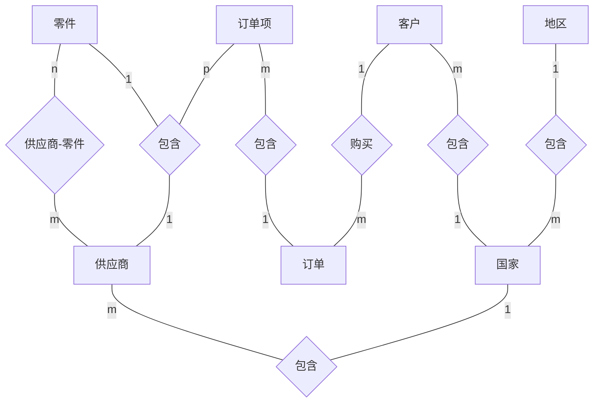

# 数据库系统概论 - 实验

**本文目的**：  
按照《数据库系统概论（第 5 版）习题解析与实验指导》所列实验内容进行实验，记录相关内容，熟悉数据库常用操作。  

**参考资料**：  
《数据库系统概论（第 5 版）》，王珊，萨师煊，高等教育出版社；  
《数据库系统概论（第 5 版）习题解析与实验指导》，王珊，张俊，高等教育出版社。  

**实验环境**：  
OS: ubuntu 16.04 server;  
DBMS: MariaDB  
mysql  Ver 15.1 Distrib 10.0.38-MariaDB, for debian-linux-gnu (x86_64) using readline 5.2  
VM: Virtual Box 6.1.16  
3700X @ 3.6 GHz, 2/8 Cores, 4/32 GB Memory, 512GB SSD M.2/SATA WD  
注：所有性能对比实验只进行实验内对比，不应进行实验间对比（因为环境可能变化）。  

**示例来源**：  
<https://dev.mysql.com/doc/index-other.html>；  
<https://github.com/datacharmer/test_db> (2020.2.12 copy)；  

[toc]

## 0 准备

### 0.1 查询

#### 0.1.1 限制最大查询数

MYSQL:  

- 从雇员表中查询 10 条记录  

```SQL
SELECT * FROM employees LIMIT 10;
```

### 0.2 SQL 语法

#### 0.2.1 反引号、单引号

反引号用于区别保留字，比如将保留字用于属性名。  
单引号用于界定字符串，或者用于单引号的转义字符。

#### 0.2.2 语句分界符

可以使用 DELIMITER 修改分界符，实现在终端中输入过程语句。如：  

```SQL
DELIMITER $$
BEGIN
  ...
END $$
```

#### 0.2.3 SHOW 格式

可以加入 \G 以实现换行打印：  

```SQL
SHOW TRIGGERS \G;
```

### 0.3 MYSQL 配置

#### 0.3.1 关闭缓存

MYSQL 默认缓存是打开的，缓存会影响性能试验，因此需要手动关闭。

```BASH
show variables like '%query_cache%';
```

```BASH
+------------------------------+----------+
| Variable_name                | Value    |
+------------------------------+----------+
| have_query_cache             | YES      |
| query_cache_limit            | 1048576  |
| query_cache_min_res_unit     | 4096     |
| query_cache_size             | 16777216 |
| query_cache_strip_comments   | OFF      |
| query_cache_type             | ON       |
| query_cache_wlock_invalidate | OFF      |
+------------------------------+----------+
```

修改 MYSQL 配置文件，添加配置即可：  

```BASH
[mysqld]
query_cache_size=0
query_cache_type=0
```

#### 0.3.2 远程访问配置

远程访问首先要关闭配置文件中绑定到本地的配置。即注释掉配置文件中的 bind-addresss 所在行  

```BASH
/etc/mysql/mariadb.conf.d/50-server.cnf
# Instead of skip-networking the default is now to listen only on
# localhost which is more compatible and is not less secure.
# bind-address          = 127.0.0.1
```

然后重启 MYSQL 服务，并检查是否处于监听状态：  

```BASH
netstat -anpt
tcp6       0      0 :::3306                 :::*                    LISTEN      -
```

注：测试时，出现了重启服务后仍然只监听本地网络，系统重启后生效的情况。

最后进行权限配置，如：  

```SQL
GRANT ALL ON *.*  TO 'root'@'%' IDENTIFIED BY '123456';
```

## 1 数据库定义与操作语言实验

### 1.1 数据库定义语言

#### 1.1.1 实验目的

理解和掌握数据库 DDL 语言，能够熟练地使用 SQL DDL 语句创建、修改和删除数据库、模式和基本表。

#### 1.1.2 实验内容和要求

理解和掌握 SQL DDL 语句的语法，特别是各种参数的具体含义和使用方法；使用 SQL 语句创建、修改和删除数据库、模式和基本表。掌握 SQL 语句常见语法错误的调试方法。

#### 1.1.3 实验重点和难点

实验重点：创建数据库、基本表。  
实验难点：创建基本表时，为不同的列选择合适的数据类型，正确创建表级和列级完整性约束，如列值是否允许为空、主码和完整性限制等。注意：数据完整性约束可以在创建基本表时定义，也可以先创建表然后定义完整性约束。由于完整性约束的限制，被引用的表要先创建。  

#### 1.1.4 实验内容记录

##### 1.1.4.1 实验内容简述

本实验建立对 employees 数据库的认识，分析各个表的关系和约束，分析表中各个列的语意。

##### 1.1.4.2 数据库结构

数据库名：employees

表 | 含义
:-: | :-:
departments | 部门表
employees | 雇员表
dept_emp | 雇员部门表
dept_manager | 部门经理表
titles | 职位表
salaries | 工资

```SQL
CREATE TABLE employees (
    emp_no      INT             NOT NULL,
    birth_date  DATE            NOT NULL,
    first_name  VARCHAR(14)     NOT NULL,
    last_name   VARCHAR(16)     NOT NULL,
    gender      ENUM ('M','F')  NOT NULL,    
    hire_date   DATE            NOT NULL,
    PRIMARY KEY (emp_no)
);

CREATE TABLE departments (
    dept_no     CHAR(4)         NOT NULL,
    dept_name   VARCHAR(40)     NOT NULL,
    PRIMARY KEY (dept_no),
    UNIQUE  KEY (dept_name)
);

CREATE TABLE dept_manager (
   emp_no       INT             NOT NULL,
   dept_no      CHAR(4)         NOT NULL,
   from_date    DATE            NOT NULL,
   to_date      DATE            NOT NULL,
   FOREIGN KEY (emp_no)  REFERENCES employees (emp_no)    ON DELETE CASCADE,
   FOREIGN KEY (dept_no) REFERENCES departments (dept_no) ON DELETE CASCADE,
   PRIMARY KEY (emp_no,dept_no)
); 

CREATE TABLE dept_emp (
    emp_no      INT             NOT NULL,
    dept_no     CHAR(4)         NOT NULL,
    from_date   DATE            NOT NULL,
    to_date     DATE            NOT NULL,
    FOREIGN KEY (emp_no)  REFERENCES employees   (emp_no)  ON DELETE CASCADE,
    FOREIGN KEY (dept_no) REFERENCES departments (dept_no) ON DELETE CASCADE,
    PRIMARY KEY (emp_no,dept_no)
);

CREATE TABLE titles (
    emp_no      INT             NOT NULL,
    title       VARCHAR(50)     NOT NULL,
    from_date   DATE            NOT NULL,
    to_date     DATE,
    FOREIGN KEY (emp_no) REFERENCES employees (emp_no) ON DELETE CASCADE,
    PRIMARY KEY (emp_no,title, from_date)
); 

CREATE TABLE salaries (
    emp_no      INT             NOT NULL,
    salary      INT             NOT NULL,
    from_date   DATE            NOT NULL,
    to_date     DATE            NOT NULL,
    FOREIGN KEY (emp_no) REFERENCES employees (emp_no) ON DELETE CASCADE,
    PRIMARY KEY (emp_no, from_date)
); 
```

#### 1.1.5 思考

- SQL 语法规定，双引号括定的符号串为对象名称，单引号括定的符号串为常量字符串，那么什么情况下需要用双引号来界定对象名呢？请实验验证。

- 数据库对象的完整引用是“服务器名.数据库名.模式名.对象名”，但通常可以省略服务器名和数据库名，甚至模式名，直接用对象名访问对象即可。请设计相应的实验验证基本表及其列的访问方法。

### 1.2 数据基本查询实验

#### 1.2.1 实验目的

掌握 SQL 程序设计基本规范，熟练运用 SQL 语言实现数据基本查询，包括单表查询、分组统计查询和连接查询。

#### 1.2.2 实验内容和要求

针对 TPC-H 数据库设计各种表单查询 SQL 语句、分组统计查询语句；设计单个表针对自身的连接查询，设计多个表的连接查询。理解和掌握 SQL 查询语句各个字句的特点和作用，按照 SQL 程序设计规范写出具体的 SQL 查询语句，并调试通过。  
说明：简单地说，SQL 程序设计规范包含 SQL 关键字大写、表名、属性名、存储过程名等标识符大小写混合、SQL 程序书写缩紧排列等变成规范。

#### 1.2.3 实验重点和难点

实验重点：分组统计查询、单表自身连接查询、多表连接查询。  
实验难点：区分元组过滤条件和分组过滤条件；确定连接属性，正确设计连接条件。

#### 1.2.4 实验内容记录

##### 1.2.4.1 单表查询（查询）

- 查询部门信息。

```SQL
SELECT dept_no, dept_name 
FROM departments;
```

##### 1.2.4.2 单表查询（选择）

- 查询雇佣日期为 1990-01-01 的所有男性员工信息。  

```SQL
SELECT * 
FROM employees
WHERE hire_date='1990-01-01' 
  AND gender='M';
```

##### 1.2.4.3 不带分组过滤条件的分组统计查询

- 查询所有员工的工资总额。

```SQL
SELECT emp_no, SUM(salary)
FROM salaries
GROUP BY emp_no;
```

##### 1.2.4.4 带分组过滤条件的分组统计查询

- 查询工资总额不低于 100 万的所有员工的工资总额。

```SQL
SELECT emp_no, SUM(salary)
FROM salaries
GROUP BY emp_no
HAVING SUM(salary) >= 1000000;
```

##### 1.2.4.5 两表连接查询（普通连接）

- 查询所有 1990 年入职的员工职位。

```SQL
SELECT DISTINCT e.emp_no, first_name, last_name, hire_date, title
FROM employees e, titles t
WHERE e.emp_no=t.emp_no 
  AND hire_date
    BETWEEN '1990-01-01'
    AND '1990-12-31';
```

#### 1.2.5 思考

- 不在 GROUP BY 子句中出现的属性，是否可以出现在 SELECT 子句中？请举例并上机验证。

析：  
GROUP BY 用于按相同属性分组，用来细化聚集函数的作用对象。使用 GROUP BY 子句后，查询结果集中每个分组只有一个元组，因此对于没有出现在 GROUP BY 子句中的属性，在 SELECT 子句中出现会出现问题。举例如：  

查询所有员工的总工资  

```SQL
SELECT emp_no, SUM(salary), salary
FROM salaries
GROUP BY emp_no;
```

```BASH
+--------+-------------+--------+
| emp_no | SUM(salary) | salary |
+--------+-------------+--------+
|  10001 |     1281612 |  60117 |
|  10002 |      413127 |  65828 |
|  10003 |      301212 |  40006 |
|  10004 |      904196 |  40054 |
|  10005 |     1134585 |  78228 |
|  10006 |      606179 |  40000 |
```

对于没有出现在 GROUP　BY 中的属性，MYSQL 选取了分组中的第一个元组值（尽管没有实际意义）。

- 请举例说明分组统计查询中 WHERE 和 HAVING 有何区别？

两者区别在于作用对象不同，WHERE 作用于基本表或视图，HAVING 作用于组。举例如：  

```SQL
SELECT emp_no, SUM(salary)
FROM salaries
GROUP BY emp_no
HAVING SUM(salary)>1000000;
```

```BASH
+--------+-------------+
| emp_no | SUM(salary) |
+--------+-------------+
|  10001 |     1281612 |
|  10005 |     1134585 |
|  10009 |     1409122 |
|  10018 |     1098241 |
|  10021 |     1029743 |
|  10050 |     1067848 |
```

```SQL
SELECT emp_no, SUM(salary)
FROM salaries
WHERE SUM(salary)>1000000
GROUP BY emp_no;
```

```BASH
ERROR 1111 (HY000): Invalid use of group function
```

**WHERE 子句中不能使用聚集函数作为条件表达式**。

- 连接查询速度是影响关系数据库性能的关键因素。请讨论如何提高连接查询速度，并进行实验验证。

连接操作中最慢的是嵌套循环算法，如果有序，或者有索引，则可以进行优化。  
如果连接条件只有等值比较，则容易优化（有序双指针比较）；  
如果连接条件能够建立索引，且事先已建立索引，则容易优化；  

举例：  

查询在 1992-01-01 入职的员工及其所在部门信息。

```SQL
SELECT COUNT(*) FROM (
  SELECT e.emp_no, d.dept_name, e.hire_date
  FROM employees e, dept_emp de, departments d
  WHERE e.emp_no=de.emp_no
  AND de.dept_no=d.dept_no
  AND e.hire_date='1992-01-01'
) AS C;
```

```BASH
+----------+
| COUNT(*) |
+----------+
|      278 |
+----------+
1 row in set (0.26 sec)
```

```SQL
SELECT COUNT(*) FROM (
  SELECT e.emp_no, d.dept_name, e.hire_date
  FROM employees e, dept_emp de, departments d
  WHERE e.emp_no=de.emp_no
  AND de.dept_no=d.dept_no
  AND e.first_name='Georgi'
) AS C;
```

```BASH
+----------+
| COUNT(*) |
+----------+
|      278 |
+----------+
1 row in set (0.27 sec)
```

```SQL
SELECT COUNT(*) FROM (
  SELECT e.emp_no, d.dept_name, e.hire_date
  FROM employees e, dept_emp de, departments d
  WHERE e.emp_no=de.emp_no
  AND de.dept_no=d.dept_no
  AND d.dept_name='Finance'
) AS C;
```

```BASH
+----------+
| COUNT(*) |
+----------+
|    17346 |
+----------+
1 row in set (0.02 sec)
```

可以看出，对于存在 UNIQUE 完整性限制的属性，连接速度提升非常大。

### 1.3 数据高级查询实验

#### 1.3.1 实验目的

掌握 SQL 嵌套查询和集合查询等各种高级查询的设计方法等。

#### 1.3.2 实验内容和要求

针对 TPC-H 数据库，正确分析用户查询要求，设计各种嵌套查询和集合查询。

#### 1.3.3 实验重点和难点

实验重点：嵌套查询。  
实验难点：相关子查询、多层 EXIST 嵌套查询。  

#### 1.3.4 实验内容记录

##### 1.3.4.1 IN 嵌套查询

- 查询财务部门经理的工资记录。

```SQL
SELECT s.emp_no, first_name, last_name, salary, 
  s.from_date, s.to_date
FROM salaries s, employees e
WHERE s.emp_no=e.emp_no
AND s.emp_no IN (
    SELECT dm.emp_no
    FROM dept_manager dm, departments d
    WHERE d.dept_name='Finance'
    AND d.dept_no=dm.dept_no
);
```

##### 1.3.4.2 单层 EXISTS 嵌套查询

注：带 EXISTS 谓词的子查询不一定能被其它形式的子查询等价替换。

- 统计（曾经）在财务部门的员工数量。

使用 EXISTS 谓词可以理解为找出这样的员工，该员工存在部门为财务的元组。

```SQL
SELECT COUNT(DISTINCT de.emp_no)
FROM dept_emp de
WHERE EXISTS (
  SELECT *
  FROM departments d
  WHERE d.dept_name='Finance'
  AND d.dept_no=de.dept_no
);
```

如果用两表连接查询，可以实现相似的语义（语义存在细微区别，前者是存在语义，后者是计数语义）。

```SQL
SELECT COUNT(DISTINCT de.emp_no)
FROM dept_emp de, departments d
WHERE de.dept_no=d.dept_no
AND d.dept_name='Finance';
```

##### 1.3.4.3 两层 EXISTS 嵌套查询

注意：SQL 查询的结果是一个集合，实际上就是一层全称谓词。如果给出的条件中再出现全称谓词，则可以转换为存在谓词进行查询。

注意：嵌套查询如果进行了相关查询，则实际上就是一个外层和内层进行笛卡尔积然后对结果集合进行筛选（嵌套内层进行筛选）的过程。

- 查询（曾经）在所有部门待过的员工。

转换为，不存在这样的部门，员工没有待过。

```SQL
SELECT emp_no
FROM employees e
WHERE NOT EXISTS (
  SELECT *
  FROM departments d
  WHERE NOT EXISTS (
    SELECT *
    FROM dept_emp de
    WHERE d.dept_no=de.dept_no
    AND e.emp_no=de.emp_no
  )
);
```

##### 1.3.4.4 FROM 子句中的嵌套查询

FROM 子句中进行嵌套是将嵌套块生成临时表进行查询。

- 统计所有员工的平均总工资。

首先需要一张员工的总工资表，然后根据总工资表进行平均数计算。

```SQL
SELECT SUM(total_salary)/COUNT(DISTINCT total_emp_no) avg
FROM (
  SELECT emp_no total_emp_no, SUM(salary) total_salary
  FROM salaries
  GROUP BY emp_no
)
AS total;
```

```BASH
+-------------+
| avg         |
+-------------+
| 604887.4671 |
+-------------+
```

##### 1.3.4.5 集合查询（交、并、差）

与集合运算的要求一致，集合查询时进行集合运算的集合必须具有相同的列数以及对应有相同的数据类型。

- 统计财务（Finance）部门和销售（Sales）部门的历史员工数。

```SQL
SELECT COUNT(DISTINCT emp_no)
FROM dept_emp de, departments d
WHERE de.dept_no=d.dept_no
AND d.dept_name IN ('Finance')
UNION
SELECT COUNT(DISTINCT emp_no)
FROM dept_emp de, departments d
WHERE de.dept_no=d.dept_no
AND d.dept_name IN ('Sales');
```

```BASH
+------------------------+
| COUNT(DISTINCT emp_no) |
+------------------------+
|                  17346 |
|                  52245 |
+------------------------+
```

- 查询在财务（Finance）部门和销售（Sales）部门都工作过的员工。

**注：MYSQL 目前不支持交运算**。

```SQL
SELECT DISTINCT de.emp_no
FROM dept_emp de, departments d
WHERE de.dept_no=d.dept_no
AND d.dept_name='Finance'
INTERSECT
SELECT DISTINCT de.emp_no
FROM dept_emp de, departments d
WHERE de.dept_no=d.dept_no
AND d.dept_name='Sales';
```

#### 1.3.5 思考

- 试分析什么类型的查询可以用连接查询实现，什么类型的查询只能用嵌套查询实现？

连接查询在算法实现上，一定可以通过嵌套循环实现，因此连接查询一定能被嵌套查询等价替换。由于嵌套查询在嵌套条件上提供了一些语义，因此嵌套查询不一定能被转换为连接查询。  
从语义上看，连接查询首先是对两个表进行笛卡尔积运算（不带条件的），然后对得到的元组集合进行条件筛选，因此连接查询适用于需要将多个表的属性关联起来的查询需求。嵌套查询则是外层表和内层表进行嵌套罗列，嵌套时可以使用 IN、ANY、ALL、EXISTS 谓词。这些谓词的使用使得嵌套查询语义不一定能被连接查询实现。  
连接查询在算法实现上不一定需要通过嵌套循环实现，因此效率往往高于嵌套查询。如：  

统计在财务（Finance）部门的员工人数。  

```SQL
SELECT COUNT(e.emp_no)
FROM employees e, dept_emp de, departments d
WHERE e.emp_no=de.emp_no
AND de.dept_no=d.dept_no
AND d.dept_name='Finance';
```

```BASH
+-----------------+
| COUNT(e.emp_no) |
+-----------------+
|           17346 |
+-----------------+
1 row in set (0.02 sec)
```

```SQL
SELECT COUNT(e.emp_no)
FROM employees e
WHERE EXISTS (
  SELECT *
  FROM dept_emp de
  WHERE EXISTS (
    SELECT *
    FROM departments d
    WHERE e.emp_no=de.emp_no
    AND de.dept_no=d.dept_no
    AND d.dept_name='Finance' 
  )
);
```

```BASH
+-----------------+
| COUNT(e.emp_no) |
+-----------------+
|           17346 |
+-----------------+
1 row in set (0.40 sec)
```

可以看出来，三个表的连接查询相比三个表的嵌套查询在速度上要快很多。

- 试分析不相关子查询和相关子查询的区别。

两者区别在于子查询是否引用外层查询的属性。若不引用，则两个查询完全隔离，相当于是两个独立的查询。  
从实现上看，相关子查询由于存在相关引用，因此子查询被执行多次，而不相关子查询由于是一个独立的查询，因此只执行一次。  

### 1.4 数据更新实验

#### 1.4.1 实验目的

熟悉数据库的数据更新操作，能够使用 SQL 语句对数据库进行数据的插入、修改、删除操作。

#### 1.4.2 实验内容和要求

针对 employees 数据库设计单元组插入、批量修改插入、修改数据和删除数据等 SQL 语句。理解和掌握 INSERT、UPDATE 和 DELETE 语法结构的各个组成成分，结合嵌套 SQL 子查询，分别设计几种不同形式的插入、修改和删除的语句，并调试成功。

#### 1.4.3 实验重点和难点

实验重点：插入、修改和删除数据的 SQL。  
实验难点：与嵌套 SQL 子查询相结合的插入、修改和删除数据的 SQL 语句；利用一个表的数据来插入、修改和删除另外一个表的数据。

#### 1.4.4 实验内容记录

##### 1.4.4.1 INSERT 基本语句

插入一条雇员记录。  

```SQL
INSERT INTO employees
VALUES(500000,'1990-05-06','San','Zhang','M','2010-09-05');
```

```SQL
INSERT INTO employees(emp_no,birth_date,first_name,last_name,gender,hire_date)
VALUES(500000,'1990-05-06','San','Zhang','M','2010-09-05');
```

##### 1.4.4.2 批量数据 INSERT 语句

- 创建一个男员工表和女员工表，并将所有男员工插入到男员工表，将所有女员工插入到女员工表。  

先创建两张表。  

```SQL
CREATE TABLE employees_female 
AS SELECT * 
FROM employees
WHERE 1=2;
```

```SQL
CREATE TABLE employees_male
AS SELECT *
FROM employees
WHERE 1=2;
```

注：这里的条件永不满足，用来复制表模式，而不复制任何数据。

然后将数据录入两张表。  

```SQL
INSERT INTO employees_female
SELECT e.*
FROM employees e
WHERE e.gender='F';
```

```SQL
INSERT INTO employees_male
SELECT e.*
FROM employees e
WHERE e.gender='M';
```

- 创建一个部门员工人数统计表，并统计所有部门的历史员工人数。  

先创建表。

```SQL
CREATE TABLE dept_emp_count(
  dept_no CHAR(4),
  emp_count INT);
```

然后批量录入数据。

```SQL
INSERT INTO dept_emp_count
SELECT de.dept_no, COUNT(DISTINCT emp_no)
FROM dept_emp de
GROUP BY de.dept_no;
```

##### 1.4.4.3 UPDATE 语句（修改部分记录的部分列值）

- 将所有 1985 年及以前入职，职位为 Assistant Engineer 的员工的职位修改为 Engineer 。  

```SQL
UPDATE titles t
SET t.title='Engineer'
WHERE t.emp_no IN (
  SELECT e.emp_no
  FROM employees e
  WHERE e.hire_date < '1986-01-01'
)
AND t.title='Assistant Engineer';
```

##### 1.4.4.4 UPDATE 语句（利用一个表的数据更新另一个表的数据）

- 更新部门员工人数统计表（假设表已经存在）。  

```SQL
UPDATE dept_emp_count decount
SET decount.emp_count = (
  SELECT COUNT(DISTINCT de.emp_no)
  FROM dept_emp de
  WHERE de.dept_no=decount.dept_no
);
```

##### 1.4.4.5 DELETE 基本语句（删除给定条件的所有记录）

- 删除 2000 年以前的工资记录。  

```SQL
DELETE FROM salaries
WHERE from_date < '2000-01-01'
AND to_date < '2000-01-01';
```

#### 1.4.5 思考

- 请分析数据库模式更新和数据更新 SQL 语句的异同。

两者的关键字不同，更新模式使用 ALTER TABLE ，更新数据使用 UPDATE 。

- 请分析数据库系统除了 INSERT、UPDATE 和 DELETE 等基本的数据更新语句之外，还有哪些可以用来更新数据库基本表数据的 SQL 语句？

如 truncate 。

### 1.5 视图实验

#### 1.5.1 实验目的

熟悉 SQL 语言有关视图的操作，能够熟练使用 SQL 语句来创建需要的视图，定义数据库外模式，并能使用所创建的视图实现数据管理。

#### 1.5.2 实验内容和要求

针对给定的数据库模式，以及相应的应用需求，创建视图和带 WITH CHECK OPTION 的视图，并验证 WITH CHECK OPTION 选项的有效性。理解和掌握视图消解执行原理，掌握可更新视图和不可更新视图的区别。

#### 1.5.3 实验重点和难点

实验重点：创建视图。  
实验难点：可更新的视图和不可更新的视图之区别，WITH CHECK OPTION 的验证。  

#### 1.5.4 实验内容记录

##### 1.5.4.1 创建视图（省略视图列名）

- 创建男性员工视图。  

```SQL
CREATE VIEW v_emploree_male AS
SELECT *
FROM employees e
WHERE e.gender='M';
```

##### 1.5.4.2 创建视图（不能省略列名的情况）

如果目标列不是单纯的属性名（如聚集函数或表达式），则应该给出列名。  

- 创建部门历史员工总数的视图。  

```SQL
CREATE VIEW v_dept_emp_num(dept_no, emp_count) AS
SELECT dept_no, COUNT(DISTINCT emp_no)
FROM dept_emp
GROUP BY dept_no;
```

##### 1.5.4.3 创建视图（WITH CHECK OPTION）

WITH CHECK OPTION 使得在对视图进行操作时，会验证操作是否符合视图的条件。  

例如，对男性员工视图进行插入操作，插入一个女员工信息：  

```SQL
INSERT INTO
v_emploree_male
VALUES(500000,'1990-05-06','San','Zhang','F','2010-09-05');
```

由男性员工视图没有 WITH CHECK OPTION 语句，因此插入成功，这使得视图的封装性被破坏。  
加入选项：  

```SQL
CREATE VIEW v_emploree_male_check AS
SELECT *
FROM employees e
WHERE e.gender='M'
WITH CHECK OPTION;
```

再执行插入：  

```SQL
INSERT INTO
v_emploree_male_check
VALUES(500000,'1990-05-06','San','Zhang','F','2010-09-05');
```

会得到错误：  

```BASH
ERROR 1369 (HY000): CHECK OPTION failed 'employees.v_emploree_male_check'
```

##### 1.5.4.4 不可更新视图

如果为行列子集视图，则一定是可以更新的（如男性员工视图）。  
如果不是，则不一定可以更新，如属性为聚集函数或表达式（如部门员工总数视图）。  

- 尝试修改财务（Finance）部门员工总数为 0 并观察报错。  

```SQL
UPDATE v_dept_emp_num vden
SET emp_count=0
WHERE vden.dept_no=(
  SELECT d.dept_no
  FROM departments
  WHERE d.dept_name='Finance'
);
```

得到报错：  

```BASH
ERROR 1288 (HY000): The target table vden of the UPDATE is not updatable
```

##### 1.5.4.5 删除视图

删除未被引用的视图，直接删除即可。

- 删除部门员工总数视图和男性员工视图。  

```SQL
DROP VIEW v_dept_emp_num;
DROP VIEW v_emploree_male;
```

删除视图时 CASCADE 语句的作用：  

先建立两个视图：  

```SQL
CREATE VIEW v_e_1 AS
SELECT emp_no,birth_date,gender
FROM employees;
CREATE VIEW v_e_2 AS
SELECT emp_no,gender
FROM v_e_1;
```

直接删除 v_e_1，

```SQL
DROP VIEW v_e_1;
```

对于 MYSQL ，删除成功，但是会引起 v_e_2 查询报错。

```BASH
ERROR 1356 (HY000): View 'employees.v_e_2' references invalid table(s) or column(s) or function(s) or definer/invoker of view lack rights to use them
```

不论使用 RESTRICT 短语还是 CASCADE 短语结果都是一样。

#### 1.5.5 思考

- 请分析视图和基本表在使用方面有哪些异同，并设计相应的例子加以验证。

视图的数据来源于最原始的基本表，也即视图本身不存放数据。  
视图不一定都是可以修改的。  

- 请具体分析修改基本表的结构对相应的视图会产生何种影响？

修改基本表后，可能导致视图不能正常工作。

先创建一个测试表：  

```SQL
CREATE TABLE d1
SELECT * FROM departments;
```

并创建基于测试表的一个视图：  

```SQL
CREATE VIEW v_d1 AS
SELECT * FROM d1;
```

然后调整测试表的结构，这里先尝试调整列的数据类型：  

```SQL
ALTER TABLE d1
MODIFY COLUMN dept_no INT;
```

调整会触发警告，数据变为 0 。相应的视图也会同步改变。

如果删除一列：  

```SQL
ALTER TABLE d1
DROP COLUMN dept_name;
```

此时查询视图会报告错误。

### 1.6 索引实验

#### 1.6.1 实验目的

掌握索引设计原则和技巧，能够创建合适的索引以提高数据库查询、统计分析效率。

#### 1.6.2 实验内容和要求

针对给定的数据库模式和具体应用需求，创建唯一索引、函数索引、复合索引等；修改索引；删除索引。设计相应的 SQL 查询验证索引有效性。学习利用 EXPLAIN 命令分析 SQL 查询是否使用了所创建的索引，并能够分析其原因，执行 SQL 查询并估算索引提高查询效率的百分比。要求实验数据集达到 10 万条记录以上的数据量，以便验证索引效果。

#### 1.6.3 实验重点和难点

实验重点：创建索引。  
实验难点：设计 SQL 查询验证索引有效性。  

#### 1.6.4 实验内容记录

##### 1.6.4.1 创建唯一索引

- 对员工表的员工号码建立唯一索引

```SQL
CREATE UNIQUE INDEX idx_emp_no
ON employees (emp_no);
```

注：主码列在创建表时会自动创建相应的索引。  
注：在存在数据时，建立索引需要一定的时间。  

##### 1.6.4.2 创建复合索引

- 对员工表的名字建立复合索引

```SQL
CREATE INDEX idx_name
ON employees (first_name, last_name);
```

##### 1.6.4.3 创建长度函数索引

MYSQL 函数索引暂不录入。

##### 1.6.4.4 创建聚簇索引

MYSQL Innodb 不支持单独建立聚簇索引。在此不列出。

##### 1.6.4.5 创建 HASH 索引

- 对员工的雇佣日期创建 HASH 索引

```SQL
CREATE INDEX idx_hash_hiredate
USING HASH
ON employees (hire_date);
```

注：MYSQL 创建 HASH 索引的语法和书中给出的语法稍有不同。

##### 1.6.4.6 修改索引名称

注：修改索引名称通过先删除再添加实现。

##### 1.6.4.7 查询表上的已有索引

- 查询员工表上的已有索引

```SQL
SHOW INDEX FROM employees;
```

```BASH
MariaDB [employees]> SHOW INDEX FROM employees;
+-----------+------------+-------------------+--------------+-------------+-----------+-------------+----------+--------+------+------------+---------+---------------+
| Table     | Non_unique | Key_name          | Seq_in_index | Column_name | Collation | Cardinality | Sub_part | Packed | Null | Index_type | Comment | Index_comment |
+-----------+------------+-------------------+--------------+-------------+-----------+-------------+----------+--------+------+------------+---------+---------------+
| employees |          0 | PRIMARY           |            1 | emp_no      | A         |      299290 |     NULL | NULL   |      | BTREE      |         |               |
| employees |          0 | idx_emp_no        |            1 | emp_no      | A         |      299290 |     NULL | NULL   |      | BTREE      |         |               |
| employees |          1 | idx_name          |            1 | first_name  | A         |        2672 |     NULL | NULL   |      | BTREE      |         |               |
| employees |          1 | idx_name          |            2 | last_name   | A         |      299290 |     NULL | NULL   |      | BTREE      |         |               |
| employees |          1 | idx_hash_hiredate |            1 | hire_date   | A         |       10688 |     NULL | NULL   |      | BTREE      |         |               |
+-----------+------------+-------------------+--------------+-------------+-----------+-------------+----------+--------+------+------------+---------+---------------+
```

##### 1.6.4.8 分析某个 SQL 语句执行时是否使用了索引

- 分析从员工表上查询某个日期雇佣的员工是否使用了索引。  

```SQL
EXPLAIN SELECT * 
FROM employees 
WHERE hire_date='1990-01-01';
```

得到结果如下：  

```BASH
MariaDB [employees]> EXPLAIN SELECT *  FROM employees  WHERE hire_date='1990-01-01';
+------+-------------+-----------+------+-------------------+-------------------+---------+-------+------+-------+
| id   | select_type | table     | type | possible_keys     | key               | key_len | ref   | rows | Extra |
+------+-------------+-----------+------+-------------------+-------------------+---------+-------+------+-------+
|    1 | SIMPLE      | employees | ref  | idx_hash_hiredate | idx_hash_hiredate | 3       | const |   65 |       |
+------+-------------+-----------+------+-------------------+-------------------+---------+-------+------+-------+
1 row in set (0.00 sec)
```

##### 1.6.4.9 验证索引效率

首先验证复合索引，在有索引的情况下，统计指定名字的员工数目。  

```SQL
SELECT COUNT(*)
FROM employees
WHERE first_name='Georgi'
AND last_name='Facello';
```

得到结果为：  

```BASH
+----------+
| COUNT(*) |
+----------+
|        2 |
+----------+
1 row in set (0.00 sec)
```

然后去掉复合索引，再次执行，结果为：  

```BASH
+----------+
| COUNT(*) |
+----------+
|        2 |
+----------+
1 row in set (0.06 sec)
```

结果显示复合索引提高了查询效率。

然后验证哈希索引，在有索引的情况下，统计指定雇佣日期的员工数目。

```SQL
SELECT COUNT(*)
FROM employees
WHERE hire_date='1990-01-01';
```

结果为：  

```BASH
+----------+
| COUNT(*) |
+----------+
|       65 |
+----------+
1 row in set (0.00 sec)
```

去掉索引，然后在查询，结果为：  

```BASH
+----------+
| COUNT(*) |
+----------+
|       65 |
+----------+
1 row in set (0.06 sec)
```

结果显示哈希索引提高了查询效率。

#### 1.6.5 思考

- 在一个表的多个字段上创建的复合索引，与在相应的每个字段上创建的多个简单索引有何异同？请设计相应的例子加以验证。

可以直接创建两个在名字上的简单索引然后测试即可。  

```SQL
CREATE INDEX idx_first_name
ON employees(first_name);
CREATE INDEX idx_last_name
ON employees(last_name);
```

```SQL
EXPLAIN
SELECT COUNT(*)
FROM employees
WHERE first_name='Georgi'
AND last_name='Facello';
```

执行结果为：  

```BASH
+------+-------------+-----------+-------------+------------------------------+------------------------------+---------+------+------+-------------------------------------------------------------------------+
| id   | select_type | table     | type        | possible_keys                | key                          | key_len | ref  | rows | Extra                                                                   |
+------+-------------+-----------+-------------+------------------------------+------------------------------+---------+------+------+-------------------------------------------------------------------------+
|    1 | SIMPLE      | employees | index_merge | idx_first_name,idx_last_name | idx_last_name,idx_first_name | 66,58   | NULL |    1 | Using intersect(idx_last_name,idx_first_name); Using where; Using index |
+------+-------------+-----------+-------------+------------------------------+------------------------------+---------+------+------+-------------------------------------------------------------------------+
1 row in set (0.00 sec)
```

也即 MYSQL 内部和执行了对多个单列索引合并为一个复合索引的优化，此时效率不受影响。  
对于已定义的复合索引，从最左侧开始的列是可用的，例如：  

```BASH
EXPLAIN SELECT COUNT(*) FROM employees WHERE last_name='Facello';
+------+-------------+-----------+-------+---------------+----------+---------+------+--------+--------------------------+
| id   | select_type | table     | type  | possible_keys | key      | key_len | ref  | rows   | Extra                    |
+------+-------------+-----------+-------+---------------+----------+---------+------+--------+--------------------------+
|    1 | SIMPLE      | employees | index | NULL          | idx_name | 124     | NULL | 299290 | Using where; Using index |
+------+-------------+-----------+-------+---------------+----------+---------+------+--------+--------------------------+
```

这里在已定义了复合索引的情况下只查询第二个条件，发现索引没有被采用，而是进行了全表扫描。

## 2 安全性语言实验

### 2.1 自主存取控制实验

#### 2.1.1 实验目的

掌握自主存取控制权限的定义和维护方法。

#### 2.1.2 实验内容和要求

定义用户、角色，分配权限给用户、角色，回收权限，以相应的用户名登陆数据库验证权限分配是否正确。选择一个应用场景，使用自主存取控制机制设计权限分配。可以采用两种方案。  
方案一：采用 SYSTEM 超级用户登录数据库（对于 MYSQL(Linux) 则是 root），完成所有权限分配工作，然后用相应用户名登陆数据库以验证权限分配正确性；  
方案二：采用 SYSTEM 用户登陆数据库创建三个部门经理用户，并分配相应的权限，然后分别用三个经理用户名登陆数据库，创建相应部门的 USER、ROLE ，并分配相应权限。

#### 2.1.3 实验重点和难点

实验重点：定义角色，分配权限和回收权限。  
实验难点：实验方案二实现权限的再分配和回收。

#### 2.1.4 实验内容记录

本次实验中，为财务部（finance）创建一个管理员，部门的管理员只有管理自己部门内部的员工的权限以及访问部门表（departments）、部门管理员表（dept_manager）的权限。

注：为了减少工作量，只为财务部门创建相关用户。其它部门的操作可以类比。

##### 2.1.4.1 建立视图

数据库基本表没有区分不同的部门，因此通过视图来划分不同部门的员工。

先创建员工所在部门视图：  

```SQL
CREATE VIEW v_emp_dept(emp_no, dept_no, dept_name) AS
SELECT de.emp_no, d.dept_no, d.dept_name
FROM dept_emp de, departments d
WHERE de.dept_no=d.dept_no;
```

然后为各个表创建部门视图：

```SQL
CREATE VIEW v_finance_employees AS
SELECT e.*
FROM employees e, v_emp_dept ved
WHERE e.emp_no=ved.emp_no
AND ved.dept_name='Finance'
WITH CHECK OPTION;
```

```SQL
CREATE VIEW v_finance_salaries AS
SELECT s.*
FROM salaries s, v_emp_dept ved
WHERE s.emp_no=ved.emp_no
AND ved.dept_name='Finance'
WITH CHECK OPTION;
```

```SQL
CREATE VIEW v_finance_dept_emp AS
SELECT de.*
FROM dept_emp de, v_emp_dept ved
WHERE de.emp_no=ved.emp_no
AND ved.dept_name='Finance'
WITH CHECK OPTION;
```

```SQL
CREATE VIEW v_finance_titles AS
SELECT t.*
FROM titles t, v_emp_dept ved
WHERE t.emp_no=ved.emp_no
AND ved.dept_name='Finance'
WITH CHECK OPTION;
```

##### 2.1.4.2 建立角色

为财务部门建立一个经理角色（完全控制本部门数据，同时能查询其它部门的数据，能够为本部门职员分配权限），一个职员角色（可以插入和查询本部门数据）。

```SQL
CREATE ROLE 
  role_finance_manager,
  role_finance_staff;
```

为角色分配权限。

注：MYSQL 只有 WITH GRANT OPTION，并且行为是非级联权限收回。

先分配部门经理角色对本部门表的权限。

```SQL
GRANT ALL 
ON emplorees.v_finance_emplorees
TO role_finance_manager
WITH GRANT OPTION;
```

```SQL
GRANT ALL 
ON emplorees.v_finance_salaries
TO role_finance_manager
WITH GRANT OPTION;
```

```SQL
GRANT ALL 
ON emplorees.v_finance_dept_emp
TO role_finance_manager
WITH GRANT OPTION;
```

```SQL
GRANT ALL 
ON emplorees.v_finance_titles
TO role_finance_manager
WITH GRANT OPTION;
```

分配部门经理对其它部门表的查询权限。  

```SQL
GRANT SELECT
ON employees.*
TO role_finance_manager;
```

分配员工对本部门的权限。  

```SQL
GRANT SELECT, INSERT
ON employees.v_finance_employees
TO role_finance_staff;
```

```SQL
GRANT SELECT, INSERT
ON employees.v_finance_salaries
TO role_finance_staff;
```

```SQL
GRANT SELECT, INSERT
ON employees.v_finance_dept_emp
TO role_finance_staff;
```

```SQL
GRANT SELECT, INSERT
ON employees.v_finance_titles
TO role_finance_staff;
```

##### 2.1.4.3 建立用户

为财务部门建立一个经理用户和一个职员用户。

```SQL
CREATE USER user_manager
IDENTIFIED BY '123456';
```

```SQL
CREATE USER user_staff
IDENTIFIED BY '123456';
```

将角色赋予用户。  

```SQL
GRANT role_finance_manager
TO user_manager;
```

```SQL
GRANT role_finance_staff
TO user_staff;
```

##### 2.1.4.4 查询角色和用户的权限

查询权限使用 SHOW GRANTS 。

查询角色的权限。  

```SQL
SHOW GRANTS FOR role_finance_manager;
```

```BASH
MariaDB [employees]> SHOW GRANTS FOR role_finance_manager;
+-------------------------------------------------------------------------------------------------------+
| Grants for role_finance_manager                                                                       |
+-------------------------------------------------------------------------------------------------------+
| GRANT USAGE ON *.* TO 'role_finance_manager'                                                          |
| GRANT SELECT ON `employees`.* TO 'role_finance_manager'                                               |
| GRANT ALL PRIVILEGES ON `emplorees`.`v_finance_titles` TO 'role_finance_manager' WITH GRANT OPTION    |
| GRANT ALL PRIVILEGES ON `emplorees`.`v_finance_emplorees` TO 'role_finance_manager' WITH GRANT OPTION |
| GRANT ALL PRIVILEGES ON `emplorees`.`v_finance_dept_emp` TO 'role_finance_manager' WITH GRANT OPTION  |
| GRANT ALL PRIVILEGES ON `emplorees`.`v_finance_salaries` TO 'role_finance_manager' WITH GRANT OPTION  |
+-------------------------------------------------------------------------------------------------------+
```

```SQL
SHOW GRANTS FOR role_finance_staff;
```

```BASH
MariaDB [employees]> SHOW GRANTS FOR role_finance_staff;
+-----------------------------------------------------------------------------------+
| Grants for role_finance_staff                                                     |
+-----------------------------------------------------------------------------------+
| GRANT USAGE ON *.* TO 'role_finance_staff'                                        |
| GRANT SELECT, INSERT ON `employees`.`v_finance_salaries` TO 'role_finance_staff'  |
| GRANT SELECT, INSERT ON `employees`.`v_finance_titles` TO 'role_finance_staff'    |
| GRANT SELECT, INSERT ON `employees`.`v_finance_employees` TO 'role_finance_staff' |
| GRANT SELECT, INSERT ON `employees`.`v_finance_dept_emp` TO 'role_finance_staff'  |
+-----------------------------------------------------------------------------------+
```

查询用户的权限。  

```SQL
SHOW GRANTS FOR user_manager;
```

```BASH
MariaDB [employees]> SHOW GRANTS FOR user_manager;
+-------------------------------------------------------------------------------------------------------------+
| Grants for user_manager@%                                                                                   |
+-------------------------------------------------------------------------------------------------------------+
| GRANT role_finance_manager TO 'user_manager'@'%'                                                            |
| GRANT USAGE ON *.* TO 'user_manager'@'%' IDENTIFIED BY PASSWORD '*6BB4837EB74329105EE4568DDA7DC67ED2CA2AD9' |
+-------------------------------------------------------------------------------------------------------------+
```

```SQL
SHOW GRANTS FOR user_staff;
```

```BASH
MariaDB [(none)]> SHOW GRANTS FOR user_staff;
+-----------------------------------------------------------------------------------------------------------+
| Grants for user_staff@%                                                                                   |
+-----------------------------------------------------------------------------------------------------------+
| GRANT role_finance_staff TO 'user_staff'@'%'                                                              |
| GRANT USAGE ON *.* TO 'user_staff'@'%' IDENTIFIED BY PASSWORD '*6BB4837EB74329105EE4568DDA7DC67ED2CA2AD9' |
+-----------------------------------------------------------------------------------------------------------+
```

##### 2.1.4.5 验证权限分配正确性

仅仅对职员用户进行尝试。

使用职员用户登录。

访问数据库时，会出现报错：  

```BASH
ERROR 1044 (42000): Access denied for user 'user_staff'@'%' to database 'employees'
```

原因是角色未启用。 [^1]

登录后，启用角色  

```SQL
SET ROLE role_finance_staff;
```

此时查询表，为  

```BASH
MariaDB [employees]> show tables;
+---------------------+
| Tables_in_employees |
+---------------------+
| v_finance_dept_emp  |
| v_finance_employees |
| v_finance_salaries  |
| v_finance_titles    |
+---------------------+
4 rows in set (0.00 sec)
```

#### 思考

- 请分析 WITH CHECK OPTION、WITH GRANT OPTION、WITH ADMIN OPTION 有何区别和联系。

WITH CHECK OPTION 是视图选项，用于达到对视图进行更新时检查视图的条件的要求。WITH GRANT OPTION 和 WITH ADMIN OPTION 在授权时使用，前者（WITH GRANT OPTION）在权限被撤销时，会级联撤销，后者不会级联撤销。  
注：MYSQL 中只有 WITH GRANT OPTION ，且其行为类似 WITH ADMIN OPTION 。

- 请结合上述实验示例分析使用角色进行权限分配有何优缺点。

使用角色进行权限分配便于管理权限（一个角色对应一种权限，而不是一个用户对应一种权限）。

### 2.2 审计实验

注：SQL 标准中不包含审计语句。  
暂略。

## 3 完整性语言实验

### 3.1 实体完整性实验

#### 3.1.1 实验目的

掌握实体完整性的定义和维护方法。

#### 3.1.2 实验内容和要求

定义实体完整性，删除实体完整性。能够写出两种方式定义实体完整性的 SQL 语句：创建表时定义实体完整性、创建表后定义实体完整性。设计 SQL 语句验证完整性约束是否起作用。

#### 3.1.3 实验重点和难点

实验重点：创建表时定义实体完整性。  
实验难点：有多个候选码时实体完整性的定义。

#### 3.1.4 实验内容记录

这里参照 employees 数据库创建一个新的数据库 test;

```SQL
CREATE DATABASE test;
```

##### 3.1.4.1 创建表时定义实体完整性（列级实体完整性）

创建雇员表。  

```SQL
CREATE TABLE employees (
    emp_no      INT             NOT NULL PRIMARY KEY,
    birth_date  DATE            NOT NULL,
    first_name  VARCHAR(14)     NOT NULL,
    last_name   VARCHAR(16)     NOT NULL,
    gender      ENUM ('M','F')  NOT NULL,    
    hire_date   DATE            NOT NULL
);
```

##### 3.1.4.2 创建表时定义实体完整性（表级实体完整性）

创建雇员表。

```SQL
CREATE TABLE employees (
    emp_no      INT             NOT NULL,
    birth_date  DATE            NOT NULL,
    first_name  VARCHAR(14)     NOT NULL,
    last_name   VARCHAR(16)     NOT NULL,
    gender      ENUM ('M','F')  NOT NULL,    
    hire_date   DATE            NOT NULL,
    CONSTRAINT PK_empno PRIMARY KEY(emp_no)
);
```

注：MYSQL 不支持约束命名。

##### 3.1.4.3 创建表后定义实体完整性

创建雇员表。

```SQL
CREATE TABLE employees (
    emp_no      INT             NOT NULL,
    birth_date  DATE            NOT NULL,
    first_name  VARCHAR(14)     NOT NULL,
    last_name   VARCHAR(16)     NOT NULL,
    gender      ENUM ('M','F')  NOT NULL,    
    hire_date   DATE            NOT NULL
);
```

```SQL
ALTER TABLE employees
ADD PRIMARY KEY(emp_no);
```

##### 3.1.4.4 定义实体完整性（多属性主码）

创建职位表。

```SQL
CREATE TABLE titles (
    emp_no      INT             NOT NULL,
    title       VARCHAR(50)     NOT NULL,
    from_date   DATE            NOT NULL,
    to_date     DATE,
    FOREIGN KEY (emp_no) REFERENCES employees (emp_no) ON DELETE CASCADE,
    PRIMARY KEY (emp_no,title, from_date)
); 
```

##### 3.1.4.5 有多个候选码时定义实体完整性

当存在多个候选码时，只能定义一个主码，其它的候选码定义唯一性约束。

创建部门表。  

```SQL
CREATE TABLE departments (
    dept_no     CHAR(4)         NOT NULL,
    dept_name   VARCHAR(40)     NOT NULL,
    PRIMARY KEY (dept_no),
    UNIQUE  KEY (dept_name)
);
```

##### 3.1.4.6 删除实体完整性

删除部门表上的实体完整性。

```SQL
ALTER TABLE departments
DROP INDEX dept_name;
```

```SQL
ALTER TABLE departments
DROP PRIMARY KEY;
```

#### 3.1.5 思考

- 所有列级完整性约束都可以改写为表级完整性约束，而表级完整性约束不一定能改写为列级完整性约束。请举例说明。

例如多属性主码就只能通过表级完整性约束定义。

- 什么情况下会违反实体完整性约束，DBMS 将做何种违约处理？请用实验验证。

当更新数据时，新的数据可能违反实体完整性约束。此时 DBMS 会拒绝执行。  
举例：略。

### 3.2 参照完整性实验

#### 3.2.1 实验目的

掌握参照完整性的定义和维护方法。

#### 3.2.2 实验内容和要求

定义参照完整性，定义参照完整性的违约处理，删除参照完整性。写出两种方式定义参照完整性的 SQL 语句：创建表时定义参照完整性、创建表后定义参照完整性。

#### 3.2.3 实验重点和难点

实验重点：创建表时定义参照完整性。  
实验难点：参照完整性的违约处理定义。  

#### 3.2.4 实验内容记录

##### 3.2.4.1 创建表时定义参照完整性

在已有员工表的情况下，定义工资表。

列级参照完整性定义。

```SQL
CREATE TABLE salaries (
    emp_no      INT             NOT NULL REFERENCES employees (emp_no),
    salary      INT             NOT NULL,
    from_date   DATE            NOT NULL,
    to_date     DATE            NOT NULL,
    PRIMARY KEY (emp_no, from_date)
); 
```

注：经测试，MYSQL 定义列级外键约束无效。

表级参照完整性定义。

注：MYSQL 支持外键约束命名。

```SQL
CREATE TABLE salaries (
    emp_no      INT             NOT NULL,
    salary      INT             NOT NULL,
    from_date   DATE            NOT NULL,
    to_date     DATE            NOT NULL,
    PRIMARY KEY (emp_no, from_date),
    CONSTRAINT FK_empno FOREIGN KEY (emp_no) REFERENCES employees(emp_no)
); 
```

##### 3.2.4.2 创建表后定义参照完整性

```SQL
CREATE TABLE salaries (
    emp_no      INT             NOT NULL,
    salary      INT             NOT NULL,
    from_date   DATE            NOT NULL,
    to_date     DATE            NOT NULL,
    PRIMARY KEY (emp_no, from_date)
); 
```

```SQL
ALTER TABLE salaries
ADD CONSTRAINT FK_empno
FOREIGN KEY(emp_no) REFERENCES employees(emp_no);
```

##### 3.2.4.3 定义参照完整性的违约处理

定义两张表：  

```SQL
CREATE TABLE departments (
  dept_no CHAR(5) NOT NULL,
  dept_name VARCHAR(40) NOT NULL,
  PRIMARY KEY (dept_no)
);
CREATE TABLE emp_dept (
  emp_no CHAR(10) NOT NULL,
  dept_no CHAR(5),
  CONSTRAINT FK_deptno 
  FOREIGN KEY (dept_no) 
  REFERENCES departments(dept_no)
  ON DELETE SET NULL
  ON UPDATE SET NULL,
  PRIMARY KEY(emp_no)
);
```

注：如果要定义删除后的行为，则必须不能与已有的限制冲突（如不能定义 NOT NULL）。

插入两条数据：  

```SQL
INSERT INTO departments 
VALUES('00001', 'Finance');
INSERT INTO emp_dept
VALUES('10000', '00001');
```

然后删除被参照表中的元组，之后参照表会变成：  

```BASH
+--------+---------+
| emp_no | dept_no |
+--------+---------+
| 10000  | NULL    |
+--------+---------+
```

##### 3.2.4.4 删除参照完整性

删除 emp_dept 上的外码。

注：和书中写法稍有不同。

```SQL
ALTER TABLE emp_dept
DROP FOREIGN KEY FK_deptno;
```

#### 3.2.5 思考

- 对于自引用表，例如课程表（课程号、课程名、先修课程号、学分）中的先修课程号引用该表的课程号，请完成如下任务：  
（1）写出课程表上的实体完整性和参照完整性。  
（2）在考虑实体完整性约束的条件下，试举出几种录入课程数据的方法。  

```SQL
CREATE TABLE course (
  cno CHAR(4),
  cname VARCHAR(40),
  cpno CHAR(4),
  ccredit SMALLINT
);
```

```SQL
ALTER TABLE course
ADD PRIMARY KEY(cno);
```

```SQL
ALTER TABLE course
ADD CONSTRAINT FK_cpno
FOREIGN KEY(cpno) REFERENCES course(cno);
```

在录入数据时，可以按照引用的顺序录入数据（总是先录入不存在引用或引用已存在的数据），也可以临时移除完整性约束，在录入数据后，再添加完整性约束。

如果数据本身无法满足约束，则引入约束时会失败。

比如先加入数据：  

```SQL
INSERT INTO course
VALUES('0001','DataStructure','0002',80);
```

这一条数据存在依赖问题，此时再引入完整性约束，则会出现无法引入的情况。

### 3.3 用户自定义完整性实验

#### 3.3.1 实验目的

掌握用户自定义完整性的定义和维护方法。

#### 3.3.2 实验内容和要求

针对具体应用语义，选择 NULL、NOT NULL、DEFAULT、DEFAULT、UNIQUE、CHECK 等，定义属性上的约束条件。

#### 3.3.3 实验重点和难点

实验重点：NULL、NOT NULL、DEFAULT  
实验难点：CHECK

#### 3.3.4 实验内容记录

##### 3.3.4.1 定义属性 NULL、NOT NULL 约束

注：默认约束即为 NULL 约束，即可以为 NULL 。  
这里不作示例。  

##### 3.3.4.2 定义属性 DEFAULT 约束

DEFAULT 约束用于给定属性的默认值，即不提供值的时候自动填充的值。  
这里不作示例。  

##### 3.3.4.3 定义 UNIQUE 约束

UNIQUE 约束即必须唯一。  

##### 3.3.4.4 使用 CHECK 约束条件

CHECK 可以跟表达式，并且可以引用多个属性。  
如：  

```SQL
...
CHECK (from_date <= to_date),
...
CHECK (grade >= 0 AND grade <=100)
...
```

## 4 触发器实验

### 4.1 触发器实验

#### 4.1 实验目的

掌握数据库触发器的设计和使用方法。  

#### 4.2 实验内容和要求

定义 BEFORE 触发器和 AFTER 触发器。能够理解不同类型触发器的作用和执行原理，验证触发器的有效性。

#### 4.3 实验重点和难点

实验重点：触发器的定义。  
实验难点：利用触发器实现较为复杂的用户自定义完整性。  

#### 4.4 实验内容记录

##### 4.4.1 AFTER 触发器

AFTER 触发器可以用来维护一致性。  
比如有一张员工总工资表，那么在加入新的工资记录后，需要更新总工资表。  

总工资表：  

```SQL
CREATE TABLE emp_salary_total (
  emp_no INT NOT NULL,
  salary_total INT NOT NULL DEFAULT 0,
  CONSTRAINT FK_empno FOREIGN KEY (emp_no)
  REFERENCES employees(emp_no)
);
```

建立总工资表后，初始化一次数据：

```SQL
INSERT INTO emp_salary_total
SELECT emp_no, SUM(salary)
FROM salaries
GROUP BY emp_no;
```

在总工资表上定义触发器：  

```SQL
DELIMITER $$
CREATE TRIGGER TRI_salary_total_DELETE
AFTER DELETE ON salaries
FOR EACH ROW
BEGIN
  UPDATE emp_salary_total e
  SET e.salary_total = (
    SELECT SUM(salary)
    FROM salaries s
    WHERE s.emp_no=OLD.emp_no
  )
  WHERE e.emp_no=OLD.emp_no;
END $$
```

下面进行验证：  
先查询 10001 的总工资：  

```SQL
SELECT * 
FROM emp_salary_total
WHERE emp_no=10001 $$
```

得到总工资为：  

```BASH
+--------+--------------+
| emp_no | salary_total |
+--------+--------------+
|  10001 |      1281612 |
+--------+--------------+
```

```BASH
MariaDB [employees]> select * from salaries where emp_no=10001$$
+--------+--------+------------+------------+
| emp_no | salary | from_date  | to_date    |
+--------+--------+------------+------------+
|  10001 |  60117 | 1986-06-26 | 1987-06-26 |
|  10001 |  62102 | 1987-06-26 | 1988-06-25 |
|  10001 |  66074 | 1988-06-25 | 1989-06-25 |
|  10001 |  66596 | 1989-06-25 | 1990-06-25 |
|  10001 |  66961 | 1990-06-25 | 1991-06-25 |
|  10001 |  71046 | 1991-06-25 | 1992-06-24 |
|  10001 |  74333 | 1992-06-24 | 1993-06-24 |
|  10001 |  75286 | 1993-06-24 | 1994-06-24 |
|  10001 |  75994 | 1994-06-24 | 1995-06-24 |
|  10001 |  76884 | 1995-06-24 | 1996-06-23 |
|  10001 |  80013 | 1996-06-23 | 1997-06-23 |
|  10001 |  81025 | 1997-06-23 | 1998-06-23 |
|  10001 |  81097 | 1998-06-23 | 1999-06-23 |
|  10001 |  84917 | 1999-06-23 | 2000-06-22 |
|  10001 |  85112 | 2000-06-22 | 2001-06-22 |
|  10001 |  85097 | 2001-06-22 | 2002-06-22 |
|  10001 |  88958 | 2002-06-22 | 9999-01-01 |
+--------+--------+------------+------------+
17 rows in set (0.00 sec)
```

从中删除一条数据：  

```SQL
DELETE FROM salaries 
WHERE salary=60117 
AND emp_no=10001 $$
```

再查询总工资为：  

```BASH
+--------+--------------+
| emp_no | salary_total |
+--------+--------------+
|  10001 |      1221495 |
+--------+--------------+
```

符合预期。

在触发器上不应定义过于复杂（耗时）的动作，例如本例中触发器执行了全扫描更新。更好的处理方式是利用被删除的行的信息来增量更新总工资。

```SQL
DELIMITER $$
CREATE TRIGGER TRI_salary_total_DELETE
AFTER DELETE ON salaries
FOR EACH ROW
BEGIN
  UPDATE emp_salary_total e
  SET e.salary_total = e.salary_total - OLD.salary
  WHERE e.emp_no=OLD.emp_no;
END $$
```

此时再删除一条数据，  

```SQL
DELETE FROM salaries 
WHERE salary=62102 
AND emp_no=10001 $$
```

然后查询总工资为

```BASH
+--------+--------------+
| emp_no | salary_total |
+--------+--------------+
|  10001 |      1159393 |
+--------+--------------+
```

同样符合预期。

##### 4.4.2 BEFORE 触发器

BEFORE 触发器可以用来检查数据更新的合法性，可以用来实现比断言更为复杂的检查（断言只能定义一个 CHECK 子句）。

例如，加入一个日期检查，要求 to_date 必须大于 from_date 。

注：MYSQL 抛出异常的写法和书中给出的不同。

```SQL
DELIMITER $$
CREATE TRIGGER TRI_salaries_INSERT
BEFORE INSERT ON salaries
FOR EACH ROW
BEGIN
  DECLARE
    v_msg VARCHAR(200);
  IF (NEW.from_date >= NEW.to_date) 
  THEN
    BEGIN
      SET v_msg = 'to_date is EARLIER than from_date!';
      SIGNAL SQLSTATE 'HY000' SET MESSAGE_TEXT = v_msg;
    END;
  END IF;
END; $$
```

然后插入一条一场数据：  

```SQL
INSERT INTO salaries
VALUES (10001, 15000, '2020-03-01', '2020-01-01');
```

会得到错误：  

```BASH
ERROR 1644 (HY000): to_date is EARLIER than from_date!
```

## 5 数据库设计实验

### 5.1 数据库设计实验

#### 5.1.1 实验目的

掌握数据库设计基本方法级数据库设计工具。

#### 5.1.2 实验内容和要求

掌握数据库设计基本步骤，包括数据库概念结构设计、逻辑结构设计、物理结构设计、数据库模式 SQL 语句生成。能够使用数据库设计工具进行数据库设计。

#### 5.1.3 实验重点和难点

实验重点：概念结构设计、逻辑结构设计。  
实验难点：逻辑结构设计。逻辑结构设计虽然可以按照一定的规则从概念结构转换而来，但是由于概念结构通常比较抽象，较少考虑更多细节，因此转换而成的逻辑结构还需要进一步调整和优化。逻辑结构承接概念结构和物理结构，处于核心地位，因而是数据库设计的重点，也是难点。

#### 5.1.4 实验内容记录

##### 5.1.4.1 要求

设计一个采购、销售和客户管理应用数据库。其中，一个供应商可以供应多种零件，一种零件也可以有多个供应商。一个客户订单可以订购多种供应商供应的零件。客户和供应商都分属不同的国家，而国家按世界五大洲八大洋划分地区。请利用 PowerDesigner 或者 ERwin 等数据库设计工具设计该数据库。

由于 PowerDesigner 和 ERwin 均不是免费软件，因此本实验使用描述的方式构建数据库。

##### 5.1.4.2 数据库概念结构设计

首先识别出数据库中存在的实体。  
供应商和零件是多对多的关系，即有供应商和零件。  
客户订单和零件是一对多的关系，即有订单和零件。  
一个订单对应多个订单项，每个订单项包含零件和供应商，即有订单项。  
国家和地区是多对一的关系，即有国家和地区。  
客户和国家是多对一的关系，即还有客户。  
因此实体大致有供应商、零件、客户、订单、订单项、国家、地区。

可以作出 E-R 图：  



##### 5.1.4.3 数据库逻辑结构设计

略。将具体的属性写出。

## 6 存储过程实验

### 6.1 存储过程实验

#### 6.1.1 实验目的

掌握 PL/SQL 编程语言，以及数据库存储过程的设计和使用方法。

#### 6.1.2 实验内容和要求

存储过程定义、存储过程运行、存储过程更名、存储过程删除、存储过程的参数传递。掌握 PL/SQL 编程语言和编程规范，规范设计存储过程。

#### 6.1.3 实验重点和难点

实验重点：存储过程定义和运算。  
实验难点：存储过程的参数传递方法。  

#### 6.1.4 实验内容记录

##### 6.1.4.1 无参数的存储过程

- 定义一个存储过程，更新部门的员工总数统计表。

先定义部门员工总数统计表：  

```SQL
DELIMITER $$
CREATE TABLE dept_emp_count(
  dept_no CHAR(4) NOT NULL,
  dept_name VARCHAR(40) NOT NULL,
  emp_count INT NOT NULL DEFAULT 0,
  PRIMARY KEY(dept_no)
) $$
```

然后定义更新部门总人数的存储过程：  

```SQL
DELIMITER $$
CREATE PROCEDURE  pro_cal_dept_emp_count()
BEGIN
  -- 保证行存在
  INSERT INTO dept_emp_count(dept_no, dept_name, emp_count) 
  SELECT DISTINCT de.dept_no, d.dept_name, 0
  FROM dept_emp de, departments d
  WHERE NOT EXISTS (
    SELECT *
    FROM dept_emp_count dec_
    WHERE dec_.dept_no=de.dept_no
  ) 
  AND de.dept_no=d.dept_no;

  -- 更新行的值
  UPDATE dept_emp_count dec_
  SET dec_.emp_count = (
    SELECT COUNT(*)
    FROM dept_emp de
    WHERE dec_.dept_no=de.dept_no
  );
END $$
```

调用存储过程进行更新：  

```SQL
DELIMITER $$
CALL pro_cal_dept_emp_count() $$
```

##### 6.1.4.2 有参数的存储过程

- 定义一个存储过程，更新给定部门的总人数（给定部门名字）。

```SQL
CREATE PROCEDURE proc_cal_dept_emp_count(dept_name VARCHAR(40))
BEGIN
  -- 保证行存在
  INSERT INTO dept_emp_count (dept_no, dept_name, emp_count)
  SELECT 
  FROM 
END $$
```

## 7 数据库应用开发实验

## 8 数据库设计与应用开发大作业

## 9 数据库监视与性能优化实验

## 10 数据库恢复技术实验

## 11 并发控制实验

[^1]: 参见 Roles Overview <https://mariadb.com/kb/en/roles_overview/#:~:text=Roles%20were%20introduced%20in%20MariaDB%2010.0.5.%20A%20role,users%20was%20by%20changing%20each%20user's%20privileges%20individually.>