# 数据结构 - B树

[toc]

## 1. 特征

对于 $m$ 阶B树，满足

1. 每个节点至多有 $m$ 棵子树
2. 除根之外的非终端节点至少有 $\lceil m/2 \rceil$ 棵子树
3. 若根节点不是叶子节点，则至少有两棵子树
4. 所有非终端节点包含：
   $(a_0,k_1,a_1,k_2,...,k_n,a_n)$，其中 $k_i$ 为关键字，$a_i$ 为指向子树的指针，左侧的所有节点关键字均小于右侧。

关键字数量最大为 $m-1$，最小为 $\lceil m/2 \rceil$

对于B树的节点，假设共有 $p+1$ 个指针，则有 $p$ 个关键字。**为叙述方便，记这个节点共有 $p$ 个项**。节点最多有 $m-1$ 个项，最少有 $\lceil m/2 \rceil-1$ 个项。

最小阶B树为3阶B树，子树数量为2-3，称为2-3树。

对5阶B树，子树数量为3-5，称为3-5树。

## 2. 操作

### 2.1 查找

插入操作不涉及树的修改，和二叉树的查找基本一致，略。

### 2.2 插入

- 思路：**插入元素后，尝试向上分裂**。

1. 若插入后，项数不超过 $m-1$ ，则完成。
2. 若插入后，项数超过 $m-1$ ，则将节点分裂。分裂方法是将节点中间位置的第 $\lceil m/2 \rceil$ 个节点（中间偏左）移动到上层节点，新产生的指针指向分裂后自由的子树。
3. 若对上层节点执行了插入操作，则对上层节点执行插入后检查。

### 2.3 删除

- 思路：**删除元素后，有可以借的兄弟则借，否则合并到兄弟**。

1. 若删除后，项数不低于 $\lceil m/2 \rceil-1$，则完成
2. 若删除后，子树数低于 $\lceil m/2 \rceil-1$：  
   2.1 若有相邻兄弟节点有多余的项，则执行旋转操作，将上层节点中和兄弟节点相邻的项复制到本节点，然后将兄弟节点中最靠近的项移动到上层节点中替换被复制的记录。  
   2.2 若没有相邻兄弟节点可以借，则将本节点连同上层节点中本节点相关的一个项合并到相邻兄弟节点，这同时相当于对上层节点执行了删除操作。  
3. 若对上层节点执行了删除操作，则对上层节点执行删除后检查。

## 3. 示例

### 3.1 插入

以1\~7插入为例：

插入1:

插入2:

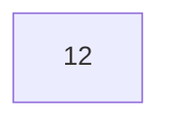

插入3:

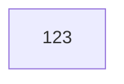

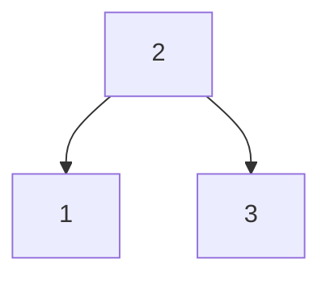

插入4:

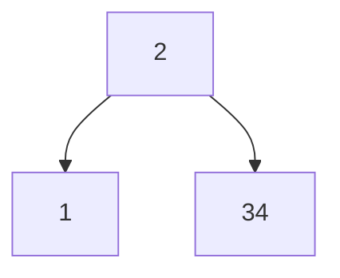

插入5:

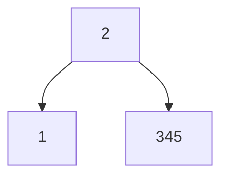

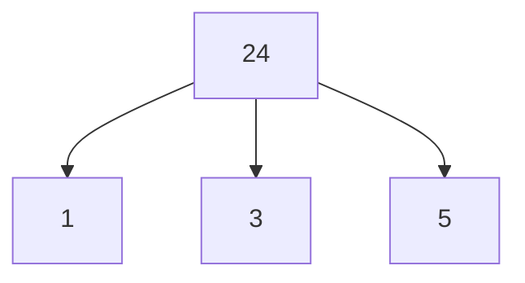

插入6:

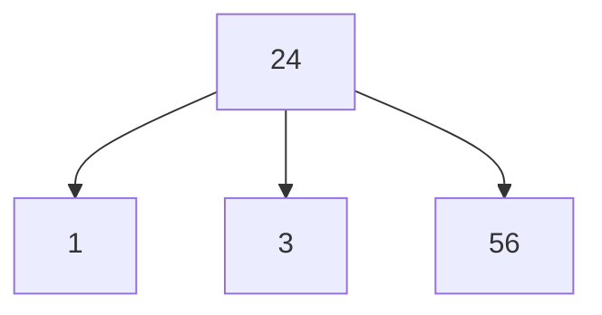

插入7：

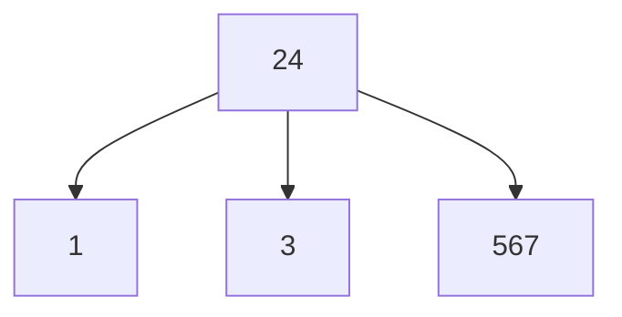

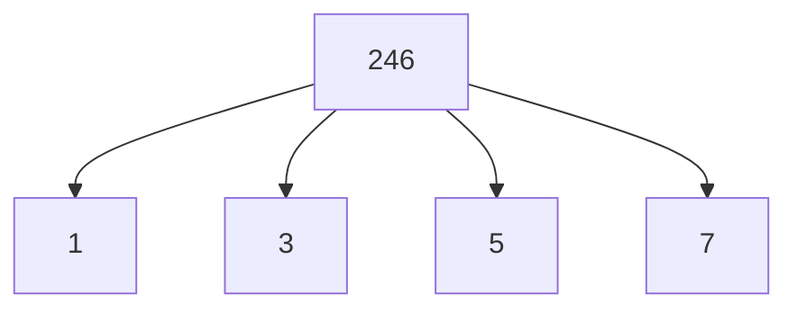

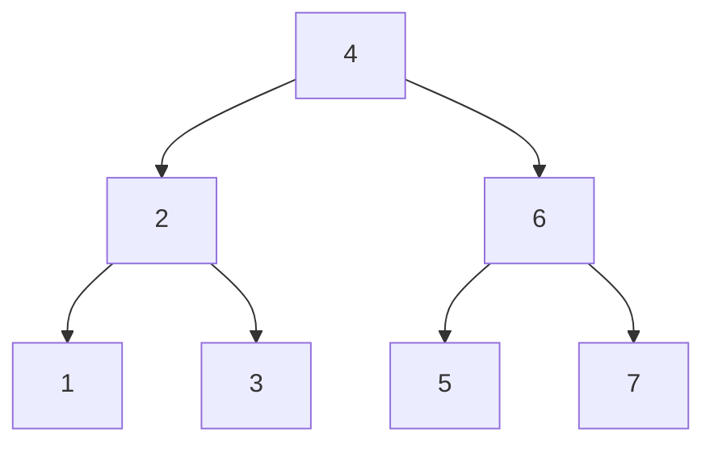

### 3.2 删除

以1\~7的B树删除7\~5为例：

原始：

删7:

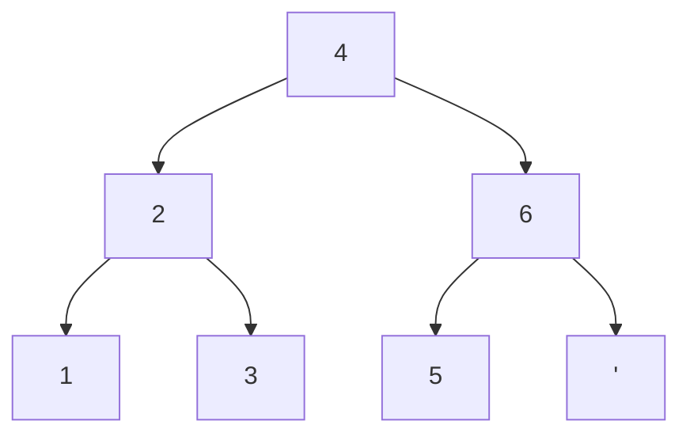

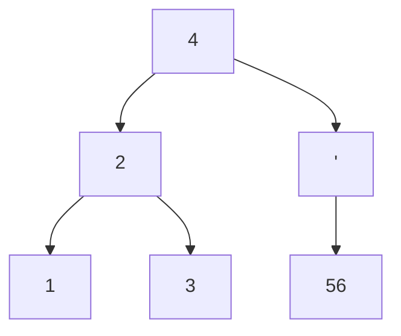

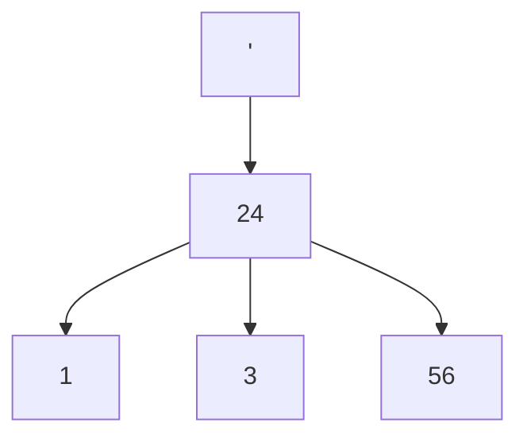

## 4. B+树

差异 | B树 | B+树
:--- | :--- | :---
1 | $n$ 个关键字对应 $n+1$ 棵子树 | $n$ 个关键字对应 $n$ 棵子树 
2 | 非叶节点包含记录 | 非叶节点不包含记录（只有关键字，记录在叶节点中）
3 | 节点的关键字唯一 | 节点的关键字不唯一（叶节点包含所有关键字）
4 | | 叶节点可以顺序访问
