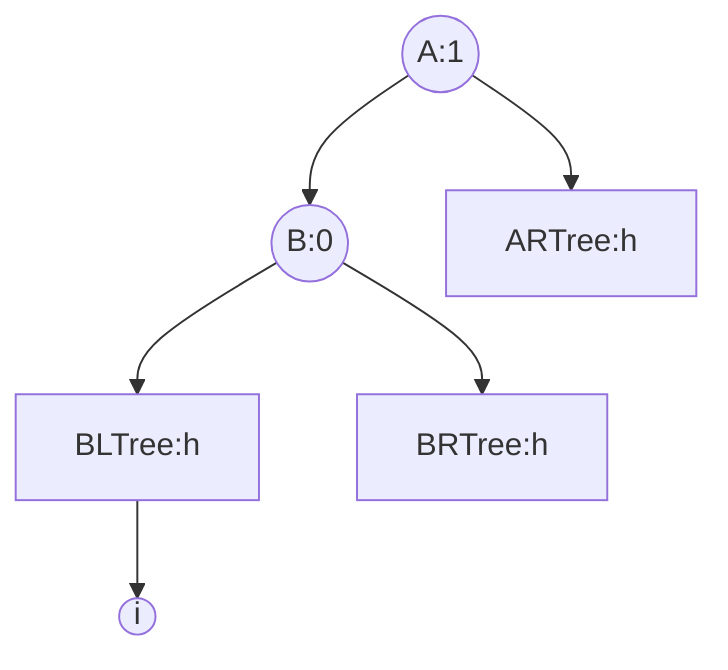
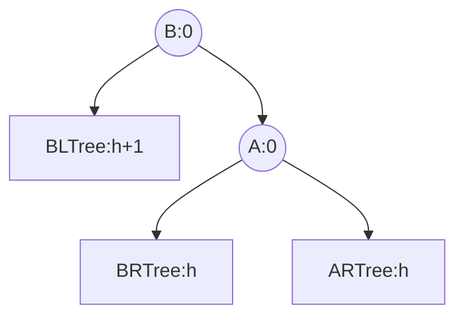
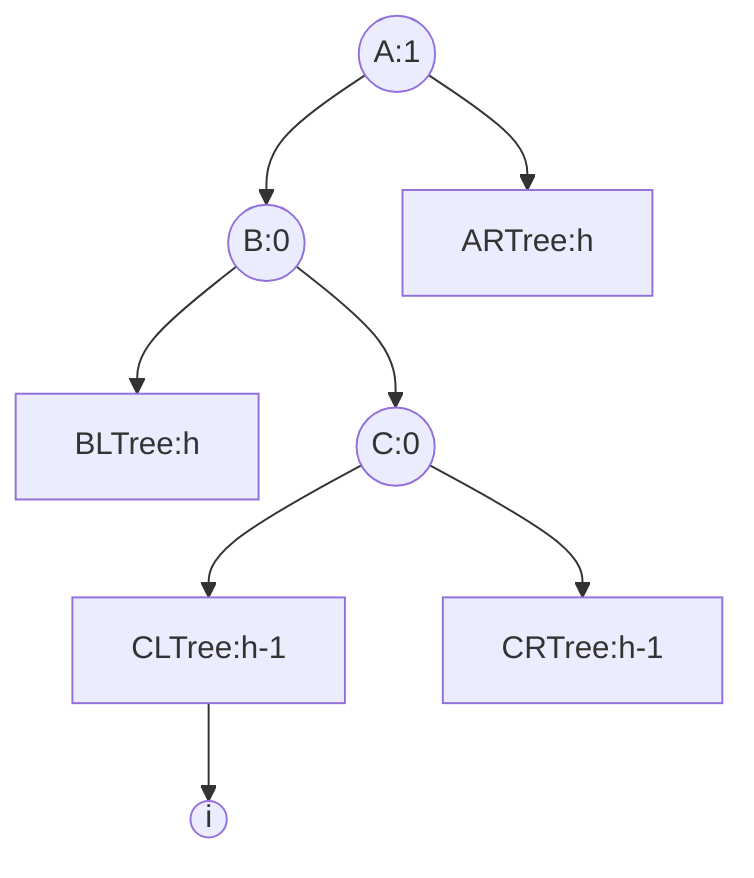
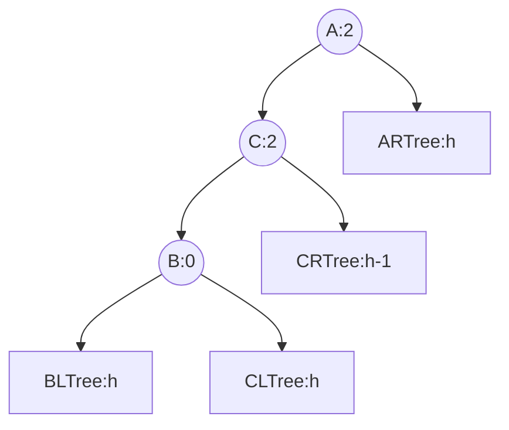
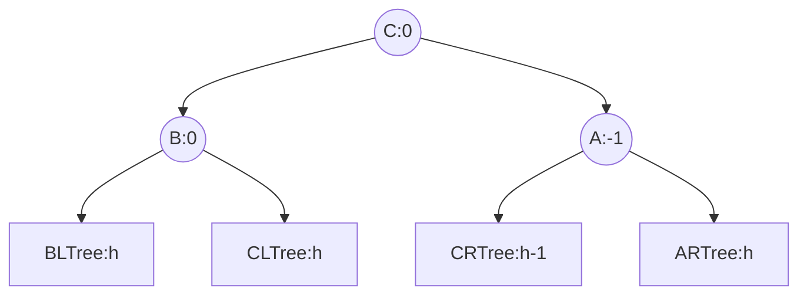

# 数据结构 - 二叉平衡树

## 1 特点

- **二叉平衡树**是一种二叉搜索树，同时也是一种二叉排序树。任一结点的左右子树的深度差不超过1。

- 二叉平衡树的插入和删除操作是再二叉排序树的基础之上进行维护实现的。

- 一个结点的**平衡因子**是左子树和右子树的深度之差，因此二叉平衡树的所有结点的平衡因子只能是-1，0，1。

## 2 维护

### 2.1 插入

- 先按二叉排序树（BST）的插入方法插入新节点，然后从该节点开始往根节点检查，若出现不平衡，则执行维护。共四种可能的情况。

#### 2.1.1 LL

- 表示左子树的左子树插入新结点引起不平衡。

- 插入前（i为插入位置）



- 插入后，右旋



#### 2.1.2 LR

- 表示左子树的右子树插入新节点引起不平衡。



- 先左旋再右旋。





#### 2.1.3 RR

- 表示右子树的右子树插入新节点引起不平衡。
- 与LL类似。

#### 2.1.4 RL

- 表示右子树的左子树插入新节点引起不平衡
- 与LR类似。

### 删除

- 先按二叉排序树（BST）的删除方式删除一个结点（引起某个子树高度减1），然后从被删除的结点开始向根节点检查是否平衡，若不平衡则执行维护。与插入节点类似，删除引起的不平衡也有四种情况。
- 例如检查到不平衡的结点是A，如果其情形和LL旋转类似，则执行LL旋转。其它一致。

## 例子

- （2019）在任意一棵非空平衡二叉树 $T_1$ 中，删除某结点 $v$ 之后形成平衡二叉树 $T_2$ ，再将 $v$ 插入 $T_2$ 形成平衡二叉树 $T_3$ 。下列关于 $T_1$ 和 $T_3$ 的叙述中，正确的是：
  a 若 $v$ 是 $T_1$ 的叶节点，则 $T_1$ 与 $T_3$ 可能不相同
  b 若 $v$ 不是 $T_1$ 的叶节点，则 $T_1$ 与 $T_3$ 一定不相同
  c 若 $v$ 不是 $T_1$ 的叶节点，则 $T_1$ 与 $T_3$ 一定相同

> 分析：通过举例子来做。
> a：
> 如果删除一个叶节点没有引起不平衡，则再次插入结点后得到的树一样。
> 如果引起不平衡，从而需要旋转，则后续再插入该节点得到的树可能并不一样。
> 
> ```mermaid
> graph TD;
> 5-->3
> 5-->7
> 3-->1
> 3-->4
> ```
> 
> 删除结点7，则得到
>
> ```mermaid
> graph TD;
> 3-->1
> 3-->5
> 5-->4
> ```
>
> 再插入7，则得到
>
> ```mermaid
> graph TD;
> 3-->1
> 3-->5
> 5-->4
> 5-->7
> ```
>
> b:
> 如果删除一个非叶节点3，如下：
>
> ```mermaid
> graph TD;
> 3-->1
> 3-->5
> ```
>
> 得到
>
> ```mermaid
> graph TD;
> 1-->null
> 1-->5
> ```
>
> 再插入3，为
>
> ```mermaid
> graph TD;
> 1-->2(null)
> 1-->5
> 5-->3(3)
> 5-->7(null)
> ```
>
> RL旋转，得到
>
> ```mermaid
> graph TD;
> 3-->1
> 3-->5
> ```
>
> 也即删除叶节点后再插入，重新插入时引起旋转，则可能出现相同的树。
>
> 对这个树删除非叶节点1，
>
> ```mermaid
> graph TD;
> 5-->1
> 5-->7
> 1-->0(null)
> 1-->4
> ```
>
> 得到
>
> ```mermaid
> graph TD;
> 5-->4
> 5-->7
> ```
>
> 再插入3，得到
>
> ```mermaid
> graph TD;
> 5-->4
> 5-->7
> 4-->1
> 4-->4r(null)
> ```
>
> 也即得到了不同的树。