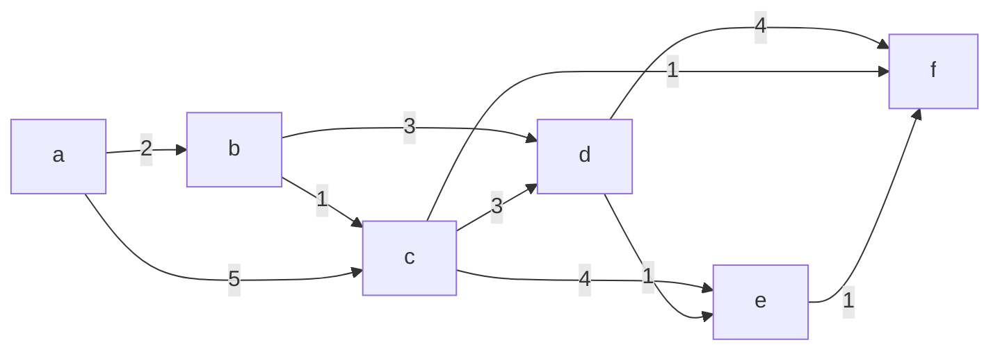

# 数据结构 - 图

[toc]

## 1 相关概念

记图为 $G$ ，有 $V$ 个顶点和 $E$ 条边。

- **有向图**：边（弧）有方向
- **无向图**：边（弧）无方向
- **简单图**：无重复边（平行边）和回指边（环）
- **多重图**：非简单图
- **完全图**：简单完全图。每个顶点都邻接所有其它顶点的简单图
- **子图**：$V$ 和 $E$ 都是子集的图
- **连通**：无向图中，两个顶点之间有路径
- **连通图**：无向图，任意两个顶点之间连通
- **连通分量**：极大连通子图（不是最大，可能有多个）
- **强连通**：针对有向图而言
- **强连通图**：针对有向图而言
- **强连通分量**：针对有向图而言
- **生成树**：连通图的生成树是一个极小连通子图
- **生成森林**：非连通图的生成树构成生成森林
- **度、入度、出度**：对无向图，为边以顶点为端点的次数。对有向图，入度为边以顶点为终点的数目，出度为以边为起点的数目。
- **权、网**：边关联的数值为权，有权的图为网
- **稠密图、稀疏图**：指边相比顶点的多少
- **路径、路径长度**：路径是一个顶点序列，路径长度是指路径上边的数目
- **回路**：路径的第一个顶点和最后一个顶点相同
- **简单路径、简单回路**：顶点不重复出现
- **距离**：最短路径的长度，若没有路径则为 $\infty$
- **有向树**：一个顶点入度为0，其余顶点入度为1的有向图

## 2 存储结构

### 2.1 邻接矩阵

为 $V$ 阶方阵，记为 $A^{(n)}$ 。其元素 $a_{ij}$ 表示顶点 $v_i$ 和 $v_j$ 邻接。若为带权图（网），则用0或者 $\infty$ 表示没有邻接边。

由于邻接矩阵是按照顶点来索引的，因此适合表示**稠密图**。

$A^n$ （矩阵的 $n$ 次幂）中的元素 $a^{(n)}_{ij}$ 表示顶点 $V_i$ 和 $V_j$ 之间长度为 $n$ 的路径的个数（归纳法证明）。

算法 | 时间复杂度 | 空间复杂度
:-- | :-- | :--
查找邻接顶点（无向表） | $O(V)$ |
查找邻接顶点（有向表） | $O(V^2)$ |

### 2.2 邻接表

顺序存储所有顶点（**顶点表**），顶点表中的每个元素附加一个邻接顶点链表。

由于邻接表记录的是边，因此表示**稀疏图**时节省空间。

由于邻接顶点链表的顺序不定，因此同一个图的邻接表不一定唯一。

算法 | 时间复杂度 | 空间复杂度
:-- | :-- | :--
查找邻接顶点（无向表） | $O(E)$ |
查找邻接顶点（有向表） | $O(EV)$ |

### 2.3 十字链表

相对邻接表，每个链节点表示一条边，并同时在相同首节点和相同尾节点的两个边链表中。每个顶点表项同时指向相同首节点和相同尾节点边链表。

由于边是有向的，因此用来表示有向表。

同一个有向图的十字链表表示同样也不一定唯一。

### 2.4 邻接多重表

相比邻接表，链节点记录一条边，并同时在依附于第一节点和第二节点的链表中。

由于每条边不会有两个相同的顶点，因此链表一定是链接不同的边，相同的边仅有一个实际表示。

相比十字链表，链节点不区分首尾。因此适合表示无向图。

## 3 树算法

### 3.1 广度优先搜索（BFS）

BFS：Breadth-First-Search

思路：参考树的层次遍历。

> **alg**
>
> 1. 从图中找一个顶点，记录顶点，将顶点入队
> 2. 出队一个顶点，并找出该顶点的所有未记录的邻接顶点，记录这些顶点，并依次入队。
> 3. 重复步骤2，直到队列为空。
> 4. 如果图中还有未记录的顶点，则从这些顶点中取一个，进入步骤1（针对图中有多个（强）连通分量的情况）。

广度优先搜索可用于求解无权图的单源最短路径问题（每层归于同一距离）。

**复杂度**分析：
需要一个存储同层顶点的队列，以及记录所有顶点是否被访问的标记，因此空间复杂度为 $O(V)$ 。  
对每个节点，要找其所有的邻接节点。如果为无向图的邻接矩阵表示，为 $O(V)$，即总复杂度为 $O(V^2)$ 。如果为无向图的邻接表表示，访问所有顶点及其邻接边总共为 $O(E+V)$ 。

算法 | 时间复杂度 | 空间复杂度
:-- | :-- | :--
BFS（无向图，邻接矩阵） | $O(V^2)$ | $O(V)$
BFS（无向图，邻接表） | $O(V+E)$ | $O(V)$
BFS（有向图，邻接表） | $O(VE^2)$ | $O(V)$

### 3.2 深度优先搜索（DFS）

DFS：Depth-First-Search

DFS使用递归算法，和树的先序遍历类似。

> **alg**
>
> 1. 从图中取一个顶点，执行步骤2
> 2. 记录顶点，获取顶点的邻接点，当邻接点没有被记录时，对邻接点执行步骤2
> 3. 步骤 2 在所有邻接点都已记录时，停止
> 4. 对图中所有未访问顶点执行步骤1，直至所有顶点都已访问（针对图中有多个（强）连通分量的情况）

**复杂度**分析：
对于一个连通分量，递归深度与顶点个数有关，即空间复杂度为 $O(V)$ 。  
每个顶点都需要访问一次，获取顶点的邻接顶点，因此时间复杂度和BFS一致。  

算法 | 时间复杂度 | 空间复杂度
:-- | :-- | :--
BFS（无向图，邻接矩阵） | $O(V^2)$ | $O(V)$
BFS（无向图，邻接表） | $O(V+E)$ | $O(V)$
BFS（有向图，邻接表） | $O(VE^2)$ | $O(V)$

### 3.3 最小生成树（MST）

MST：Minimum-Spanning-Tree

#### 3.3.1 Prim 生成树算法

一个生成树对应一个连通图。

思路：每次找离已有生成树顶点最近的顶点。

> alg
>
> 1. 从图中取一个顶点，加入树 $T$ 
> 2. 找离树 $T$ 最近的一个顶点，加入树 $T$ 
> 3. 重复步骤2，直到所有节点都已加入树 $T$

**复杂度**分析：
需要存储过程中的生成树顶点，因此空间复杂度为 $O(V)$ （同时也是所求的结果）。  
一共需要处理 $V$ 个节点，每个节点需要比较 $V-1,V-2...1,0$ 次（邻接矩阵），即总时间复杂度为 $O(V^2)$ 。  

#### 3.3.2 Kruskal 生成树算法

思路：将 $V$ 个顶点视为 $V$ 个连通分量，每次找出一个连接两个连通分量的边加入树 $T$ （相当于连通两个连通分量，变为一个连通分量），直到只剩一个连通分量。

算法特点：处理边

> alg
>
> 1. $V$ 个顶点的图共有 $V$ 个分量
> 2. 取出一条最短的边，若边在一个分量内部，则重复执行步骤2，否则将边加入树 $T$
> 3. 执行步骤2 $V-1$ 次，直到边为空。

**复杂度**分析：  
需要记录边，因此为 $O(E)$ 。  
取最短边最多 $min(V-1,E)$ 次，使用堆算法每次需要 $O(logE)$ ，即找最短边总共为 $O(min(V,E)logE)$ 。将共 $E$ 条边按等价类划分的方式形成一个等价类，总耗时为 $O(ElogE)$ [^1]。考虑稀疏图，则为 $O(ElogE)$。

### 3.4 最短路径

**原理**：若某路径是 $(v_1,v_2)$ 的最短路径，则该路径同时也包含了 $v_1$ 到沿途所有顶点的最短路径。（证明：若 $v_1$ 到某顶点有更短的路径，则应该选更短的路径）

#### 3.4.1 Dijkstra单源最短路径算法

**思路**：与Prim最小生成树算法一致，每次找距离已有路径最近的顶点。  
**原理**：设已知最短路径的顶点集合为 $S$ ，起点为 $v_0$ ，对于 $S$ 的一个顶点 $v_s$ 邻接点 $v_n$ ，假设其最短路径包含一个不在 $S$ 中的顶点 $v_p$，则按最短路径原理就有 $(v_0...v_s),(v_0...v_p...v_s)$ 都是最短路径（前者在 $S$ 中，后者至少有一个节点不在 $S$ 中），也即这两个路径的长度相等，此时，求最短路径则选取其一即可，算法中我们取前者，即认为 $v_n$ 的最短路径的中间节点都在 $S$ 中。因此 $v_n$ 的最短路径或者只有两个顶点（没有中间顶点），或者为已知路径上的一个顶点加邻接点 $v_n$ （中间节点全部在 $S$ 中）。  

需要两个辅助记录：  
`dist[]`：记录顶点 $v_0$ 到所有其它顶点的距离。  
`path[]`：记录到顶点的最近路径的最后位置（前驱位置）  

> alg
>
> 1. 获取起始顶点的所有邻边，并以此初始化`path[]`和`dist[]`，将起始顶点加入已知最短路径集合
> 2. 获取不在最短路径集合中且对应`dist[]`值最小的点（离已知最短路径集合最近的点），将其加入已知最短路径集合
> 3. 遍历最新加入的顶点的所有邻接点，比较邻接点到尾节点的距离+已知最短路径长度和邻接点到起点的邻接距离，取小者，并更新`path[]`和`dist[]`。
> 4. 重复步骤2，3，直到所有顶点都加入最短路径。

**复杂度**分析：  
需要记录每个顶点的最近距离和路径，因此空间复杂度为 $O(V)$ 。  
一共 $V$ 个顶点，对每个顶点查询其邻接顶点，时间为 $O(V)$ ，故总时间复杂度为 $O(V^2)$ 。  

#### 3.4.2 Floyd全部顶点最短路径算法

**思路**：使用一个辅助方阵 $A$，其元素 $a_{ij}$ 表示 $v_i$ 到 $v_j$ 的最短路径长度。一共进行 $V$ 次迭代，每次迭代将图中的一个顶点作为中间点，加入已知的最短路径中比较是否需要更新。对 $A$ 的元素 $a_{ij}$，初始时表示顶点 $v_i$、$v_j$ 没有中间节点的最短路径长度。第一次迭代以第一个顶点 $v_k$ 为中间节点，比较所有 $v_iv_kv_j$ 的路径长度是否更短，结束时 $a_{ij}$ 表示中间节点数目 $\le 1$ 的最短路径。依次进行，直到最后，$a_{ij}$ 则表示中间节点数目 $\le V$ 的最短路径长度，也即 $v_i$ 到 $v_j$ 的最短路径长度。

> alg
>
> 1. 初始化 $A$ 。对每个节点找邻接节点，并更新 $A$ 。
> 2. 以一个顶点 $v_m$ 为中间节点，按 $A$ 中元素下表扫描整个图，对下标 $i,j$ 即对应 $v_j,v_j$ ，检查 $(v_i,v_m)+(v_m,v_j)$ 的路径长度和（即 $a_{im}+a_{mj}$ ）和 $(v_i,v_j)$ 的当前路径长度，取小者，然后更新 $a_{ij}$ （需要记录路径的此时记录路径）。
> 3. 重复步骤2，直到所有顶点都作为中间节点执行了扫描。

**复杂度**分析：  
只考虑辅助方阵 $A$，空间复杂度为 $O(V^2)$ 。  
对于一个中间节点，需要检查总共 $V^2$ 个下标，一共需要考虑 $V$ 个中间节点，因此总共的时间复杂度为 $O(V^3)$ 。  

### 3.5 拓扑排序

对于一个图的拓扑序列，其满足：

- 所有顶点仅出现一次
- 在序列中，若顶点 $v_i$ 在 顶点 $v_j$ 后，则不存在顶点 $v_i$ 到 顶点 $v_j$ 的路径

**思路**：逐次去掉图中的无前驱的顶点，即得到一个**拓扑序列**。逐次去掉图中的无后继的顶点，则得到一个**逆拓扑序列**。

**复杂度**分析：  
用一个栈来存当前的无前驱顶点。空间复杂度为 $O(V)$ 。  
初始找所有无前驱顶点，耗时 $O(V)$ ，对每个顶点找后继节点，耗时 $O(V)$ （邻接矩阵），故总的时间复杂度为 $O(V^2)$ 。  

> alg
> 
> 1. 略

## 3.6 关键路径

AOE网中，顶点表示**事件**，边表示**活动**。

**关键路径**：顶点 $v_i$ 到 $v_j$ 的最长路径。关键路径上的活动称为**关键活动**。

**事件最早发生时间**：从起点到事件的最长路径长度。求法：按拓扑顺序，从起点开始，分别求出其后继事件的最早发生时间。

**活动最早开始时间**：即活动的起点事件的最早发生时间。

**事件最晚发生时间**：从事件到终点的最短路径长度。求法：按逆拓扑顺序，求出每个顶点的所有前驱顶点的最晚发生时间。对同一个事件的多个更新，取最早的值。

**活动最晚开始时间**：即活动的终点事件的最晚发生时间减活动耗时。

**思路**：

- 分别按拓扑顺序求事件最早发生时间和逆拓扑顺序求事件最晚发生时间
- 求所有活动的最早开始时间和最晚开始时间
- 某活动的最早开始时间和最晚开始时间相同，则为关键路径节点。

**复杂度**分析：
考虑求事件最早发生时间，拓扑排序需要 $O(V^2)$ ，对每个顶点更新后继节点需要 $O(V)$ ，因此总的时间复杂度为 $O(V^2)$ 。

## 4 举例

### 4.1 例一

#### 使用Dijkstra单源最短路径算法，从a开始

dist[]/ | 选a | 选b | 选c | 选f | 选d | 选e |
:--- | :--- | :--- | :--- | :-- | :-- | :-- |
a |
b | 2(a) |
c | 5(a) | 3(b)
d | $\infty$ | 5(b) | 5(b) | 5(b) |
e | $\infty$ | $\infty$ | 7(c) | 7(c) | 6(d)
f | $\infty$ | $\infty$ | 4(c)

流程：

1. 将起点a加入集合，求a的邻接点，更新`dist[]`，得到第一列。括号内表示`path[]`需要记录的内容。
2. 在`dist[]`中选择一个最小值，为b，将b加入集合，根据b的邻接点更新`dist[]`的内容，得到第二列。
3. 依此类推。

[^1]: 数据结构，严蔚敏，6.5 树与等价问题
