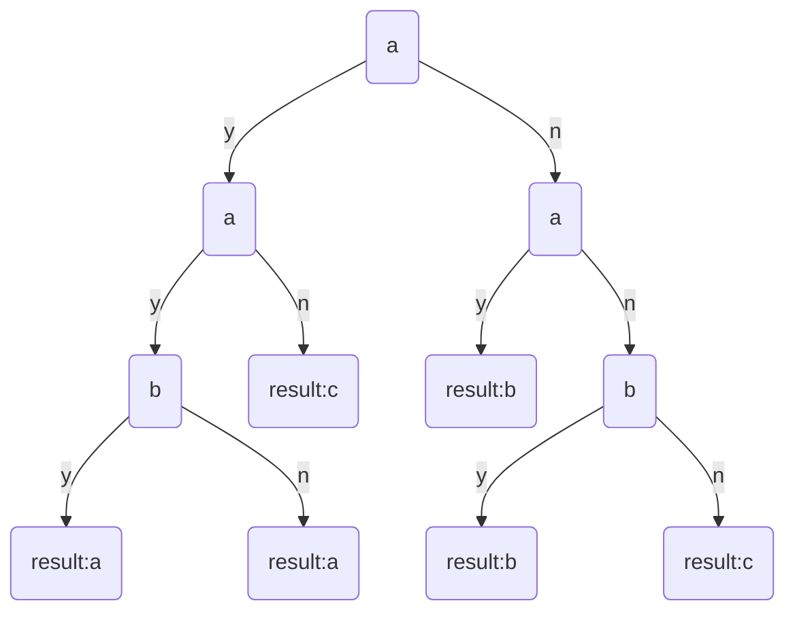
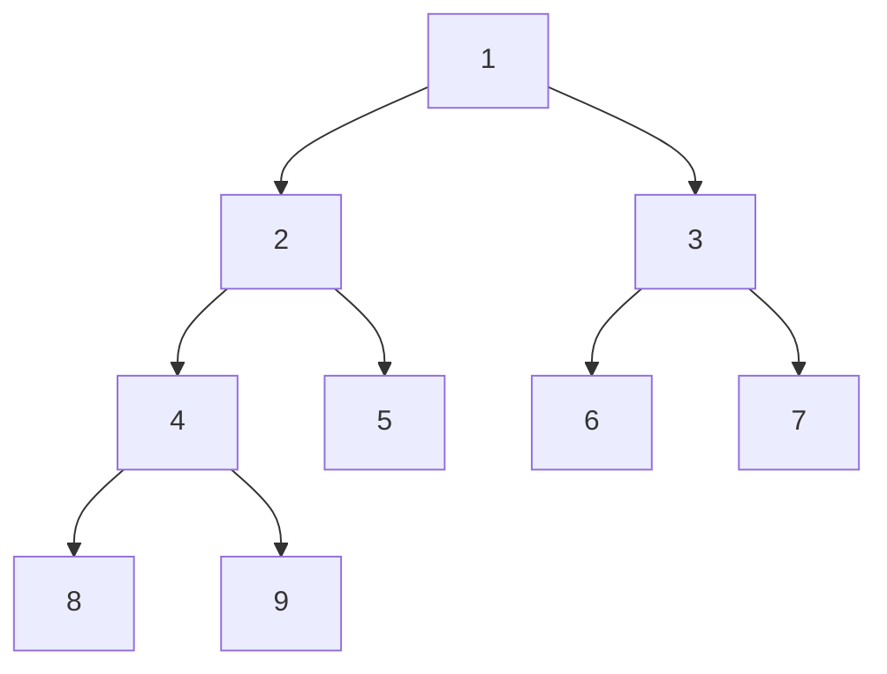
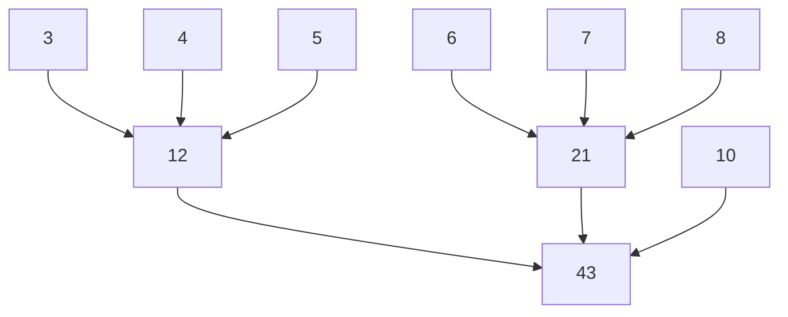
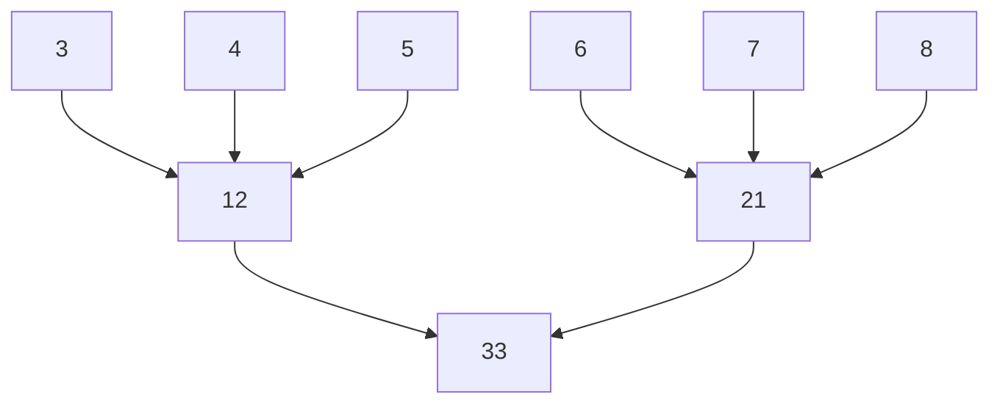
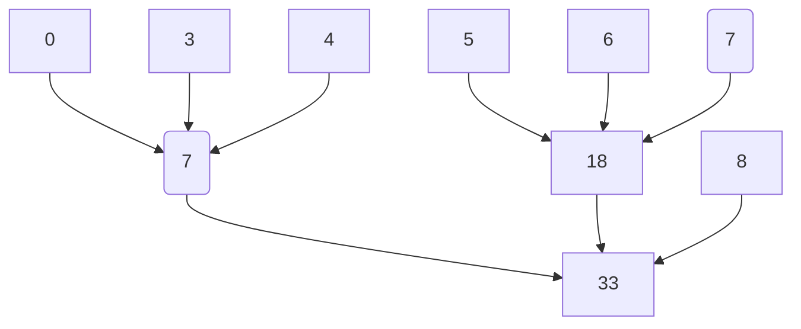

# 数据结构 - 排序

[toc]

## 1. 排序的理论速度

### 1.1 三个元素的例子

一种比较方法：



可见，所有的有序序列出现在**比较选择树**的叶节点上。

### 1.2 理论推广

假设有 $n$ 个元素，则总共可能的序列为 $A_n^n=n!$ ，对于一棵高度为 $h$ 的二叉树，其最大子节点数目为 $2^{h-1}$ ，也即理论情况下，最少比较 $h-1$ 次，就可以得到 $2^{h-1}$ 个序列。取 $n!=2^{h-1}$ ，就有 $h-1=log_2n!$ ，即比较次数为 $\lceil log_2(n!)\rceil$ 。  
根据斯特林公式，有 $O(\lceil log_2(n!)\rceil)=O(nlogn)$ 。也即**基于比较的排序理论复杂度为 $nlogn$** 。  

## 2. 插入排序

### 2.1 直接插入排序

**思路**：按顺序将元素插入到左侧已排序序列中。

**复杂度**：
最好情况下（一个不需要排序的序列）只需要 $n-1$ 次比较。  
最差情况下（一个相反的排序序列），需要 $\displaystyle\sum_{i=1}^{n}i=\frac{n(n+1)}{2}$ 次比较（移动次数同样复杂度）。  
也即复杂度为 $O(n^2)$ 。

### 2.2 折半插入排序

**思路**：在直接插入排序基础上，使用折半算法查找插入位置。  
**特点**：折半查找要求必须为顺醋存储形式，因此移动元素的复杂度没有降低。  

### 2.3 希尔排序

**思路**：在直接排序的基础上，每次对某个起点开始的固定间隔的元素集合进行排序，然后右移起点，直到无法右移（右移后集合只有一个元素）或者所有元素都被排序过一次，至此称为一趟排序。然后减小间隔，再次进行。最后对全部元素进行插入排序（间隔为1）。又称为**缩小增量排序**。这里缩小是指每次排序的范围缩小，增量是指缩小的范围以一个增量移动。

**形象化**：假设数据排列在一把尺子的毫米刻度上，取间隔为10mm，即每次将尺子的厘米刻度上的元素进行插入排序，然后将尺子右移1mm。直到移动了10mm或者数据上只有一个刻度为止。然后将间隔改为5mm，再进行一次，直到最后间隔为1mm（全部元素插入排序）。

**原理**：插入排序对于已经初步排序的数据效率高。

**特点**：当取的增量序列在某些值时，时间复杂度约为 $O(n^{1.3})$ 。希尔排序是一种**不稳定**的排序方法。

## 3. 交换排序

### 3.1 冒泡排序

**思路**：通过相邻元素交换，每次将一个最大的元素挪动到最右端。当整个冒泡流程没有发生元素交换，或者没有剩余元素时，退出。

**稳定性**：由于仅仅进行了相邻交换，因此是稳定排序。

**复杂度**：第一个元素需要扫描 $n$ 个元素，第二个需要扫描 $n-1$ 个元素，因此最坏时间复杂度为 $O(n^2)$ 。当元素基本有序时，只需要执行一趟冒泡，因此最好时间复杂度为 $O(n)$ 。

### 3.2 快速排序

**思路**：分治法，每次选定一个中间值，并以中间值将序列划分为左右两部分，左边小于中间值，右边大于中间值。然后对左边部分和右边部分分别进行同样划分处理。

**稳定性**：当将重复元素作为中间值时，进行左右划分会破坏原油顺序，因此是不稳定排序。

**复杂度**：
最坏情况下，栈的深度为 $O(n)$ ，最好情况下，栈深度为 $O(log_2n)$ ，栈深度即为对应的空间复杂度。  
对于递归树，每层比较的数目都为 $n$，因此时间复杂度，最坏情况下为 $O(n^2)$ ，最好情况下为 $O(nlog_2n)$ 。  
平均情况下，记每次选取的参考元素在所在集合中的位置百分比为 $\omega$ ，有 $\omega$ 为区间 $[0,1]$ 的一个随机值。对任意 $\omega$ ，有 $n\omega ^h=1$ ，即 $h=log_{\frac{1}{\omega}}n$ ，也此时的时间复杂度为 $O(nlogn)$。也即只要保证选取的参考元素为按比例随机分布，则其时间复杂度为 $O(nlogn)$ 。  

## 4. 选择排序

### 4.1 简单选择排序

**思路**：每次从未排序的元素中找出一个最大元素，并放到未排序元素尾部，重复进行直到剩余未排序元素不大于1个。

**稳定性**：很显然相同值的元素会被逆置，因此是不稳定排序。

**复杂度**：对于 $n$ 个元素，选取一个最小元素需要比较 $n$ 次，因此复杂度为 $O(n^2)$ 。

### 4.2 堆排序



**大根堆（大顶堆）**：满足元素大于左右子节点，即 $L(i)>=L(2i)$ 且 $L(i)>=L(2i+1)$ 。

**大顶堆维护**：将大顶堆的根元素替换成其它元素后。维护的主要步骤是比较节点和其左右子节点，并择大交换，重复进行至叶节点。

**大顶堆建堆**：依次（逆序）对所有非叶节点执行维护。如图，对2执行维护时，必有其左右子树都已经是大顶堆，此时2就相当于是被替换的根节点。维护完成之后，2对应的子树就是一个大顶堆。

**思路**：首先对序列执行建堆操作，然后将根节点交换至末尾，得到一个有序元素，然后对剩余的元素构成的堆执行维护，直到剩余的元素数目不超过1。

**稳定性**：每次选择最大元素并交换至末尾，因此可能引起次序颠倒。是不稳定的排序算法。

**复杂度**：
对于 $n$ 个元素，一次维护需要 $O(\lceil log_2n\rceil)$ 或者 $h$ 次操作。
记根节点为第1层，则第 $i$ 层上最多有 $2^{i-1}$ 个节点，每个节点维护操作的最大操作复杂度为 $O(h-i)$ ，即第 $i$ 层节点总复杂度为 $2^{i-1}\cdot (h-i)$ ，因此建堆的总复杂度为 $\displaystyle\sum_{i=h-1}^{1}2^{i-1}\cdot O(h-i)=O(\displaystyle\sum_{i=h-1}^{1}2^{i-1}\cdot (h-i))= O(2^h)=O(n)$ 。  
排序过程中，依次需要对 $n-1,n-2,...,2$ 个元素的堆执行维护，即维护复杂度为 $O(\lceil log_2(n-1)\rceil+\lceil log_2(n-2)\rceil+...+\lceil log_22\rceil)\le O(nlog_2n)$ ，不可能低于排序理论复杂度，因此为 $O(nlogn)$ 。  
因此总的时间复杂度为 $O(nlogn)$ 。  

## 5. 归并排序

**思路**：将多个有序序列合并为一个有序序列。每个序列称为一个组，初始时一个组只有一个元素，多次合并直到最后只剩一个组。

**2路归并**：每次将2组有序序列合并为一个有序序列。

**特点**：需要 $O(n)$ 的辅助空间。

**复杂度**：对两个长度为 $m$ 和 $n$ 的序列，每次比较得到一个合并元素，则最多需要 $m+n-1$ 次比较。将归并视作一个递归过程，则构成了一个归并树，在树的每一层上的时间复杂度则为 $O(n)$ 。树的高度为 $O(logn)$，即总的时间复杂度为 $O(nlogn)$ 。  
最好情况下，归并数每一层上的时间复杂度为 $O(\frac{n}{2})$ ，因此同样为 $O(nlogn)$ 。  

## 6. 基数排序

**思路**：基数排序是一种多关键字排序方法，不需要进行元素的比较，而是根据元素的多个关键字的大小排序。有两种方式，一种是高位优先（MSD，Most Significant Digit first），一种是低位优先（LSD，Least Significant Digit first）。高位优先法先按高位对序列排序，形成若干个高位相同但低位不同的子序列，然后分别对各个子序列排序。低位优先法先按低位对序列排序，形成低位有序序列，然后使用稳定排序方法按高位排序，此时相同高位对应的低位顺序仍然有序。

**链式基数排序**：
链式基数排序是一种低位优先排序方法，借助分配和搜集过程实现稳定的排序。
以3位2进制数为例，按从小到大分配2个槽（0～1），第一遍根据最低位将待排序列依次追加到各个槽，然后从左到右将槽中元素搜集形成新的排序队列，此时即完成了对最低位的稳定排序。第二遍对第二位进行同样操作，第三遍对第三位进行操作，结束之后即得到排序结果。

```C
arr:000,100,010,011,110,001,111
第一遍：
0:000,100,010,110
1:011,001,111
合并：
000,100,010,110,011,001,111
第二遍：
0:000,100,001
1:010,110,011,111
合并：
000,100,001,010,110,011,111
第三遍
0:000,001,010,011
1:100,110,111
合并：
000,001,010,011,100,110,111
```

**复杂度**：
设每个元素的关键字个数为 $d$ ，关键字的可能值有 $r$ 个。
辅助空间：当输入为链表时，可以不分配元素的辅助空间，只需要 $r$ 个空队列，即为 $O(r)$ 。  
每一趟分配需要 $O(n)$ ，每一趟合并需要 $O(r)$ （将 $r$ 个链表首尾相连），一共需要进行 $d$ 趟，因此时间复杂度为 $O(d(r+n))$。对于特定的一类元素，$d$ 和 $r$ 为常数，因此时间复杂度可作 $O(n)$ 。  

## 7. 内部排序的比较

算法 | 时间最好 | 时间平均 | 时间最坏 | 空间 | 稳定
--- | --- | --- | --- | --- | --- | ---
直接插入排序 | $O(n)$ | $O(n^2)$ | $O(n^2)$ | $O(1)$ | $\surd$
冒泡排序 | $O(n)$ | $O(n^2)$ | $O(n^2)$ | $O(1)$ | $\surd$
简单选择排序 | $O(n^2)$ | $O(n^2)$ | $O(n^2)$ | $O(1)$ | $\times$
希尔排序 | | | | $O(1)$ | $\times$
快速排序 | $O(nlog_2n)$ | $O(nlog_2n)$ | $O(n^2)$ | $O(log_2n)$ | $\times$
堆排序 | $O(nlog_2n)$ | $O(nlog_2n)$ | $O(nlog_2n)$ | $O(1)$ | $\times$
2路归并排序 | $O(nlog_2n)$ | $O(nlog_2n)$ | $O(nlog_2n)$ | $O(n)$ | $\surd$
基数排序 | $O(d(r+n))$ | $O(d(r+n))$ | $O(d(r+n))$ | $O(r)$ | $\surd$

### 7.1 稳定性

直接插入排序、冒泡排序只有相邻元素交换，因此为稳定排序。  
2路归并排序属于归并排序，归并过程只要按顺序提取元素，则能保证稳定性。  
基数排序的前提就是所用的排序是稳定排序，因此为稳定排序。  
选择排序、希尔排序、堆排序进行了非相邻元素的调换，不稳定。  
快速排序在选择参考节点并划分时，参考节点只能处于相同元素的左侧或者右侧，因此不稳定。  

### 7.2 空间复杂度

归并排序需要归并临时存储，基数排序需要空队列，其它算法都能原地执行。

### 7.3 时间复杂度

1. 堆排序是一种时间复杂度恒定的排序方法，在元素数量较大时，可以采用。
2. 归并排序常用于外部排序。

### 7.4 排序算法的选择

1. 规模较小时，采用简单选择排序。
2. 若初步有序，采用插入排序。
3. 若规模较大，可采用时间复杂度为 $nlog_2n$ 的快速排序、堆排序、归并排序。其中归并排序为稳定的排序。
4. 当待排序列元素的关键字位数少且可以分解为多个关键字，规模很大，则可以采用基数排序得到 $O(n) $ 的时间复杂度。

## 8 外部排序

**流程**：

1. 按可用内存大小，将外存上含有 $n$ 个记录的文件分成若干长度为 $l$ 的子文件或**段**，依次读入内存并使用内部排序方法排序，然后将已排序的段重新写入外存。称这些有序子文件为**归并段**或**顺串**。
2. 将得到的归并段逐趟归并，直至得到整个文件为止。

**外部排序的主要内容**：第1步直接用内部排序算法即可，外部排序和内部排序的主要差异在于归并步骤的优化。

**可用内存划分**：对于2路归并排序，需要2个输入缓冲区和1个输出缓冲区。

### 8.1 归并过程耗时分析

$\text{总耗时=产生初始归并段耗时+读写数据耗时+内部归并耗时}$

和内部排序一样，归并过程形成一棵归并树，归并树的每一层需要访问的数据为待排全部数据，因此**读写数据耗时和归并树高度有关**。

假设使用 $k$ 路归并，归并段总共有 $m$ 个，因此归并的趟数为 $s=\lfloor log_km\rfloor$ 。因此有归并路数 $k$ 越大，读写耗时越少。总归并段 $m$ 越少，读写耗时越少。

考虑 $k$ 路归并，每得到一个元素需要 $k-1$ 次比较，总共的记录数为 $n$ ，则一趟比较需要比较 $(k-1)(n-1)$ 次，总的比较次数为 $\lfloor log_km\rfloor(k-1)(n-1)=\lfloor \frac{lgm}{lgk}\rfloor (k-1)(n-1)$ 。因此有归并路数 $k$ 越大，比较次数越大。

**败者树**可以优化 $k$ 路归并时的比较次数，从而抵消 $k$ 增加带来的影响。

### 8.2 败者树

特征：败者树和胜者树的叶节点是待处理元素，非叶节点是比较元素（存引用）。

补充：**胜者树**，用于树形选择排序，可以用 $O(log_2n)$ 的时间复杂度获取一个最大元素。每次将低一层节点两两比较后将大者存入上一层（引用），向上逐层进行，即建树。输出一个元素后，将输出元素（的引用）修改为极小值（对应路径同时被修改）。当移除一个极小值之后，欲找出次小值，只需要将之前被极小值比较路径上的所有节点重新比较一次即可。

**败者树**：胜者树在上一层节点保存的是胜者，在胜者被移除后即无效，败者树改为在上层节点存储败者，将胜者存入上上层节点。在输出一个节点后，要获得下一个节点，则输出节点取得下一个值后，直接于上层节点比较，重复执行即可。若待排输入为空，则将节点值置为极小值。

由于树的高度为 $O(log_2n)$ ，因此从 $k$ 个元素中取最大值的时间复杂度为 $O(log_2k)$ 。

### 8.3 置换-选择排序

在构建初始归并段时，直接将子文件读入内存并使用内部排序算法进行排序，则归并段的长度将受限于内存的大小。置换-选择排序可以在相同的内存空间下产生更长的归并段。

执行过程：  
记待排文件为 $\text{FI}$ ，初始归并段输出文件为 $\text{FO}$ ，内存工作区为 $\text{WA}$ ，$\text{WA}$ 可容纳 $\text{size}$ 个记录。

1. 读入 $\text{WA}$ 至满。
2. 从 $\text{WA}$ 从取一个最小记录 ，输出到 $\text{FO}$ 。
3. 再读入一条记录，找出比上一个最小值大的最小值记录，输出到 $\text{FO}$ 中。
4. 重复执行2、3，直到选不出满足3中要求的最小值。此时得到一个归并段。
5. 剩余的记录继续执行2，直到全部输出。

举例：
$\text{FI}=\{5,7,2,4,1,8,6,3\},\text{WA.size=3}$

$\text{FI}$ | $\text{WA}$ | $\text{FO}$
:--- | :--- | :---
5,7,2,4,1,8,6,3 | $\text{---}$ | $\text{---}$
4,1,8,6,3 | 5,7,2 |
4,1,8,6,3 | 5,7 | 2
1,8,6,3 | 5,7,4 | 2
1,8,6,3 | 5,7 | 2,4
8,6,3 | 5,7,1 | 2,4
8,6,3 | 7,1 | 2,4,5
6,3 | 7,1,8 | 2,4,5
6,3 | 1,8 | 2,4,5,7
3 | 1,8,6 | 2,4,5,7
3 | 1,6 | 2,4,5,7,8
$\text{---}$ | 1,6,3 | 2,4,5,7,8
$\text{---}$ | 3,6 | 2,4,5,7,8;1
$\text{---}$ | 6 | 2,4,5,7,8;1,3
$\text{---}$ | $\text{---}$ | 2,4,5,7,8;1,3,6

可以看出，通过置换-选择排序，能够产生更长的归并段，并且每个归并段的长度不一。

### 8.4 最佳归并树

对于 $n$ 个节点的归并树，当每个归并段的长度不一致时，对于一棵归并树，归并段所在的节点的路径长度就是归并段归并过程中产生的读写量。因此可以将归并段的长度作为节点的权值构建哈夫曼树，即最佳归并树。

对于 $k$ 阶归并，考虑到每个节点应该有 $k$ 个子树效率最高，因此当总的归并段数目不为 $k$ 的整数倍时，应该添加 0 节点将数目凑齐为，然后构建。

外部排序多阶最佳归并树的构造：  
和哈夫曼树构造过程一致。例如，要构造三阶最佳归并树，每次总是从森林中找三个根节点权值最小的树合成一棵新的树。

例子：

对于3阶合并，子段长度分别为 $3,4,5,6,7,8,10$



只考虑归并读次数，则恰为对应的归并树的带权路径长度（所有叶节点的权和叶节点深度的乘积之和）。  
总的读写次数为带权路径长度的2倍。  
树的带权路径为 $(12+21)\times 2+10\times 1=76$ 。  

如果少一个子段，为 $3,4,5,6,7,8$

则同样的方法构造的归并树为



此时带权路径为 $(12+21)\times 2=66$ 。

如果添加一个虚段，即 $0,3,4,5,6,7,8$

则得到的归并树为



此时带权路径为 $7\times 2+18\times 2 +8\times 1=61$ ，即添加虚段将归并树变成一个完整的归并树（每个结点若有子节点，则必有k个子节点），得到的带权路径最小。